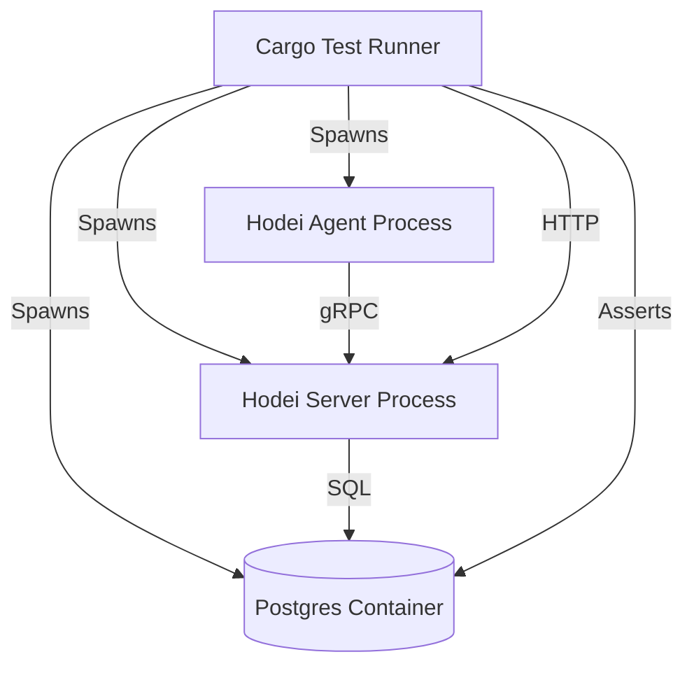

# 🔍 Análisis Crítico y Propuestas de Mejora (Revisión Profunda)

Tras una revisión exhaustiva del código, incluyendo los nuevos módulos `crates/security` y `crates/hwp-agent`, presento un análisis crítico del estado actual.

---

## 1. 🚨 Análisis Crítico de la Implementación "Completa"

Aunque la estructura del proyecto ha crecido y se han añadido los crates necesarios, la **implementación funcional es superficial o inexistente** en áreas críticas marcadas como "100% Completadas".

### A. Seguridad (EPIC-06) - **ESTADO REAL: MOCK / FACADE**
El documento de estado indica que esta épica está completada, pero el código revela lo contrario:

1.  **JWT (`crates/security/src/jwt.rs`)**:
    - **Hallazgo**: La función `verify_token` es un **mock**.
    - **Código**:
      ```rust
      // Simplified validation - in production, validate JWT properly
      if token.is_empty() { ... }
      Ok(JwtToken { ... }) // Retorna siempre un token válido hardcodeado
      ```
    - **Riesgo**: Cualquier token no vacío es aceptado como válido. **Seguridad Nula**.

2.  **Secret Masking (`crates/security/src/secret_masking.rs`)**:
    - **Hallazgo**: Implementación ingenua que solo reemplaza la cadena literal `"secret"`.
    - **Código**: `text.replace("secret", &self.config.replacement)`
    - **Problema**: No implementa Aho-Corasick como se prometió. No compila patrones. No detecta secretos reales (solo la palabra "secret").

3.  **mTLS (`crates/security/src/mtls.rs`)**:
    - **Hallazgo**: Estructuras vacías (`CertificateValidator`) sin lógica de validación.
    - **Problema**: El cliente gRPC (`hwp-agent/src/connection/grpc_client.rs`) usa `Channel::from_shared` sin configuración TLS. La comunicación es **texto plano**.

### B. Agente HWP (EPIC-04) - **ESTADO REAL: ESQUELETO**
1.  **Funcionalidad Core**:
    - **Hallazgo**: El método `handle_stream` en `grpc_client.rs` no está implementado.
    - **Código**: `warn!("Stream handler not yet implemented");`
    - **Impacto**: El agente se conecta pero no puede recibir trabajos ni enviar logs. Es funcionalmente inútil.

---

## 2. 💡 Propuestas de Mejora Inmediatas

Para llevar el proyecto de un "esqueleto funcional" a un sistema real, se requieren las siguientes acciones:

### P1. Implementación Real de Seguridad
Dejar de usar mocks y conectar librerías reales.
- **JWT**: Usar el crate `jsonwebtoken` para validar firmas reales (HS256/RS256).
- **mTLS**: Configurar `tonic::transport::Server::builder().tls_config(...)` en el servidor y `Channel::builder().tls_config(...)` en el agente.
- **Masking**: Integrar `aho-corasick` real para compilar patrones al inicio y escanear logs en O(n).

### P2. Finalizar el Loop del Agente
Implementar `handle_stream` para:
1.  Recibir `AssignJobRequest`.
2.  Ejecutar el comando (usando `tokio::process::Command` o `portable-pty`).
3.  Capturar `stdout/stderr`.
4.  Enviar `LogEntry` de vuelta al servidor.

---

## 3. 🧪 Estrategia de Testing E2E (Propuesta Robusta)

Actualmente, los tests E2E asumen un entorno externo o mocks. Para garantizar la calidad, propongo una estrategia basada en **contenedores efímeros**.

### Arquitectura de Test
Usar `testcontainers` (crate `testcontainers-modules`) para levantar infraestructura real durante `cargo test`.



### Plan de Implementación de Tests E2E

1.  **Setup (`crates/e2e-tests/src/infrastructure/docker.rs`)**:
    - Crear helper para levantar Postgres en Docker.
    - Esperar a que el puerto 5432 esté listo.

2.  **Server Fixture**:
    - Levantar `hodei-server` en un puerto aleatorio (para permitir paralelismo).
    - Inyectar la URL de la DB del contenedor.

3.  **Escenarios de Prueba**:
    - **Security Test**:
        - Intentar conectar un Agente sin certificado mTLS -> Debe fallar.
        - Intentar conectar con certificado inválido -> Debe fallar.
        - Conectar con certificado válido -> Éxito.
    - **Execution Test**:
        - Enviar Job "echo 'SECRET_API_KEY=12345'" -> Verificar que el log recibido en servidor sea "SECRET_API_KEY=*****".

### Herramientas Recomendadas
- **`testcontainers`**: Para orquestar Docker desde Rust.
- **`rcgen`**: Para generar certificados CA/Server/Client al vuelo durante los tests (para probar mTLS).
- **`tokio::process`**: Para levantar los binarios compilados del servidor y agente.

---

## 4. 📊 Conclusión

El proyecto tiene una arquitectura excelente (Hexagonal, Modular), pero la implementación actual de las características "Enterprise" es una simulación.

**Recomendación**:
1.  Actualizar `IMPLEMENTATION_STATUS.md` para reflejar la realidad (Seguridad: 10% - Mocks, Agente: 20% - Esqueleto).
2.  Priorizar la implementación real de **JWT** y **mTLS** antes de seguir añadiendo funcionalidades.
3.  Implementar el **Test Harness** con Docker para validar que la seguridad realmente funciona y no es solo un "return Ok()".
