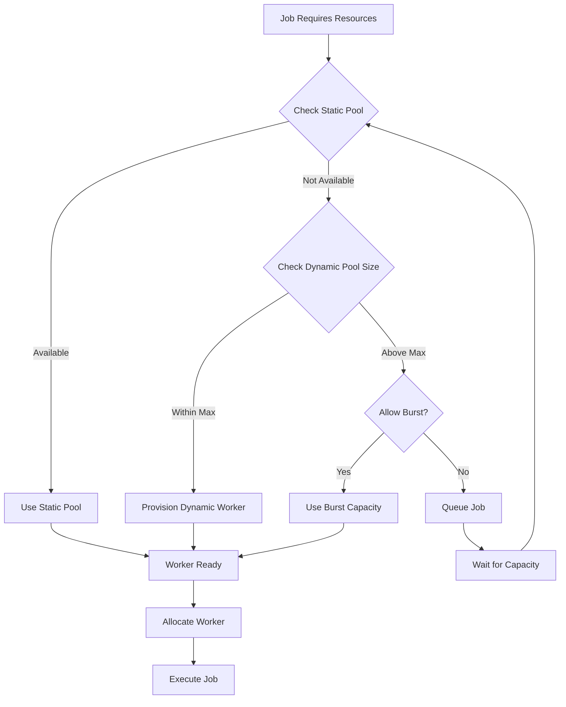
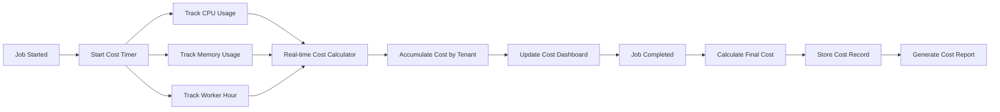
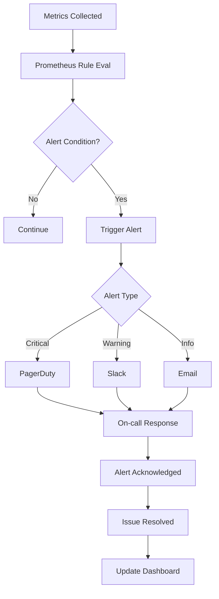

# Job Lifecycle Flow Diagram - Complete Resource Pool Integration

## 🔄 Complete Job Flow with Resource Pools

```mermaid
flowchart TD
    %% Client Request
    A[Client: POST /api/v1/jobs] --> B{API Gateway}
    
    %% Authentication & Authorization
    B --> C[Extract Tenant ID]
    C --> D[Validate JWT Token]
    D --> E{Tenant Valid?}
    
    E -->|No| F[401 Unauthorized]
    E -->|Yes| G[Parse Job Request]
    
    %% Job Validation
    G --> H[Validate JobSpec]
    H --> I{Job Valid?}
    
    I -->|No| J[400 Bad Request]
    I -->|Yes| K[Calculate Required Resources]
    
    %% Quota Enforcement
    K --> L[MultiTenancyQuotaManager]
    L --> M[Check Current Usage]
    M --> N{Within Quota?}
    
    N -->|No| O[429 Quota Exceeded]
    N -->|Yes| P{Request Burst?}
    
    P -->|Yes| Q[BurstCapacityManager]
    P -->|No| R[Accept Job]
    
    Q --> Q1{Available Burst?}
    Q1 -->|No| O
    Q1 -->|Yes| Q2[Create Burst Session]
    Q2 --> R
    
    %% Queue Assignment
    R --> S[QueueAssignmentEngine]
    S --> T[WeightedFairQueueingEngine]
    T --> U[Calculate Virtual Finish Time]
    U --> V[Assign Queue Priority]
    V --> W[Enqueue Job]
    
    %% Job State Transition
    W --> X[Job State: PENDING]
    X --> Y[Orchestrator picks job]
    
    %% Scheduler Loop
    Y --> Z[SchedulerModule]
    Z --> AA[Collect Pool Metrics]
    AA --> BB{Idle Workers Available?}
    
    BB -->|No| CC[Check Auto-Scaling Triggers]
    CC --> DD{Scaling Needed?}
    
    DD -->|Yes| EE[Trigger Scaling Policy]
    EE --> EE1[AutoScalingEngine]
    EE1 --> EE2[Provision Workers]
    EE2 --> EE3[Register Workers]
    EE3 --> FF[Wait for Workers]
    FF --> BB
    
    DD -->|No| GG[Wait in Queue]
    GG --> Z
    
    BB -->|Yes| HH[Select Worker]
    HH --> II[Queue Prioritization]
    II --> JJ[Apply SLA Boost]
    JJ --> KK[Pick Best Worker]
    
    %% Worker Assignment
    KK --> LL[Static Pool Check]
    LL --> MM{Static Pool Available?}
    
    MM -->|Yes| NN[Allocate from Static Pool]
    MM -->|No| OO[Dynamic Pool Check]
    
    OO --> PP{Dynamic Pool Size OK?}
    PP -->|No| QQ[Scale Up Dynamic Pool]
    QQ --> RR[Provision Worker]
    RR --> NN
    
    PP -->|Yes| NN
    
    NN --> SS[Worker Selection]
    SS --> TT[Validate Worker Capabilities]
    TT --> UU{Worker Suitable?}
    
    UU -->|No| VV[Find Alternative Worker]
    VV --> HH
    
    UU -->|Yes| WW[Mark Worker BUSY]
    WW --> XX[Allocate Resources]
    XX --> YY[Track Allocation Metrics]
    
    %% Job Execution
    YY --> ZZ[Submit to Worker]
    ZZ --> AAA[Worker executes job]
    AAA --> BBB[Track Execution Metrics]
    BBB --> CCC[Track Cost in Real-time]
    
    %% Job Completion
    CCC --> DDD{Job Succeeded?}
    
    DDD -->|No| EEE[Mark Job FAILED]
    EEE --> FFF[Increment Failure Count]
    FFF --> GGG[Update Tenant Metrics]
    
    DDD -->|Yes| HHH[Mark Job SUCCESS]
    HHH --> III[Collect Job Metrics]
    III --> JJJ[Calculate Final Cost]
    JJJ --> KKK[Store Cost by Tenant]
    KKK --> LLL[Return Worker to Pool]
    
    %% Worker Return
    LLL --> MMM{Worker Reusable?}
    
    MMM -->|Yes| NNN[Mark Worker IDLE]
    MMM -->|No| OOO[Terminate Worker]
    
    NNN --> PPP[Update Pool Metrics]
    OOO --> QQQ[Update Pool Metrics]
    PPP --> RRR[Trigger Scaling Down?]
    QQQ --> RRR
    
    RRR --> SSS{Scale Down Triggered?}
    SSS -->|Yes| TTT[CooldownManager]
    TTT --> UUU[Wait Cooldown Period]
    UUU --> VVV[Scale Down Pool]
    VVV --> WWW[Pool Metrics Update]
    
    RRR -->|No| XXX[Job Complete]
    SSS -->|No| XXX
    
    %% Metrics & Monitoring
    XXX --> YYY[Update Pool Metrics]
    YYY --> ZZZ[Push to Prometheus]
    ZZZ --> AAAA[Update Grafana Dashboards]
    AAAA --> BAAA[Evaluate Alert Rules]
    
    %% Final Responses
    GGG --> CAAA[Return Error Response]
    WWW --> DAAA[Return Success Response]
    CAAA --> EAAA[Client receives response]
    DAAA --> EAAA
    
    %% Update Job State
    XXX --> FAAA[Job State: SUCCESS]
    AAA --> GAAA[Job State: RUNNING]
    GAAA --> FAAA
    
    %% Legend
    style A fill:#e1f5fe
    style EAAA fill:#c8e6c9
    style F fill:#ffcdd2
    style J fill:#ffcdd2
    style O fill:#ffcdd2
    style GG fill:#fff3e0
    style QQ fill:#fff3e0
```



## 📊 Detailed Flow Phases

### Phase 1: Request Validation (Steps A-K)
**Duration**: ~50ms
**Components**:
- API Gateway
- AuthService
- JobValidator

**Checks**:
- JWT token validation
- Tenant context extraction
- JobSpec validation
- Resource calculation

### Phase 2: Quota Enforcement (Steps L-R)
**Duration**: ~20ms
**Components**:
- MultiTenancyQuotaManager
- BurstCapacityManager

**Checks**:
- CPU quota check
- Memory quota check
- Concurrent jobs limit
- Burst session creation (if needed)

### Phase 3: Queue Assignment (Steps S-W)
**Duration**: ~10ms
**Components**:
- QueueAssignmentEngine
- WeightedFairQueueingEngine
- SLAQueue

**Operations**:
- Calculate virtual finish time
- Assign queue position
- Apply fair share weighting
- Enqueue with priority

### Phase 4: Scheduling Loop (Steps Y-DD)
**Duration**: Variable (100ms - 30s)
**Components**:
- SchedulerModule
- AutoScalingEngine

**Operations**:
- Poll job queue
- Check available workers
- Evaluate scaling triggers
- Execute scaling policies

### Phase 5: Worker Allocation (Steps LL-WW)
**Duration**: ~100-500ms
**Components**:
- StaticPoolManager
- DynamicPoolManager
- WorkerSelection

**Operations**:
- Check static pool availability
- Scale dynamic pool if needed
- Select best worker
- Allocate resources

### Phase 6: Job Execution (Steps AAA-DDD)
**Duration**: Job-specific
**Components**:
- Worker
- JobExecutor
- CostTracker

**Operations**:
- Submit job to worker
- Monitor execution
- Track real-time cost
- Collect execution metrics

### Phase 7: Cleanup & Metrics (Steps HHH-WWW)
**Duration**: ~200ms
**Components**:
- WorkerManager
- PoolLifecycleManager
- MetricsCollector
- CostOptimizer

**Operations**:
- Return worker to pool
- Calculate final cost
- Update tenant metrics
- Scale down if needed
- Push metrics

## 🎯 Critical Performance Paths

### Fast Path (Static Pool Hit)
```
Job Request → Quota Check → WFQ → Static Pool → Worker Allocation → Execution
Total Latency: ~200ms
```

### Burst Path (Burst Capacity)
```
Job Request → Burst Check → WFQ → Burst Allocation → Execution
Total Latency: ~250ms
```

### Slow Path (Dynamic Pool)
```
Job Request → Quota Check → WFQ → Scale Up (5-10s) → Execution
Total Latency: 5-15 seconds
```

## 📈 Resource Pool Selection Logic



## 💰 Cost Tracking Flow



## 📊 Metrics Collection Points

### Per-Request Metrics
- API latency
- Quota check duration
- Queue wait time
- Worker allocation time
- Job execution time

### Per-Tenant Metrics
- Total CPU used
- Total memory used
- Jobs count
- Cost today
- Quota utilization

### Per-Pool Metrics
- Worker count
- Utilization %
- Queue depth
- Provisioning time
- Success rate

## 🚨 Alert Flow



## 🔍 Observability Stack

### Metrics Sources
1. **API Layer**: Request rate, latency, errors
2. **Scheduler**: Queue depth, scheduling rate
3. **Pools**: Worker count, utilization
4. **Jobs**: Execution time, success rate
5. **Costs**: Real-time cost, daily total

### Grafana Dashboards
1. **Pool Overview**: Worker states, job metrics
2. **Tenant Metrics**: Per-tenant usage, quotas
3. **Cost Analysis**: Daily costs, trends
4. **SLA Dashboard**: Queue wait times, SLA compliance

### Prometheus Alerts
1. **Pool Health**: Worker failures, provisioning errors
2. **Performance**: High latency, low throughput
3. **Costs**: Budget exceeded, cost spikes
4. **Quotas**: Tenant overage, quota violations
5. **SLA**: Queue wait time > SLA, missed deadlines

## 📝 Implementation Checklist

### API Endpoints Required
- [ ] `POST /api/v1/jobs` - Create job with tenant context
- [ ] `GET /api/v1/tenants/{id}/quotas` - Get tenant quotas
- [ ] `PUT /api/v1/tenants/{id}/quotas` - Update quotas
- [ ] `POST /api/v1/tenants/{id}/burst` - Request burst capacity
- [ ] `GET /api/v1/pools/{id}/metrics` - Get pool metrics
- [ ] `GET /api/v1/pools/{id}/scaling/history` - Get scaling history
- [ ] `GET /api/v1/cost-optimization/reports` - Get cost reports
- [ ] `GET /api/v1/metrics/prometheus` - Prometheus metrics endpoint

### Configuration Required
- [ ] Resource pool definitions
- [ ] Tenant quota defaults
- [ ] Burst capacity policies
- [ ] Auto-scaling triggers
- [ ] Cost tracking settings
- [ ] Prometheus configuration
- [ ] Grafana dashboard configs

### Dependencies
- [ ] MultiTenancyQuotaManager integrated
- [ ] WeightedFairQueueingEngine integrated
- [ ] BurstCapacityManager integrated
- [ ] ResourcePoolMetricsCollector integrated
- [ ] CostOptimizationEngine integrated

---

**Document Version**: 1.0
**Created**: 2025-11-25
**Flow Version**: v1
**Status**: ✅ Ready for Implementation

