# Hodei Jobs - Flujos de Llamadas y Arquitectura API

## Índice

1. [Arquitectura General](#arquitectura-general)
2. [Flujo SDK/CLI → API](#flujo-sdkcli--api)
3. [Flujo de Creación de Pipeline](#flujo-de-creación-de-pipeline)
4. [Flujo de Ejecución de Jobs](#flujo-de-ejecución-de-jobs)
5. [Flujo de Log Streaming](#flujo-de-log-streaming)
6. [Secuencia Completa: Pipeline → Job → Ejecución](#secuencia-completa-pipeline--job--ejecución)
7. [Diagrama de Servicios y Dependencias](#diagrama-de-servicios-y-dependencias)
8. [Flujo de Gestión de Workers](#flujo-de-gestión-de-workers)
9. [Flujo de Scheduling](#flujo-de-scheduling)
10. [Respuestas de API](#respuestas-de-api)

---

## Arquitectura General

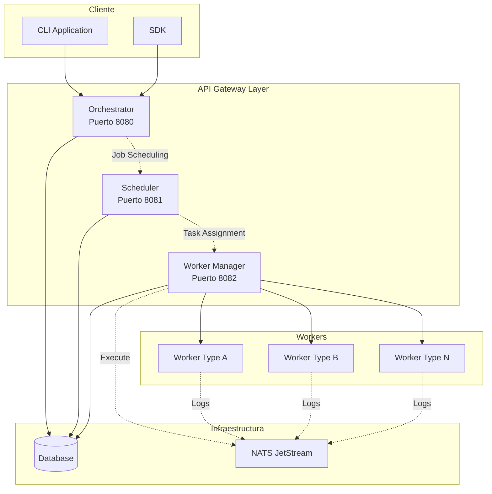
```mermaid
graph TB
    subgraph "Cliente"
        CLI[CLI Application]
        SDK[SDK]
    end

    subgraph "API Gateway Layer"
        ORCH[Orchestrator<br/>Puerto 8080]
        SCHED[Scheduler<br/>Puerto 8081]
        WM[Worker Manager<br/>Puerto 8082]
    end

    subgraph "Infraestructura"
        NATS[NATS JetStream]
        DB[(Database)]
    end

    subgraph "Workers"
        W1[Worker Type A]
        W2[Worker Type B]
        Wn[Worker Type N]
    end

    CLI --> ORCH
    SDK --> ORCH

    ORCH --> DB
    SCHED --> DB
    WM --> DB

    ORCH -.->|Job Scheduling| SCHED
    SCHED -.->|Task Assignment| WM
    WM -.->|Execute| NATS
    WM --> W1
    WM --> W2
    WM --> Wn

    W1 -.->|Logs| NATS
    W2 -.->|Logs| NATS
    Wn -.->|Logs| NATS
```

---

## Flujo SDK/CLI → API

### Creación de Pipeline via SDK

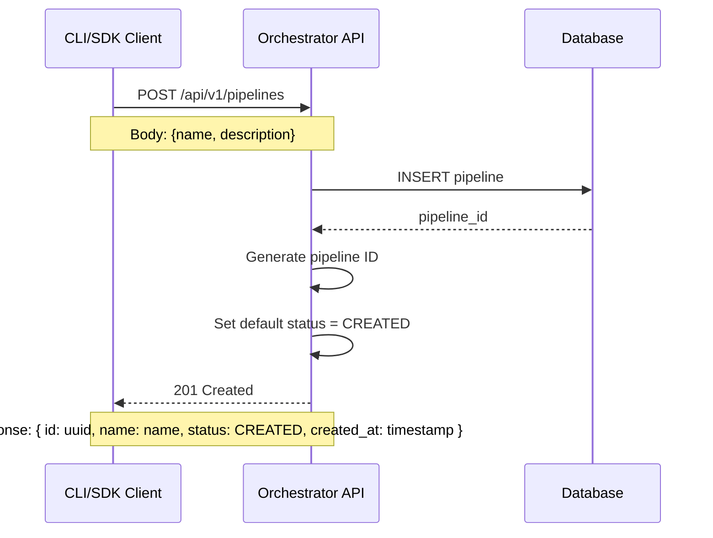
```mermaid
sequenceDiagram
    participant CLI as CLI/SDK Client
    participant ORCH as Orchestrator API
    participant DB as Database

    CLI->>ORCH: POST /api/v1/pipelines
    Note over CLI,ORCH: Body: {name, description}

    ORCH->>DB: INSERT pipeline
    DB-->>ORCH: pipeline_id
    ORCH->>ORCH: Generate pipeline ID
    ORCH->>ORCH: Set default status = CREATED

    ORCH-->>CLI: 201 Created
    Note over ORCH,CLI: Response: { id: uuid, name: name, status: CREATED, created_at: timestamp }
```

### Ejecución de Comando via Worker Manager

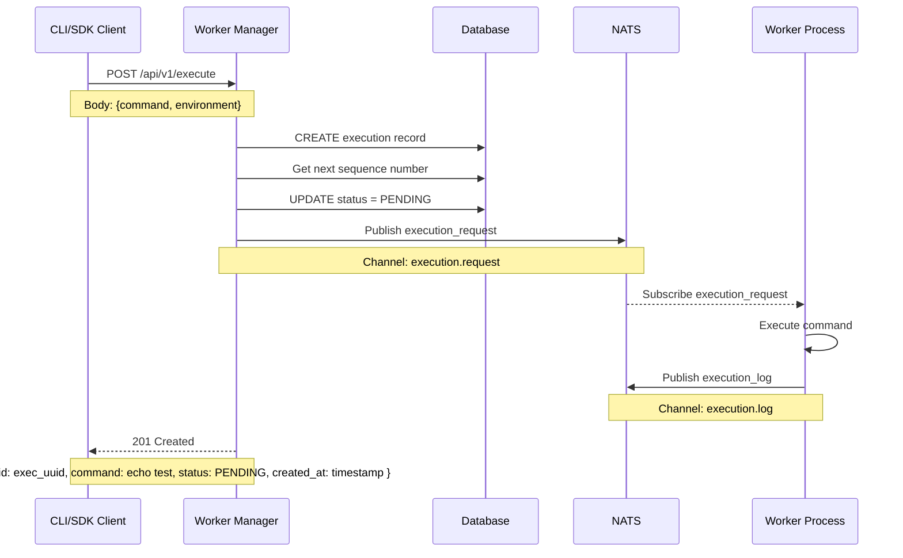
```mermaid
sequenceDiagram
    participant CLI as CLI/SDK Client
    participant WM as Worker Manager
    participant DB as Database
    participant NATS as NATS
    participant WORKER as Worker Process

    CLI->>WM: POST /api/v1/execute
    Note over CLI,WM: Body: {command, environment}

    WM->>DB: CREATE execution record
    WM->>DB: Get next sequence number
    WM->>DB: UPDATE status = PENDING

    WM->>NATS: Publish execution_request
    Note over WM,NATS: Channel: execution.request

    NATS-->>WORKER: Subscribe execution_request
    WORKER->>WORKER: Execute command
    WORKER->>NATS: Publish execution_log
    Note over WORKER,NATS: Channel: execution.log

    WM-->>CLI: 201 Created
    Note over WM,CLI: Response: { id: exec_uuid, command: echo test, status: PENDING, created_at: timestamp }
```

---

## Flujo de Creación de Pipeline

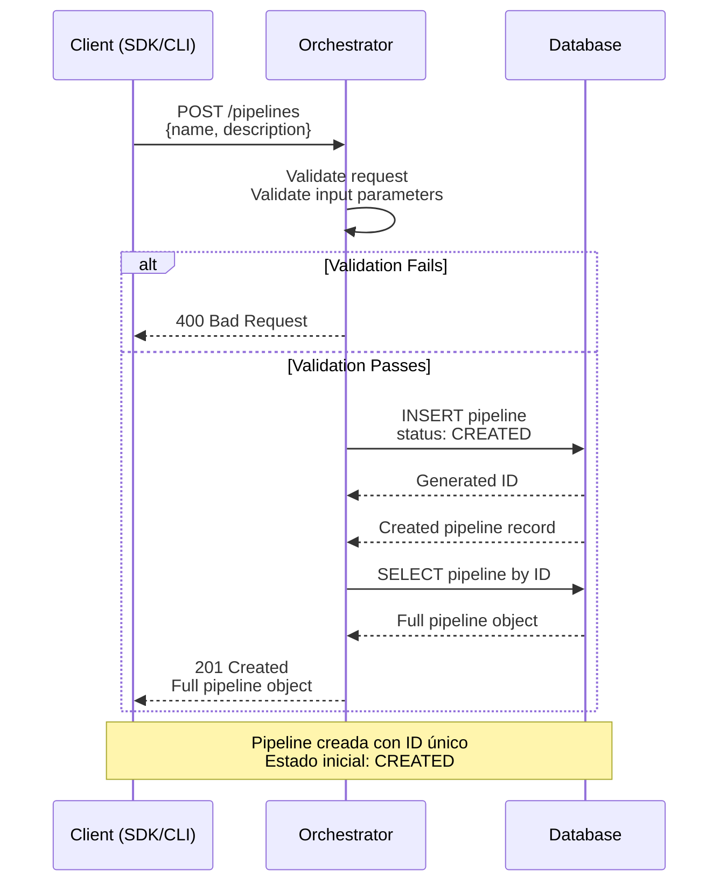
```mermaid
sequenceDiagram
    participant Client as Client (SDK/CLI)
    participant ORCH as Orchestrator
    participant DB as Database

    Client->>ORCH: POST /pipelines<br/>{name, description}

    ORCH->>ORCH: Validate request<br/>Validate input parameters

    alt Validation Fails
        ORCH-->>Client: 400 Bad Request
    else Validation Passes
        ORCH->>DB: INSERT pipeline<br/>status: CREATED
        DB-->>ORCH: Generated ID
        DB-->>ORCH: Created pipeline record

        ORCH->>DB: SELECT pipeline by ID
        DB-->>ORCH: Full pipeline object

        ORCH-->>Client: 201 Created<br/>Full pipeline object
    end

    Note over Client,DB: Pipeline creada con ID único<br/>Estado inicial: CREATED
```

---

## Flujo de Ejecución de Jobs

### Paso 1: Crear Job en Pipeline

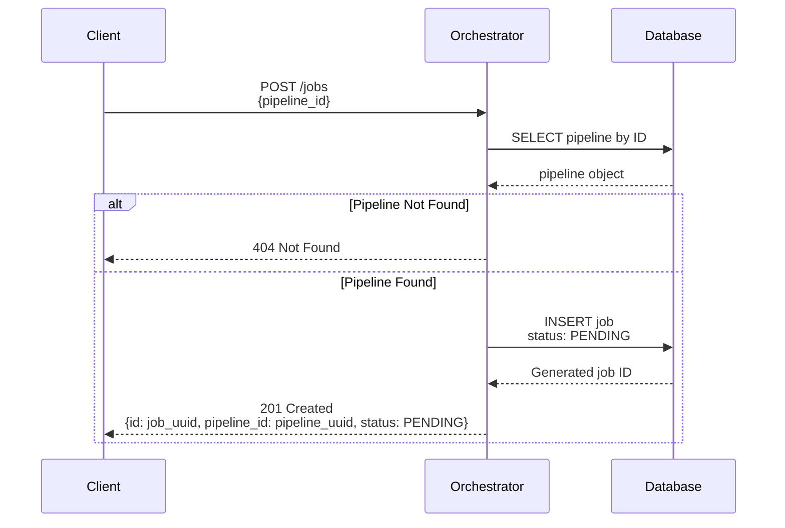
```mermaid
sequenceDiagram
    participant Client as Client
    participant ORCH as Orchestrator
    participant DB as Database

    Client->>ORCH: POST /jobs<br/>{pipeline_id}

    ORCH->>DB: SELECT pipeline by ID
    DB-->>ORCH: pipeline object

    alt Pipeline Not Found
        ORCH-->>Client: 404 Not Found
    else Pipeline Found
        ORCH->>DB: INSERT job<br/>status: PENDING
        DB-->>ORCH: Generated job ID

        ORCH-->>Client: 201 Created<br/>{id: job_uuid, pipeline_id: pipeline_uuid, status: PENDING}
    end
```

### Paso 2: Ejecutar Job (Scheduling)

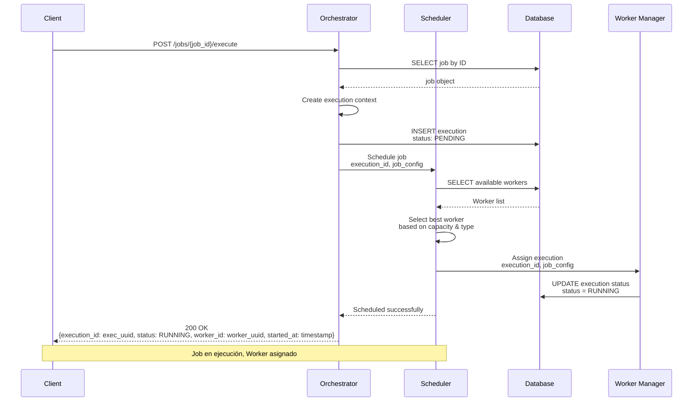
```mermaid
sequenceDiagram
    participant Client as Client
    participant ORCH as Orchestrator
    participant SCHED as Scheduler
    participant DB as Database
    participant WM as Worker Manager

    Client->>ORCH: POST /jobs/{job_id}/execute

    ORCH->>DB: SELECT job by ID
    DB-->>ORCH: job object

    ORCH->>ORCH: Create execution context
    ORCH->>DB: INSERT execution<br/>status: PENDING

    ORCH->>SCHED: Schedule job<br/>execution_id, job_config

    SCHED->>DB: SELECT available workers
    DB-->>SCHED: Worker list

    SCHED->>SCHED: Select best worker<br/>based on capacity & type

    SCHED->>WM: Assign execution<br/>execution_id, job_config

    WM->>DB: UPDATE execution status<br/>status = RUNNING

    SCHED-->>ORCH: Scheduled successfully

    ORCH-->>Client: 200 OK<br/>{execution_id: exec_uuid, status: RUNNING, worker_id: worker_uuid, started_at: timestamp}

    Note over Client,SCHED: Job en ejecución, Worker asignado
```

---

## Flujo de Log Streaming

### Suscripción a Logs via SSE

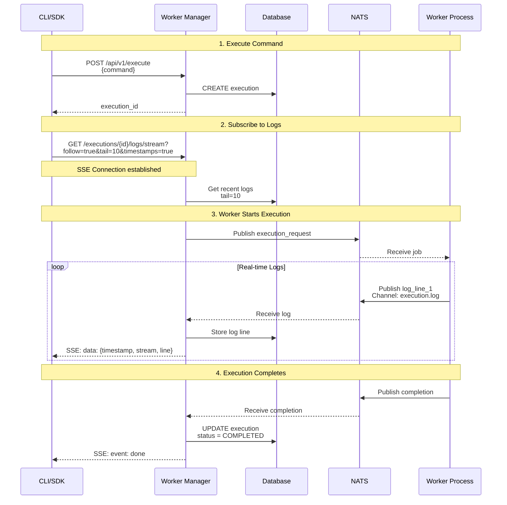
```mermaid
sequenceDiagram
    participant CLI as CLI/SDK
    participant WM as Worker Manager
    participant DB as Database
    participant NATS as NATS
    participant WORKER as Worker Process

    Note over CLI,WORKER: 1. Execute Command
    CLI->>WM: POST /api/v1/execute<br/>{command}
    WM->>DB: CREATE execution
    WM-->>CLI: execution_id

    Note over CLI,WORKER: 2. Subscribe to Logs
    CLI->>WM: GET /executions/{id}/logs/stream?<br/>follow=true&tail=10&timestamps=true
    Note over CLI,WM: SSE Connection established

    WM->>DB: Get recent logs<br/>tail=10

    Note over CLI,WORKER: 3. Worker Starts Execution
    WM->>NATS: Publish execution_request
    NATS-->>WORKER: Receive job

    loop Real-time Logs
        WORKER->>NATS: Publish log_line_1<br/>Channel: execution.log
        NATS-->>WM: Receive log
        WM->>DB: Store log line
        WM-->>CLI: SSE: data: {timestamp, stream, line}
    end

    Note over CLI,WORKER: 4. Execution Completes
    WORKER->>NATS: Publish completion
    NATS-->>WM: Receive completion
    WM->>DB: UPDATE execution<br/>status = COMPLETED
    WM-->>CLI: SSE: event: done
```

### Arquitectura de Log Streaming

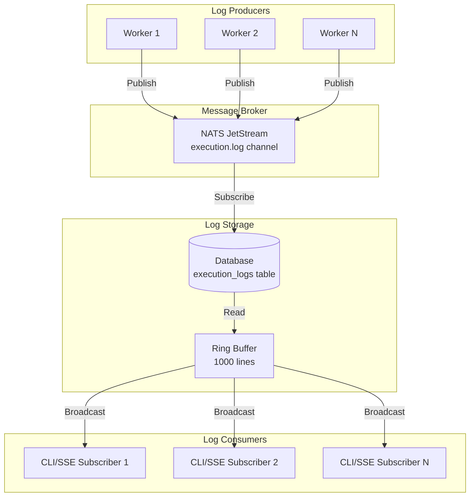
```mermaid
graph TD
    subgraph "Log Producers"
        WORKER1[Worker 1]
        WORKER2[Worker 2]
        WORKERn[Worker N]
    end

    subgraph "Message Broker"
        NATS[NATS JetStream<br/>execution.log channel]
    end

    subgraph "Log Storage"
        DB[(Database<br/>execution_logs table)]
        BUFFER[Ring Buffer<br/>1000 lines]
    end

    subgraph "Log Consumers"
        SSE1[CLI/SSE Subscriber 1]
        SSE2[CLI/SSE Subscriber 2]
        SSEn[CLI/SSE Subscriber N]
    end

    WORKER1 -->|Publish| NATS
    WORKER2 -->|Publish| NATS
    WORKERn -->|Publish| NATS

    NATS -->|Subscribe| DB
    DB -->|Read| BUFFER

    BUFFER -->|Broadcast| SSE1
    BUFFER -->|Broadcast| SSE2
    BUFFER -->|Broadcast| SSEn

```

---

## Secuencia Completa: Pipeline → Job → Ejecución

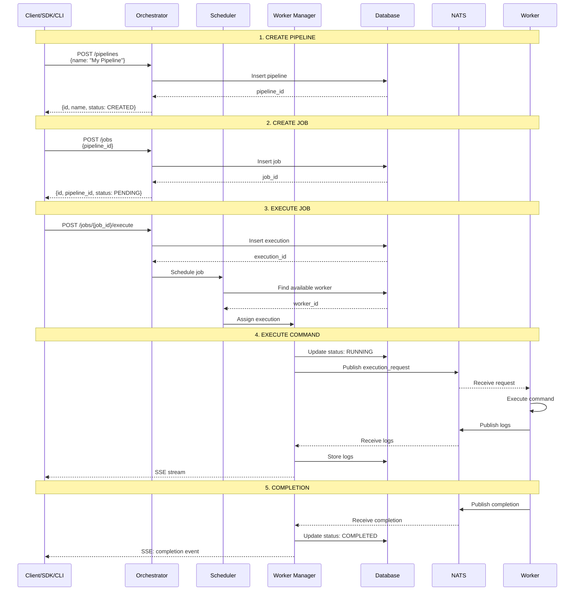
```mermaid
sequenceDiagram
    participant C as Client/SDK/CLI
    participant O as Orchestrator
    participant S as Scheduler
    participant W as Worker Manager
    participant D as Database
    participant N as NATS
    participant Wkr as Worker

    Note over C,Wkr: 1. CREATE PIPELINE
    C->>O: POST /pipelines<br/>{name: "My Pipeline"}
    O->>D: Insert pipeline
    D-->>O: pipeline_id
    O-->>C: {id, name, status: CREATED}

    Note over C,Wkr: 2. CREATE JOB
    C->>O: POST /jobs<br/>{pipeline_id}
    O->>D: Insert job
    D-->>O: job_id
    O-->>C: {id, pipeline_id, status: PENDING}

    Note over C,Wkr: 3. EXECUTE JOB
    C->>O: POST /jobs/{job_id}/execute
    O->>D: Insert execution
    D-->>O: execution_id
    O->>S: Schedule job
    S->>D: Find available worker
    D-->>S: worker_id
    S->>W: Assign execution

    Note over C,Wkr: 4. EXECUTE COMMAND
    W->>D: Update status: RUNNING
    W->>N: Publish execution_request
    N-->>Wkr: Receive request
    Wkr->>Wkr: Execute command
    Wkr->>N: Publish logs
    N-->>W: Receive logs
    W->>D: Store logs
    W-->>C: SSE stream

    Note over C,Wkr: 5. COMPLETION
    Wkr->>N: Publish completion
    N-->>W: Receive completion
    W->>D: Update status: COMPLETED
    W-->>C: SSE: completion event
```

---

## Diagrama de Servicios y Dependencias

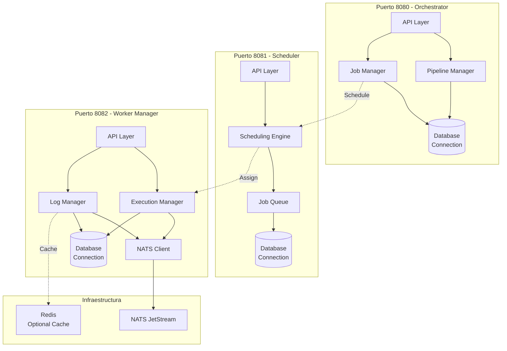
```mermaid
graph TB
    subgraph "Puerto 8080 - Orchestrator"
        O_API[API Layer]
        O_PIPELINE[Pipeline Manager]
        O_JOB[Job Manager]
        O_DB[(Database<br/>Connection)]
    end

    subgraph "Puerto 8081 - Scheduler"
        S_API[API Layer]
        S_ENGINE[Scheduling Engine]
        S_QUEUE[Job Queue]
        S_DB[(Database<br/>Connection)]
    end

    subgraph "Puerto 8082 - Worker Manager"
        WM_API[API Layer]
        WM_EXEC[Execution Manager]
        WM_LOG[Log Manager]
        WM_NATS[NATS Client]
        WM_DB[(Database<br/>Connection)]
    end

    subgraph "Infraestructura"
        NATS[NATS JetStream]
        REDIS[Redis<br/>Optional Cache]
    end

    O_API --> O_PIPELINE
    O_API --> O_JOB
    O_PIPELINE --> O_DB
    O_JOB --> O_DB

    S_API --> S_ENGINE
    S_ENGINE --> S_QUEUE
    S_QUEUE --> S_DB

    WM_API --> WM_EXEC
    WM_API --> WM_LOG
    WM_EXEC --> WM_NATS
    WM_EXEC --> WM_DB
    WM_LOG --> WM_NATS
    WM_LOG --> WM_DB

    O_JOB -.->|Schedule| S_ENGINE
    S_ENGINE -.->|Assign| WM_EXEC
    WM_NATS --> NATS

    WM_LOG -.->|Cache| REDIS

```

---

## Flujo de Gestión de Workers

### Registrar Worker

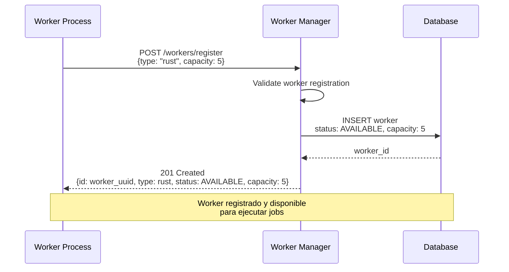
```mermaid
sequenceDiagram
    participant W as Worker Process
    participant WM as Worker Manager
    participant D as Database

    W->>WM: POST /workers/register<br/>{type: "rust", capacity: 5}

    WM->>WM: Validate worker registration
    WM->>D: INSERT worker<br/>status: AVAILABLE, capacity: 5
    D-->>WM: worker_id

    WM-->>W: 201 Created<br/>{id: worker_uuid, type: rust, status: AVAILABLE, capacity: 5}

    Note over W,D: Worker registrado y disponible<br/>para ejecutar jobs
```

### Asignación de Job a Worker

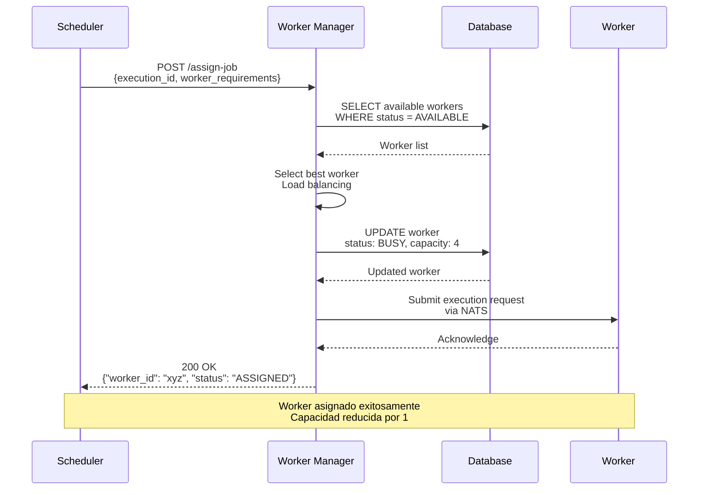
```mermaid
sequenceDiagram
    participant S as Scheduler
    participant W as Worker Manager
    participant D as Database
    participant Wkr as Worker

    S->>W: POST /assign-job<br/>{execution_id, worker_requirements}

    W->>D: SELECT available workers<br/>WHERE status = AVAILABLE
    D-->>W: Worker list

    W->>W: Select best worker<br/>Load balancing

    W->>D: UPDATE worker<br/>status: BUSY, capacity: 4
    D-->>W: Updated worker

    W->>Wkr: Submit execution request<br/>via NATS
    Wkr-->>W: Acknowledge

    W-->>S: 200 OK<br/>{"worker_id": "xyz", "status": "ASSIGNED"}

    Note over S,Wkr: Worker asignado exitosamente<br/>Capacidad reducida por 1
```

### Worker Lifecycle

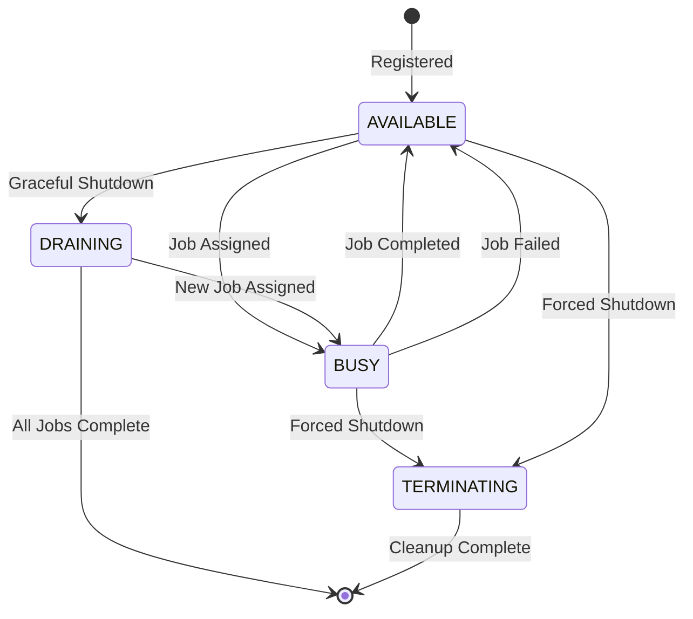
```mermaid
stateDiagram-v2
    [*] --> AVAILABLE: Registered

    AVAILABLE --> BUSY: Job Assigned
    BUSY --> AVAILABLE: Job Completed
    BUSY --> AVAILABLE: Job Failed

    AVAILABLE --> DRAINING: Graceful Shutdown
    DRAINING --> [*]: All Jobs Complete

    BUSY --> TERMINATING: Forced Shutdown
    AVAILABLE --> TERMINATING: Forced Shutdown
    TERMINATING --> [*]: Cleanup Complete

    DRAINING --> BUSY: New Job Assigned
```

---

## Flujo de Scheduling

### Algoritmo de Selección de Worker

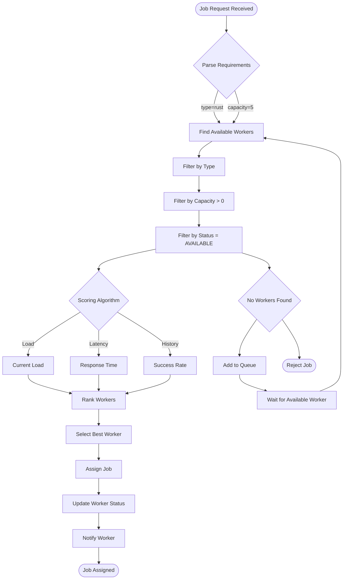
```mermaid
flowchart TD
    START([Job Request Received]) --> REQ{Parse Requirements}

    REQ -->|type=rust| FIND[Find Available Workers]
    REQ -->|capacity=5| FIND

    FIND --> FILTER1[Filter by Type]
    FILTER1 --> FILTER2[Filter by Capacity > 0]
    FILTER2 --> FILTER3[Filter by Status = AVAILABLE]

    FILTER3 --> SCORE{Scoring Algorithm}

    SCORE -->|Load| LOAD[Current Load]
    SCORE -->|Latency| LATENCY[Response Time]
    SCORE -->|History| HISTORY[Success Rate]

    LOAD --> RANK[Rank Workers]
    LATENCY --> RANK
    HISTORY --> RANK

    RANK --> SELECT[Select Best Worker]

    SELECT --> ASSIGN[Assign Job]

    ASSIGN --> UPDATE_DB[Update Worker Status]
    UPDATE_DB --> NOTIFY[Notify Worker]
    NOTIFY --> SUCCESS([Job Assigned])

    FILTER3 --> NO_WORKER{No Workers Found}
    NO_WORKER --> QUEUE[Add to Queue]
    NO_WORKER --> REJECT([Reject Job])

    QUEUE --> WAIT[Wait for Available Worker]
    WAIT --> FIND
```

---

## Respuestas de API

### Pipeline API Responses

#### Create Pipeline - 201 Created

```json
{
  "id": "pipe_550e8400-e29b-41d4-a716-446655440000",
  "name": "My CI/CD Pipeline",
  "description": "Build and test application",
  "status": "CREATED",
  "created_at": "2024-01-15T10:30:45Z",
  "updated_at": "2024-01-15T10:30:45Z",
  "job_count": 0,
  "last_execution": null
}
```

#### Get Pipeline - 200 OK

```json
{
  "id": "pipe_550e8400-e29b-41d4-a716-446655440000",
  "name": "My CI/CD Pipeline",
  "description": "Build and test application",
  "status": "ACTIVE",
  "created_at": "2024-01-15T10:30:45Z",
  "updated_at": "2024-01-15T10:35:22Z",
  "job_count": 3,
  "last_execution": {
    "id": "exec_12345678",
    "status": "COMPLETED",
    "started_at": "2024-01-15T10:34:18Z",
    "completed_at": "2024-01-15T10:35:15Z"
  }
}
```

### Job API Responses

#### Create Job - 201 Created

```json
{
  "id": "job_123e4567-e89b-12d3-a456-426614174000",
  "pipeline_id": "pipe_550e8400-e29b-41d4-a716-446655440000",
  "name": "Build Job",
  "description": "Compile application",
  "status": "PENDING",
  "priority": 5,
  "created_at": "2024-01-15T10:31:00Z",
  "scheduled_at": null,
  "started_at": null,
  "completed_at": null,
  "execution": null
}
```

#### Execute Job - 200 OK

```json
{
  "execution_id": "exec_987fcdeb-51a2-43d1-9c4f-123456789abc",
  "job_id": "job_123e4567-e89b-12d3-a456-426614174000",
  "status": "RUNNING",
  "worker_id": "worker_abc123",
  "worker_type": "rust",
  "command": "cargo build",
  "environment": {
    "RUST_VERSION": "1.75.0",
    "CARGO_HOME": "/tmp/cargo"
  },
  "started_at": "2024-01-15T10:32:00Z",
  "estimated_completion": "2024-01-15T10:35:00Z"
}
```

### Execution API Responses

#### Get Execution - 200 OK

```json
{
  "id": "exec_987fcdeb-51a2-43d1-9c4f-123456789abc",
  "job_id": "job_123e4567-e89b-12d3-a456-426614174000",
  "pipeline_id": "pipe_550e8400-e29b-41d4-a716-446655440000",
  "status": "RUNNING",
  "worker_id": "worker_abc123",
  "command": "cargo build",
  "exit_code": null,
  "started_at": "2024-01-15T10:32:00Z",
  "completed_at": null,
  "duration_seconds": null,
  "logs_available": true,
  "log_count": 47
}
```

#### Get Logs - 200 OK (SSE Format)

```
data: {"timestamp":"2024-01-15T10:32:01Z","stream":"stdout","line":"Compiling hodei-worker v0.1.0"}
data: {"timestamp":"2024-01-15T10:32:02Z","stream":"stdout","line":"Finished dev [unoptimized + debuginfo] target(s) in 1.2s"}
data: {"timestamp":"2024-01-15T10:32:02Z","stream":"stderr","line":""}
event: done
```

#### Execute Command - 201 Created

```json
{
  "id": "exec_adhoc_xyz789",
  "command": "echo 'Hello World'",
  "status": "PENDING",
  "created_at": "2024-01-15T10:40:00Z",
  "estimated_duration": 1,
  "stream": "stdout",
  "logs_available": true
}
```

### Log Streaming Response (SSE)

#### Historical Logs

```
data: {"timestamp":"2024-01-15T10:32:01Z","stream":"stdout","line":"Starting execution","sequence":1}
data: {"timestamp":"2024-01-15T10:32:02Z","stream":"stdout","line":"Processing data","sequence":2}
data: {"timestamp":"2024-01-15T10:32:03Z","stream":"stdout","line":"Writing output","sequence":3}
```

#### Real-time Streaming

```
data: {"timestamp":"2024-01-15T10:32:05Z","stream":"stdout","line":"Line 1","sequence":1}
data: {"timestamp":"2024-01-15T10:32:06Z","stream":"stdout","line":"Line 2","sequence":2}
data: {"timestamp":"2024-01-15T10:32:07Z","stream":"stdout","line":"Line 3","sequence":3}
event: done
```

### Error Responses

#### 400 Bad Request

```json
{
  "error": "VALIDATION_ERROR",
  "message": "Invalid request parameters",
  "details": {
    "field": "pipeline_id",
    "issue": "UUID format required"
  },
  "timestamp": "2024-01-15T10:30:45Z",
  "request_id": "req_abc123"
}
```

#### 404 Not Found

```json
{
  "error": "NOT_FOUND",
  "message": "Pipeline not found",
  "resource": "pipeline",
  "resource_id": "pipe_invalid",
  "timestamp": "2024-01-15T10:30:45Z",
  "request_id": "req_abc123"
}
```

#### 500 Internal Server Error

```json
{
  "error": "INTERNAL_ERROR",
  "message": "Database connection failed",
  "timestamp": "2024-01-15T10:30:45Z",
  "request_id": "req_abc123"
}
```

---

## Resumen de Flujos

### Flujo Principal de Usuario

1. **Crear Pipeline** → Orchestrator (Puerto 8080)
2. **Crear Job** → Orchestrator (Puerto 8080)
3. **Ejecutar Job** → Orchestrator → Scheduler → Worker Manager
4. **Ver Logs** → Worker Manager (Puerto 8082) → SSE Stream

### Flujo de Logs

1. **Worker** → Publica logs en NATS
2. **Worker Manager** → Suscribe a NATS, almacena en DB
3. **Cliente** → Conecta a SSE endpoint
4. **Worker Manager** → Lee de ring buffer, envía via SSE

### Flujo de Scheduling

1. **Scheduler** → Recibe job de Orchestrator
2. **Scheduler** → Busca worker disponible en DB
3. **Scheduler** → Asigna job via NATS a Worker
4. **Worker** → Ejecuta y reporta resultado

### Puertos y Protocolos

- **8080**: Orchestrator (HTTP/JSON)
- **8081**: Scheduler (HTTP/JSON)
- **8082**: Worker Manager (HTTP/JSON + SSE)
- **NATS**: Mensajería asíncrona
- **PostgreSQL**: Persistencia de datos
