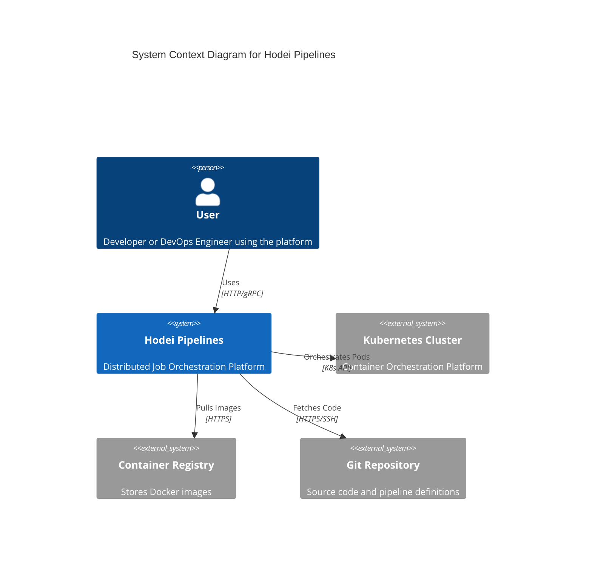
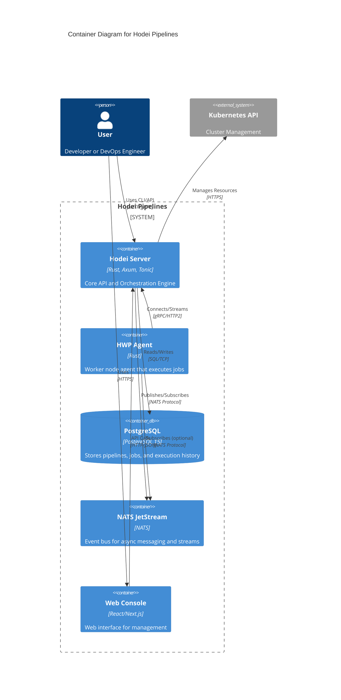
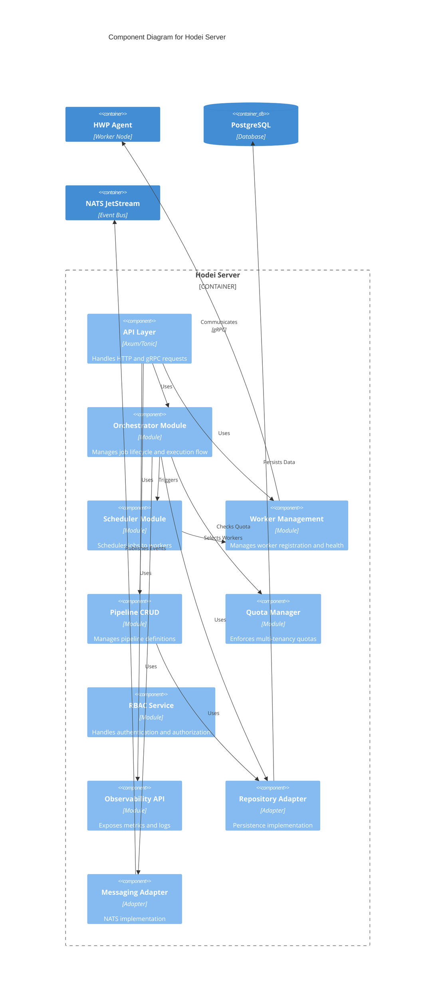
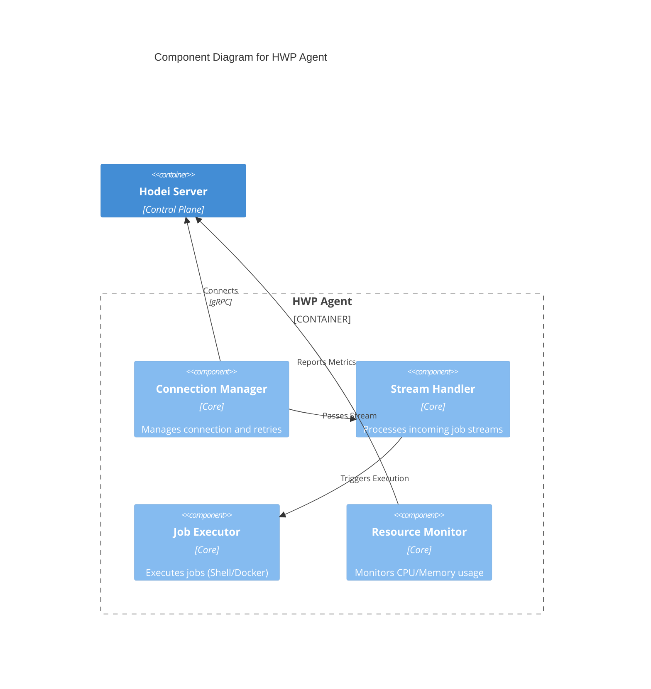

# Hodei Pipelines - Architecture

This document describes the architecture of Hodei Pipelines using the C4 model.

## 1. System Context Diagram

The System Context diagram shows the software system in the context of its users and external systems.

## 2. Container Diagram

The Container diagram shows the high-level software containers (applications, databases, etc.) and how they interact.

## 3. Component Diagram - Hodei Server

The Component diagram shows the internal structure of the Hodei Server.

## 4. Component Diagram - HWP Agent

The Component diagram shows the internal structure of the HWP Agent.

