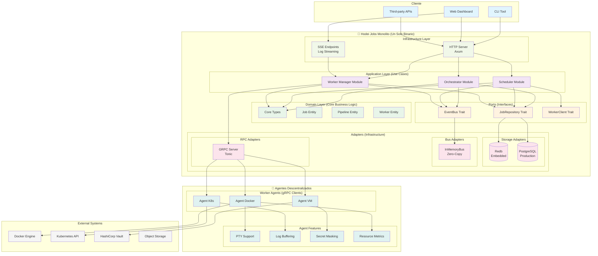
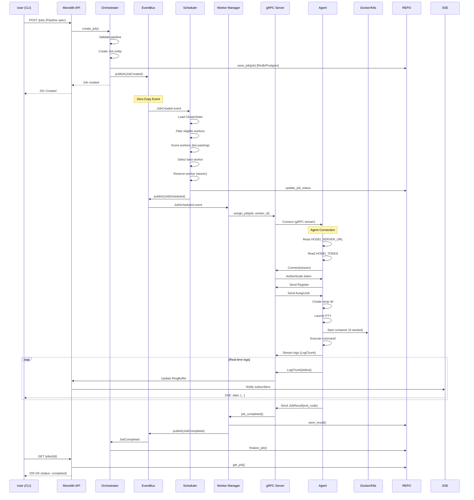
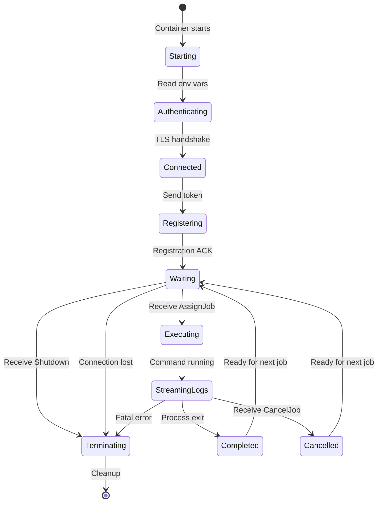
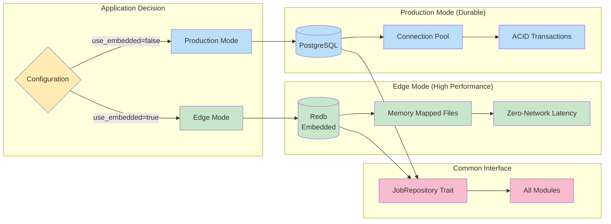
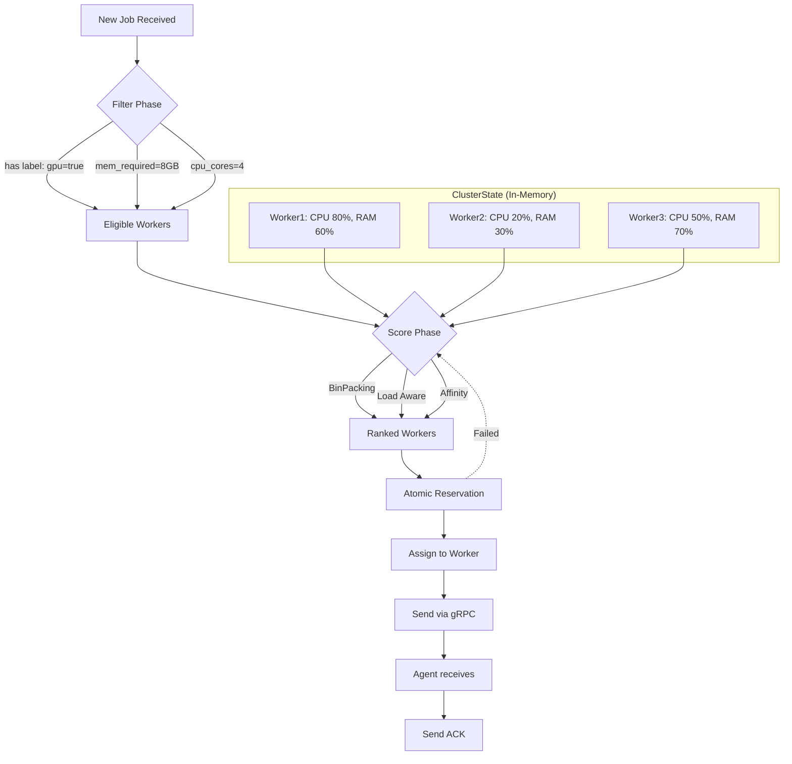

# Diagrama de Arquitectura Hexagonal - Hodei Jobs

## Arquitectura General



## Flujo de Ejecución de Job



## Protocolo de Agente (HWP)



## Persistencia Dual



## Bus de Eventos Zero-Copy

```mermaid
graph TB
    subgraph "Monolith Process"
        subgraph "Event Producers"
            PROD1[Orchestrator]
            PROD2[Scheduler]
            PROD3[Worker Manager]
        end

        subgraph "InMemoryBus"
            TX[broadcast::Sender]
            RX1[broadcast::Receiver 1]
            RX2[broadcast::Receiver 2]
            RX3[broadcast::Receiver 3]
        end

        subgraph "Event Consumers"
            CONS1[Scheduler Loop]
            CONS2[Log Aggregator]
            CONS3[Metrics Collector]
        end
    end

    PROD1 -->|Arc<Job>| TX
    PROD2 -->|JobScheduled| TX
    PROD3 -->|LogChunk| TX

    TX --> RX1
    TX --> RX2
    TX --> RX3

    RX1 --> CONS1
    RX2 --> CONS2
    RX3 --> CONS3

    Note over TX,RX1: Zero-copy: Only Arc pointer copied (8 bytes)
    Note over PROD1,CONS1: Latency: ~10-50μs (vs ~1-5ms with NATS)
```

## Scheduler Inteligente



## Log Streaming Pipeline

```mermaid
graph LR
    subgraph "Agent (Container)"
        PROCESS[User Process]
        PTY[PTY Terminal]
        BUFFER[4KB Buffer]
        MASK[Secret Masker]
        GRPC[gRPC Client]
    end

    subgraph "Monolith"
        GRPC_S[GRPC Server]
        RING[RingBuffer<br/>Shared Memory]
        ARCHIVE[Background Archiver]
        SSE[SSE Endpoint]
    end

    subgraph "Client"
        BROWSER[Web Browser]
        DASHBOARD[Dashboard]
    end

    PROCESS --> PTY
    PTY --> BUFFER
    BUFFER --> MASK
    MASK --> GRPC
    GRPC --> GRPC_S

    GRPC_S --> RING
    RING --> SSE
    SSE --> BROWSER

    RING --> ARCHIVE
    ARCHIVE --> S3[(S3/Disk)]

    BROWSER --> DASHBOARD

    Note over PTY,RING: Zero-copy within process
    Note over GRPC_S,SSE: <10ms latency
```

## Dependencias y Tecnologías

```mermaid
graph TB
    subgraph "Rust Crates"
        TOKIO[ Tokio<br/>Async Runtime]
        TONIC[ Tonic<br/>gRPC]
        SQLX[ SQLx<br/>PostgreSQL]
        REDB[ Redb<br/>Embedded DB]
        SERDE[ Serde<br/>Serialization]
        AXUM[ Axum<br/>HTTP Server]
        CROSSBEAM[ Crossbeam<br/>Channels]
    end

    subgraph "Hodei Jobs"
        AGENT[Agent Binary]
        SERVER[Monolith Server]
        MODULES[Modules]
    end

    AGENT --> TOKIO
    AGENT --> TONIC
    AGENT --> SERDE

    SERVER --> TOKIO
    SERVER --> TONIC
    SERVER --> SQLX
    SERVER --> REDB
    SERVER --> AXUM
    SERVER --> CROSSBEAM

    MODULES --> SERDE

    note right of AGENT: 5MB static binary
    note right of SERVER: Single binary
    note right of MODULES: Pure Rust
```
