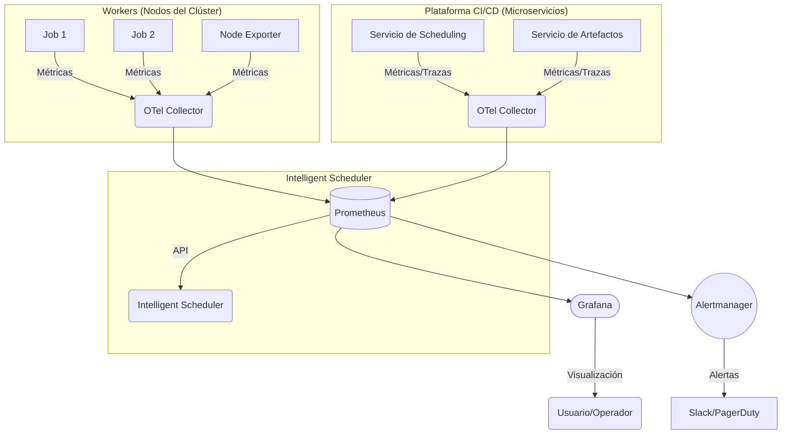
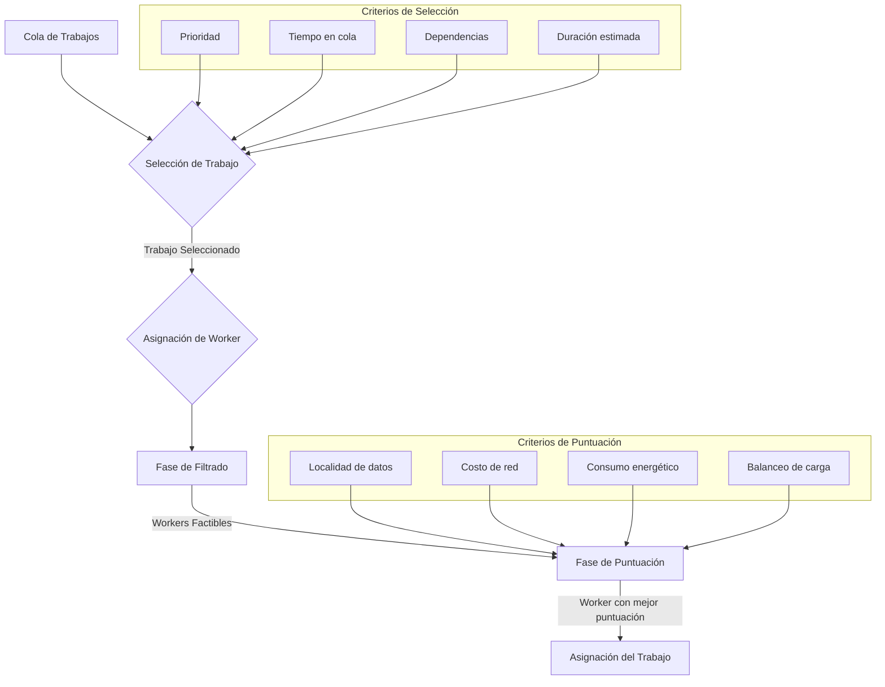
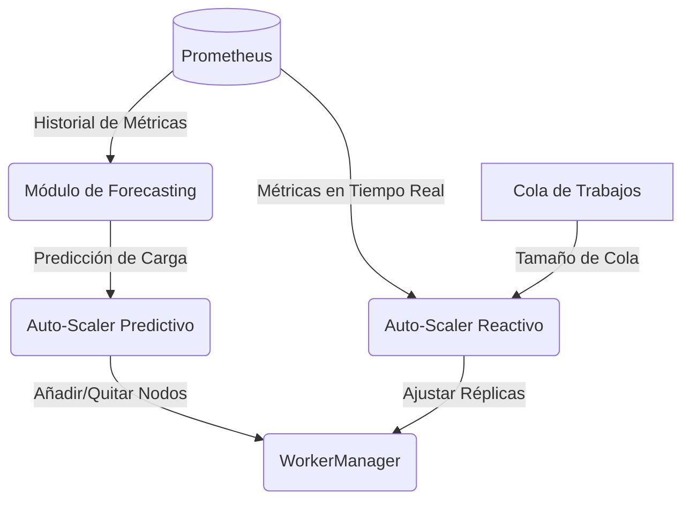
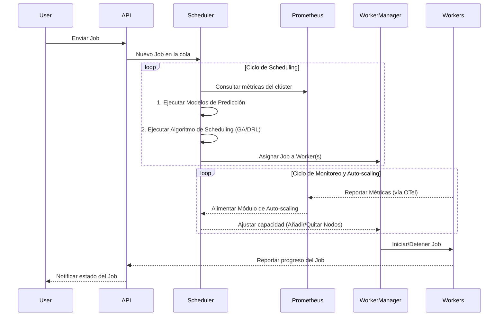

# Planificador Inteligente con Visibilidad de Recursos: Especificaciones de Diseño (Fase 8)

## 1. Resumen Ejecutivo

Este documento presenta las especificaciones arquitectónicas para la **Fase 8: Planificador Inteligente con Visibilidad de Recursos**, un componente avanzado del sistema CI/CD distribuido en Rust. El objetivo de esta fase es evolucionar el scheduler de un modelo reactivo a uno proactivo e inteligente, capaz de optimizar la asignación de recursos, predecir la carga y auto-escalar la infraestructura para maximizar la eficiencia, la resiliencia y el rendimiento, minimizando al mismo tiempo los costos operativos.

El planificador inteligente se fundamenta en cinco pilares clave:

1.  **Monitoreo Continuo de Recursos**: Un sistema de observabilidad en tiempo real basado en **Prometheus, Grafana y OpenTelemetry** para capturar métricas de CPU, memoria, I/O, red y métricas de negocio personalizadas.
2.  **Scheduling Basado en Capacidad Real**: La implementación de algoritmos de scheduling que utilizan **Aprendizaje por Refuerzo Profundo (DRL)** y metaheurísticas como **Algoritmos Genéticos (GA) y Recocido Simulado (SA)** para tomar decisiones de asignación de trabajos que optimicen el tiempo de completitud (JCT), el consumo energético y la utilización de recursos.
3.  **Predicción de Carga y Auto-scaling**: El uso de modelos de series temporales como **LSTM, ARIMA y Prophet** para predecir la demanda de recursos y alimentar estrategias de auto-escalado híbridas (predictivas y reactivas), tanto a nivel de aplicación (pods) como de infraestructura (nodos).
4.  **Rebalanceo Dinámico y Tolerancia a Fallos**: La gestión avanzada de dependencias de tareas (DAGs), el balanceo de carga dinámico y la implementación de mecanismos de tolerancia a fallos, como la replicación proactiva y los reintentos inteligentes.
5.  **Manejo de Trabajadores Heterogéneos**: La capacidad de asignar trabajos de manera óptima en un clúster con nodos de diferentes capacidades (CPU, GPU) y topologías de red, utilizando políticas de afinidad y algoritmos conscientes de la heterogeneidad.

La arquitectura propuesta integra estos componentes en un bucle de control cerrado, donde los datos de monitoreo alimentan los modelos de predicción, cuyas salidas informan las decisiones del scheduler, que a su vez son ejecutadas por la capa de abstracción de `WorkerManager`. Este diseño no solo mejora significativamente la eficiencia y la resiliencia del sistema, sino que también sienta las bases para futuras optimizaciones, como el scheduling consciente del carbono (`carbon-aware`).

## 2. Introducción

El sistema CI/CD distribuido, en sus fases anteriores, ha establecido una base sólida con una arquitectura de microservicios, un bus de eventos desacoplado con NATS, un sistema de seguridad robusto y una capa de abstracción para la gestión de workers. Sin embargo, para operar a gran escala de manera eficiente y rentable, el sistema requiere un mecanismo de scheduling que vaya más allá de la simple asignación de trabajos a workers disponibles. La Fase 8 aborda esta necesidad crítica mediante la introducción de un **Planificador Inteligente**.

El objetivo principal es transformar el scheduler en un cerebro proactivo que comprenda el estado del sistema, anticipe las demandas futuras y tome decisiones de asignación y escalado que optimicen un conjunto de objetivos múltiples:

*   **Reducir el tiempo de espera y ejecución de los trabajos (JCT).**
*   **Maximizar la utilización de los recursos del clúster.**
*   **Minimizar los costos de infraestructura mediante un auto-scaling preciso.**
*   **Aumentar la resiliencia del sistema ante fallos y picos de carga.**
*   **Optimizar el consumo energético de la plataforma.**

Para lograr estos objetivos, este documento detalla las especificaciones de diseño de cada uno de los componentes del planificador inteligente, desde la recolección de datos hasta la ejecución de políticas de scheduling avanzadas, basándose en la investigación exhaustiva de las últimas tendencias en monitoreo, Machine Learning y algoritmos de optimización.

## 3. Agente de Monitoreo Continuo de Recursos

La base de cualquier sistema de scheduling inteligente es una **visibilidad completa y en tiempo real** del estado del sistema. El Agente de Monitoreo Continuo de Recursos es el encargado de recolectar, procesar y exponer las métricas necesarias para alimentar los modelos de predicción y los algoritmos de scheduling.

### 3.1. Arquitectura de Observabilidad

La arquitectura de observabilidad se basará en un stack de herramientas estándar en la industria, probadas por su escalabilidad y flexibilidad, principalmente **Prometheus, Grafana y OpenTelemetry**.

*   **OpenTelemetry (OTel)**: Se utilizará como el estándar para la **instrumentación** de los microservicios del sistema y de los propios workers. OTel proporciona un conjunto unificado de APIs y SDKs para generar, recolectar y exportar telemetría (métricas, trazas y logs), garantizando la portabilidad y evitando el *vendor lock-in*. El **OTel Collector** se desplegará como un agente en cada nodo para recolectar telemetría localmente, procesarla (ej. filtrando, enriqueciendo con metadatos) y exportarla a los backends correspondientes.

*   **Prometheus**: Será el sistema central de **almacenamiento y consulta de métricas de series temporales**. Prometheus utilizará un modelo *pull* para recolectar métricas de los endpoints expuestos por los microservicios, el OTel Collector y los exportadores de nodos (`node_exporter`). Su lenguaje de consulta, **PromQL**, permitirá realizar agregaciones y cálculos complejos sobre las métricas, que serán la base para las alertas y los dashboards.

*   **Grafana**: Funcionará como la **plataforma de visualización y alerting**. Se crearán dashboards para monitorear la salud del sistema, la utilización de recursos, el rendimiento de los pipelines de CI/CD y los KPIs de negocio. Grafana se conectará a Prometheus como fuente de datos principal y permitirá correlacionar métricas con logs y trazas.

El siguiente diagrama Mermaid ilustra la arquitectura de monitoreo:

### 3.2. Métricas Clave

El sistema recolectará un conjunto exhaustivo de métricas, clasificadas en las siguientes categorías:

#### 3.2.1. Métricas de Infraestructura y Workers

Estas métricas proporcionan visibilidad sobre la salud y la utilización de los recursos de hardware.

| Métrica | Descripción | Origen | Utilidad para el Scheduler |
| :--- | :--- | :--- | :--- |
| `node_cpu_seconds_total` | Tiempo total de CPU consumido por modo (user, system, idle, etc.) | Node Exporter | Medir la carga de CPU por nodo. |
| `node_memory_MemAvailable_bytes` | Memoria disponible en el nodo. | Node Exporter | Prevenir OOM (Out of Memory) y tomar decisiones de asignación. |
| `node_disk_io_time_seconds_total` | Tiempo total de I/O en disco. | Node Exporter | Identificar cuellos de botella de I/O. |
| `node_network_receive_bytes_total` | Bytes recibidos por interfaz de red. | Node Exporter | Monitorear el tráfico de red y detectar saturación. |

#### 3.2.2. Métricas de Aplicación y Pipelines (Custom)

Estas métricas, instrumentadas a través de OpenTelemetry, son cruciales para entender el rendimiento del sistema CI/CD.

| Métrica | Descripción | Origen | Utilidad para el Scheduler |
| :--- | :--- | :--- | :--- |
| `cicd_job_duration_seconds` | Duración de un job de CI/CD, con etiquetas (labels) por tipo de job, resultado (éxito/fallo), etc. | Instrumentación OTel en Workers | Predecir la duración de futuros jobs y optimizar el makespan. |
| `cicd_job_queue_time_seconds` | Tiempo que un job pasa en la cola antes de ser ejecutado. | Servicio de Scheduling | Medir la eficiencia del scheduler y escalar workers si la cola crece. |
| `cicd_pipeline_success_rate` | Tasa de éxito de los pipelines. | Servicio de Scheduling | Correlacionar fallos con la asignación de recursos. |
| `worker_manager_resource_utilization` | Utilización de recursos (CPU/mem) por parte de los workers asignados. | `WorkerManager` | Alimentar modelos de predicción de carga y VPA. |

### 3.3. Integración con el Planificador Inteligente

El Planificador Inteligente consultará la API de Prometheus para obtener las series temporales de estas métricas. Esta información será la entrada para:

*   **Los modelos de predicción de carga**, que aprenderán los patrones de uso de recursos.
*   **Los algoritmos de scheduling**, que conocerán la capacidad disponible en tiempo real de cada nodo.
*   **El sistema de auto-scaling**, que decidirá cuándo añadir o eliminar workers basándose en la carga actual y predicha.

La granularidad y la retención de las métricas serán configurables. Para las decisiones de scheduling en tiempo real, se utilizarán métricas de alta granularidad (ej. 15-30 segundos). Para el entrenamiento de modelos de predicción, se usarán agregados a más largo plazo (ej. minutos, horas).

## 4. Algoritmos de Scheduling Basados en Capacidad Real

El núcleo del Planificador Inteligente reside en su capacidad para tomar decisiones de asignación de trabajos que van más allá de una simple cola FIFO. Se implementarán algoritmos avanzados que consideran la capacidad real de los recursos, las características del trabajo y los objetivos de optimización del sistema.

### 4.1. Fundamentos: De Heurísticas a Aprendizaje por Refuerzo

El scheduling de trabajos en sistemas distribuidos es un problema NP-hard. Las soluciones se mueven en un espectro de complejidad y optimalidad:

*   **Heurísticas Clásicas**: Algoritmos como *Earliest Deadline First (EDF)* o *Shortest Job First (SJF)* son simples pero a menudo subóptimos en entornos con cargas heterogéneas y dependencias complejas.
*   **Metaheurísticas**: Algoritmos como **Algoritmos Genéticos (GA)** y **Recocido Simulado (SA)** exploran el espacio de soluciones para encontrar asignaciones casi óptimas. Son robustos pero pueden tener tiempos de convergencia elevados.
*   **Aprendizaje por Refuerzo Profundo (DRL)**: Este es el enfoque más avanzado, donde un agente de DRL aprende una política de scheduling óptima a través de la interacción con el entorno (el clúster). Es especialmente potente para problemas con espacios de estado grandes y dinámicas complejas.

Nuestra implementación adoptará un enfoque híbrido, comenzando con metaheurísticas robustas y evolucionando hacia un scheduler basado en DRL.

### 4.2. Modelo de Decisión del Scheduler

El scheduler tomará decisiones en dos niveles:

1.  **Selección del Trabajo (Job Selection)**: ¿Qué trabajo de la cola se debe ejecutar a continuación? La decisión se basará en una función de prioridad que considerará:
    *   **Prioridad explícita del trabajo.**
    *   **Tiempo de espera en la cola (para evitar inanición).**
    *   **Dependencias de otros trabajos (DAGs).**
    *   **Estimación de la duración del trabajo (proveniente del modelo de predicción).**

2.  **Asignación del Worker (Worker Assignment)**: ¿Qué worker o conjunto de workers es el más adecuado para ejecutar el trabajo seleccionado? Esta decisión se basará en un **proceso de filtrado y puntuación** similar al de Kubernetes:
    *   **Fase de Filtrado**: Se descartan los workers que no cumplen con los requisitos del trabajo (ej. recursos insuficientes, falta de hardware específico como GPU, restricciones de afinidad).
    *   **Fase de Puntuación**: A los workers restantes se les asigna una puntuación basada en una función de costo que optimiza para:
        *   **Localidad de datos**: Favorecer workers que ya tengan los datos o artefactos necesarios.
        *   **Costo de red**: Minimizar la comunicación entre nodos si el trabajo es parte de un DAG distribuido.
        *   **Consumo energético**: Preferir nodos con un perfil de consumo más eficiente.
        *   **Balanceo de carga**: Evitar la sobrecarga de ciertos nodos.

El siguiente diagrama Mermaid describe este flujo de decisión:

### 4.3. Implementación de Algoritmos

#### 4.3.1. Fase Inicial: Algoritmo Genético (GA)

Inicialmente, se implementará un Algoritmo Genético para optimizar la asignación de un lote de trabajos a un conjunto de workers. La ventaja del GA es su capacidad para explorar un gran espacio de soluciones y encontrar soluciones buenas para objetivos múltiples (makespan, costo, etc.).

*   **Cromosoma**: Representará una posible asignación de trabajos a workers.
*   **Función de Fitness**: Evaluará la calidad de una asignación, penalizando el tiempo total de ejecución (makespan), el desbalanceo de carga y los costos de red.
*   **Operadores**: Se utilizarán operadores de selección, cruce y mutación para evolucionar la población de soluciones hacia un óptimo.

#### 4.3.2. Evolución a DRL: El Agente de Scheduling

El objetivo a largo plazo es implementar un scheduler basado en DRL, inspirado en sistemas como **Decima** de MIT. El agente de DRL aprenderá una política de scheduling que maximice una recompensa a lo largo del tiempo.

*   **Estado (State)**: Una representación del estado actual del clúster, incluyendo la carga de cada worker, los trabajos en la cola y sus dependencias (DAGs). Se utilizarán Redes Neuronales de Grafos (GNNs) para codificar la estructura de los DAGs.
*   **Acción (Action)**: La decisión de scheduling, que puede ser:
    *   Asignar un trabajo específico a un worker específico.
    *   Ajustar el paralelismo de un trabajo (cuántos workers asignar).
*   **Recompensa (Reward)**: Una función que premia al agente por tomar buenas decisiones. Estará inversamente relacionada con el Job Completion Time (JCT), el consumo de recursos y los costos.

La implementación del agente DRL se realizará utilizando una librería de DRL en Rust (aún por determinar en el ecosistema, pero se podría considerar `tch-rs` con bindings para PyTorch o una implementación nativa) y se integrará con el sistema de monitoreo para obtener el estado del entorno en tiempo real.

## 5. Predicción de Carga y Auto-scaling

El auto-scaling proactivo es fundamental para la eficiencia. En lugar de reaccionar a la sobrecarga, el sistema debe anticiparla y aprovisionar recursos justo a tiempo. Esto se logra mediante la predicción de la carga de trabajo y la integración de estas predicciones en las estrategias de auto-scaling.

### 5.1. Modelos de Predicción de Series Temporales

El Planificador Inteligente incluirá un módulo de forecasting que analizará las métricas históricas de utilización de recursos (CPU, memoria, etc.) para predecir la carga futura. Se evaluarán y combinarán varios modelos:

*   **ARIMA (Autoregressive Integrated Moving Average)**: Efectivo para series temporales con patrones estacionales claros y relativamente estables.
*   **Prophet**: Desarrollado por Facebook, es robusto ante datos faltantes y cambios de tendencia, y maneja bien la estacionalidad múltiple (diaria, semanal).
*   **LSTM (Long Short-Term Memory)**: Un tipo de red neuronal recurrente ideal para capturar dependencias a largo plazo y patrones no lineales complejos en los datos de carga.

El sistema utilizará un **enfoque de ensemble**, combinando las predicciones de los tres modelos para obtener un pronóstico más robusto y fiable. El modelo LSTM, enriquecido con características adicionales (como el tipo de job o eventos del calendario como despliegues), será el componente principal para capturar las dinámicas más complejas.

### 5.2. Estrategias de Auto-scaling Híbrido

El sistema combinará dos estrategias de auto-scaling para lograr un equilibrio entre proactividad y reactividad, operando tanto a nivel de aplicación como de infraestructura.

*   **Auto-scaling Predictivo (a nivel de infraestructura)**: Basado en las predicciones del módulo de forecasting, el sistema solicitará al `WorkerManager` que aprovisione o desaprovisione nodos (`Workers`) con antelación. Esto es crucial para manejar picos de carga predecibles y para clústeres donde el tiempo de arranque de un nuevo nodo es significativo.

*   **Auto-scaling Reactivo (a nivel de aplicación/pods)**: Se seguirá utilizando un mecanismo reactivo como el **Horizontal Pod Autoscaler (HPA)** de Kubernetes, pero informado por métricas más inteligentes que solo la CPU. Por ejemplo, se podrá escalar basándose en el tamaño de la cola de trabajos (`cicd_job_queue_time_seconds`) o la latencia de procesamiento.

El siguiente diagrama ilustra la interacción entre los componentes de auto-scaling:

La combinación de ambos enfoques (híbrido) permite que el sistema se prepare para la carga esperada (predictivo) mientras mantiene la capacidad de responder a eventos inesperados (reactivo). Además, se implementará un **Vertical Pod Autoscaler (VPA)** en modo de recomendación para optimizar las solicitudes (`requests`) y límites (`limits`) de CPU y memoria de los workers, mejorando la eficiencia del *bin packing* en los nodos.

## 6. Rebalanceo Dinámico de Jobs en Ejecución

Un sistema distribuido es inherentemente dinámico. Los nodos pueden fallar, la carga de trabajo puede cambiar inesperadamente y las estimaciones iniciales pueden ser incorrectas. El Planificador Inteligente debe ser capaz de adaptarse a estos cambios mediante el rebalanceo dinámico y la tolerancia a fallos.

### 6.1. Gestión de Dependencias y DAGs

El scheduler tendrá soporte de primera clase para la ejecución de **Grafos Acíclicos Dirigidos (DAGs)**. Inspirado en sistemas como Airflow, permitirá definir trabajos con dependencias complejas. El scheduler visualizará el grafo completo y tomará decisiones de asignación que optimicen el *makespan* total del DAG, por ejemplo, co-localizando tareas que se comunican intensivamente para minimizar la latencia de red.

El plugin de Kubernetes para *network-aware scheduling* será una referencia clave, utilizando CRDs como `AppGroup` y `NetworkTopology` para informar al scheduler sobre las dependencias de comunicación y los costos de red entre zonas.

### 6.2. Rebalanceo de Carga y Migración de Tareas

Si un nodo se sobrecarga o si se detecta una asignación subóptima, el scheduler podrá tomar la decisión de **migrar un trabajo en ejecución** a otro worker. Esta es una operación compleja que requiere:

1.  **Soporte para Checkpointing**: El trabajo debe ser capaz de guardar su estado intermedio.
2.  **Análisis de Costo-Beneficio**: El scheduler debe evaluar si el costo de la migración (overhead de checkpointing y transferencia de estado) es menor que el beneficio de mover el trabajo a un nodo más adecuado.

Inicialmente, la migración se limitará a trabajos que lo soporten explícitamente y se activará solo en casos de desbalanceo severo. A futuro, se podría explorar la migración preemptiva para trabajos de baja prioridad.

### 6.3. Tolerancia a Fallos

El scheduler implementará varias estrategias para la tolerancia a fallos:

*   **Reintentos Inteligentes**: Si un trabajo falla, no se reintentará inmediatamente. El scheduler analizará la causa del fallo (a través de los logs y métricas). Si fue por un problema transitorio del worker, lo reasignará a un nodo diferente. Si fue un error del propio trabajo, se marcará como fallido para no malgastar recursos.
*   **Replicación Proactiva**: Para trabajos críticos, el scheduler podrá optar por ejecutar **réplicas redundantes** en diferentes nodos (o incluso en diferentes zonas de disponibilidad). Si una de las réplicas falla, las otras continúan, garantizando la completitud del trabajo. El algoritmo **FastMinRR** será una referencia para minimizar el número de réplicas necesarias para cumplir un objetivo de fiabilidad.
*   **Adopción de Huérfanos**: Si un worker se desconecta, el scheduler detectará los trabajos que estaban en ejecución en él y los reasignará a otros workers, similar al mecanismo de adopción de Airflow.

## 7. Manejo de Trabajadores Heterogéneos

Los clústeres modernos rara vez son homogéneos. A menudo consisten en una mezcla de tipos de instancias con diferentes capacidades de CPU, memoria, almacenamiento y hardware especializado como GPUs. El Planificador Inteligente debe ser consciente de esta heterogeneidad para tomar decisiones de asignación óptimas.

### 7.1. Perfilado de Recursos y Capacidades

El `WorkerManager` será responsable de detectar y etiquetar a cada worker con sus capacidades específicas. Estas etiquetas incluirán:

*   **Arquitectura de CPU** (ej. `amd64`, `arm64`).
*   **Tipo y cantidad de GPU** (ej. `nvidia-tesla-v100`, `amd-instinct-mi250`).
*   **Tipo de almacenamiento** (ej. `ssd`, `hdd`).
*   **Ubicación de red** (ej. `zona-a`, `region-us-east-1`).

Esta información se expondrá a través de la API de Prometheus para que el scheduler pueda utilizarla en su fase de filtrado. Los trabajos podrán especificar sus requisitos de hardware a través de `constraints` en su definición.

### 7.2. Algoritmos de Scheduling Conscientes de la Heterogeneidad

El algoritmo de scheduling (tanto el GA como el DRL) incorporará la heterogeneidad en su función de costo/recompensa. Por ejemplo:

*   Un trabajo que requiere una GPU solo será considerado para asignación en nodos que tengan esa GPU disponible.
*   Un trabajo de I/O intensivo recibirá una puntuación más alta en nodos con almacenamiento SSD.
*   Para un DAG distribuido, el scheduler intentará co-localizar las tareas en la misma zona de disponibilidad para minimizar la latencia y los costos de red, utilizando la información del CRD `NetworkTopology`.

El enfoque **HRLHS (PSO + RL)**, que combina optimización por enjambre de partículas y aprendizaje por refuerzo, será una referencia clave para minimizar el consumo energético en sistemas heterogéneos, asignando tareas a los procesadores más eficientes para esa carga de trabajo específica.

### 7.3. Priorización y Cuotas

En un entorno multi-tenant, es crucial gestionar la prioridad y las cuotas de recursos. El scheduler implementará un sistema de prioridades y cuotas inspirado en Kubernetes y LSF:

*   **Clases de Prioridad**: Los trabajos se podrán asociar a clases de prioridad (ej. `alta`, `media`, `baja`). El scheduler siempre intentará ejecutar los trabajos de alta prioridad primero, pero utilizará mecanismos para evitar la inanición de los trabajos de baja prioridad.
*   **Cuotas de Recursos**: Se podrán definir cuotas por usuario o por equipo, limitando la cantidad total de recursos (CPU, memoria, GPU) que pueden consumir en un momento dado. El scheduler rechazará trabajos que excedan la cuota de un usuario.

## 8. Arquitectura de Referencia y Roadmap

### 8.1. Arquitectura de Componentes

La arquitectura del Planificador Inteligente se integra con los componentes existentes del sistema CI/CD. El siguiente diagrama muestra la interacción entre los principales módulos:

### 8.2. Roadmap de Implementación

La implementación del Planificador Inteligente se llevará a cabo en fases incrementales:

*   **Fase 1 (Mes 1-2): Monitoreo y Scheduling Básico.**
    *   Desplegar el stack de monitoreo (Prometheus, Grafana, Node Exporter, OTel Collector).
    *   Instrumentar los componentes clave del sistema para exponer métricas básicas (duración de jobs, uso de CPU/memoria).
    *   Implementar un scheduler con filtrado y puntuación simple (heurísticas).
    *   Habilitar HPA reactivo basado en CPU/memoria.

*   **Fase 2 (Mes 3-4): Predicción y Auto-scaling Predictivo.**
    *   Desarrollar e integrar el módulo de forecasting (ARIMA, Prophet).
    *   Implementar el auto-scaler predictivo a nivel de infraestructura.
    *   Crear dashboards en Grafana para visualizar las predicciones y el comportamiento del auto-scaler.

*   **Fase 3 (Mes 5-6): Scheduling Avanzado con Metaheurísticas.**
    *   Implementar el scheduler basado en Algoritmo Genético (GA) para la optimización de lotes de trabajos.
    *   Integrar la gestión de dependencias (DAGs) y el scheduling consciente de la red.
    *   Desarrollar las capacidades de tolerancia a fallos (reintentos inteligentes, adopción de huérfanos).

*   **Fase 4 (Mes 7+): Evolución a DRL y Optimización Continua.**
    *   Comenzar el desarrollo del agente de DRL para scheduling, utilizando un simulador validado con datos reales.
    *   Implementar el manejo de trabajadores heterogéneos y cuotas de recursos.
    *   Realizar pruebas A/B entre el scheduler GA y el scheduler DRL para validar las mejoras en JCT y utilización de recursos.

## 9. Conclusión

El diseño del **Planificador Inteligente (Fase 8)** representa un salto cualitativo en la capacidad y eficiencia del sistema CI/CD distribuido. Al pasar de un enfoque reactivo a uno proactivo e inteligente, el sistema podrá manejar cargas de trabajo a gran escala de manera más eficiente, resiliente y rentable.

La combinación de un monitoreo de recursos exhaustivo, modelos de predicción de carga, algoritmos de scheduling avanzados (metaheurísticas y DRL) y estrategias de auto-scaling híbridas, permitirá optimizar el uso de la infraestructura, reducir los tiempos de espera para los usuarios y garantizar el cumplimiento de los SLAs. La arquitectura modular y el roadmap incremental aseguran una transición controlada, donde cada fase aporta valor tangible y sienta las bases para la siguiente.

La implementación exitosa de esta fase no solo consolidará la ventaja técnica de la plataforma, sino que también abrirá la puerta a futuras innovaciones en áreas como la optimización energética y el scheduling consciente del carbono, posicionando al sistema a la vanguardia de las plataformas de CI/CD nativas de la nube.

## 10. Sources

Este informe se ha elaborado a partir de la síntesis de la investigación contenida en los siguientes documentos:

*   [1] [Sistemas modernos de monitoreo de recursos en tiempo real para arquitecturas distribuidas](docs/scheduling_research/resource_monitoring_systems.md)
*   [2] [Técnicas de ML para predicción de carga en sistemas distribuidos](docs/scheduling_research/ml_load_prediction_techniques.md)
*   [3] [Estrategias modernas de auto-scaling para sistemas distribuidos](docs/auto_scaling_strategies.md)
*   [4] [Patrones y algoritmos para job scheduling en sistemas distribuidos](docs/scheduling_research/distributed_job_scheduling_patterns.md)
*   [5] [Algoritmos modernos de scheduling inteligente en sistemas distribuidos (2020–2024)](docs/scheduling_research/intelligent_scheduling_algorithms.md)
