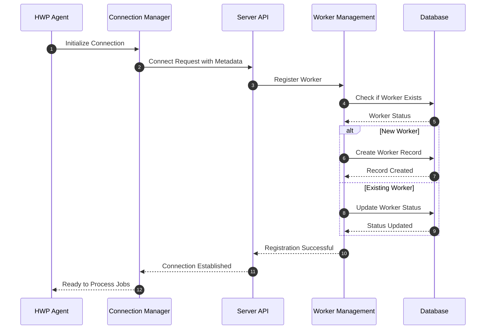
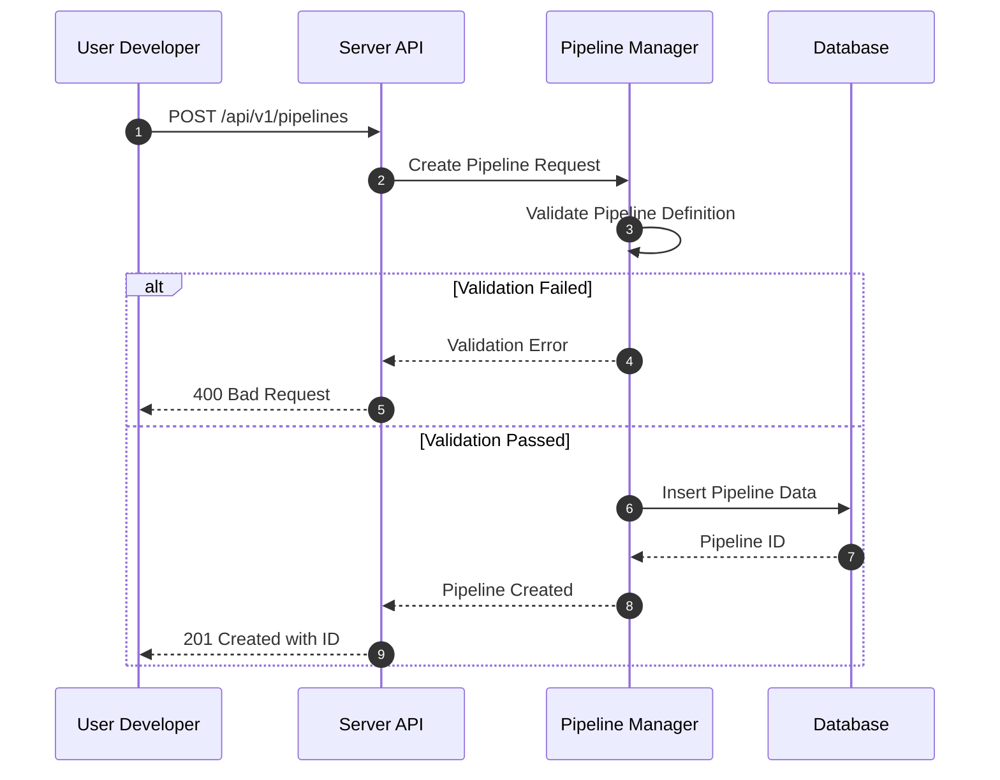
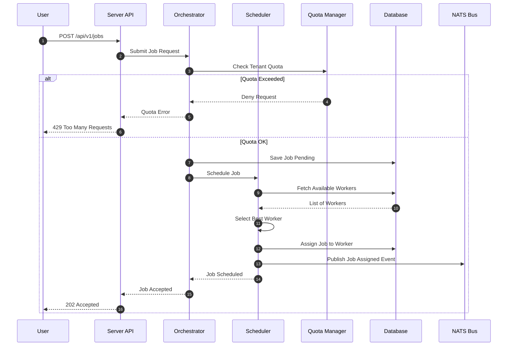
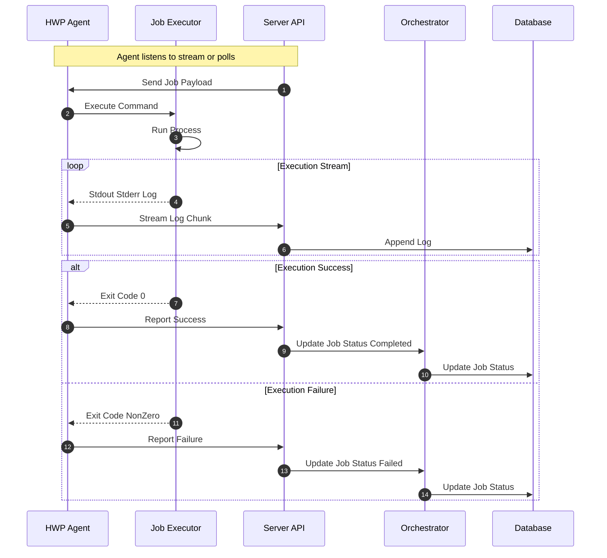

# Hodei Pipelines - Sequence Diagrams

This document illustrates the main use cases of Hodei Pipelines using sequence diagrams.

## 1. Worker Registration

This flow describes how a new HWP Agent registers itself with the Hodei Server.

## 2. Pipeline Creation

This flow shows how a user creates a new pipeline definition.

## 3. Job Submission and Scheduling

This flow illustrates how a job is submitted and scheduled to a worker.

## 4. Job Execution and Status Update

This flow details the execution of a job by a worker and the feedback loop.

