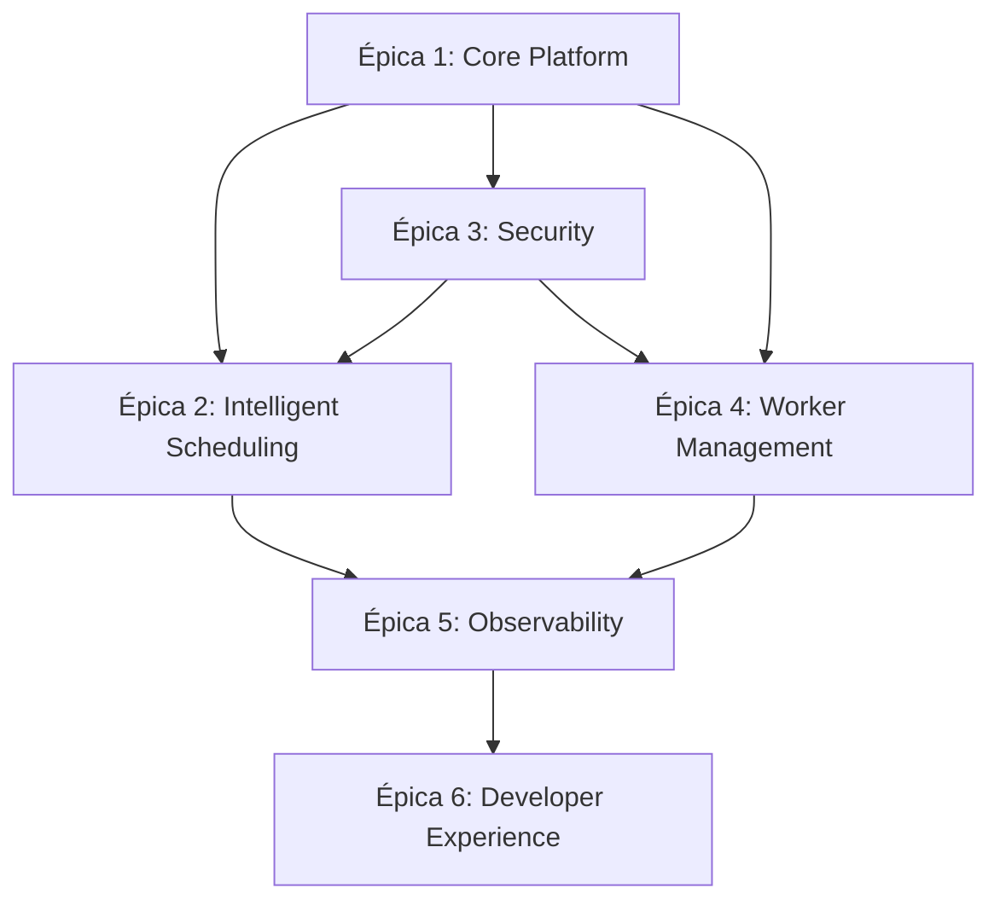

# Estrategia General y Roadmap de Planificación - Sistema CI/CD Distribuido

**Documento de Estrategia de Desarrollo - Sistema CI/CD Distribuido (Rust)**  
**Autor:** MiniMax Agent  
**Fecha:** 2025-11-21  
**Versión:** 1.0  

## 📋 Índice
1. [Visión Estratégica General](#visión-estratégica-general)
2. [Arquitectura de Bounded Contexts](#arquitectura-de-bounded-contexts)
3. [Estructura de Workspace y Crates](#estructura-de-workspace-y-crates)
4. [Principios Arquitectónicos Fundamentales](#principios-arquitectónicos-fundamentales)
5. [Metodología TDD y Conventional Commits](#metodología-tdd-y-conventional-commits)
6. [Patrones Conascense y Análisis de Acoplamientos](#patrones-conascense-y-análisis-de-acoplamientos)
7. [Épicas y Dependencias Estratégicas](#épicas-y-dependencias-estratégicas)
8. [Estimaciones y Capacidad de Sprint](#estimaciones-y-capacidad-de-sprint)
9. [Criterios de Calidad y DoD](#criterios-de-calidad-y-dod)

---

## 🎯 Visión Estratégica General

### Objetivos del Sistema
Desarrollar un sistema CI/CD distribuido de clase empresarial utilizando Rust, con arquitectura hexagonal y principios DDD, que proporcione:

- **Escalabilidad horizontal**: Gestión de miles de workers distribuidos
- **Inteligencia adaptativa**: Planificador  para optimización automática
- **Seguridad multicapa**: Zero-trust con Keycloak + AWS Verified Permissions
- **Observabilidad completa**: Monitoreo en tiempo real con Prometheus/Grafana
- **Experiencia de desarrollo superior**: Herramientas CLI/SDK con DX optimizada

### Métricas de Éxito Cuantificables
- **Performance**: < 30s tiempo de ejecución promedio de jobs
- **Escalabilidad**: 10,000+ workers concurrentes
- **Disponibilidad**: 99.99% uptime con auto-recovery
- **Seguridad**: Zero-breach con audit trail completo
- **Developer Experience**: < 2min setup para nuevos equipos

---

## 🏗️ Arquitectura de Bounded Contexts

### Estructura de Crates por Dominio

```
hodei-jobs/ (workspace root)
├── Cargo.toml (dependencias centralizadas)
├── README.md
├── docs/ (documentación técnica)
├── sprint_planning/ (este documento y épicas)
│
├── crates/ (bounded contexts principales)
│   ├── orchestration/ (Core Platform - Stages 1, 4, 5)
│   │   ├── orchestrator/
│   │   ├── scheduler/
│   │   └── distributed-comm/
│   │
│   ├── scheduling/ (Stage 8 + Research)│   
│   │   ├── auto-scaling/
│   │   └── performance-optimization/
│   │
│   ├── security-identity/ (Stage 6)
│   │   ├── keycloak-integration/
│   │   ├── hodei-verified-permissions/
│   │   └── audit-compliance/
│   │
│   ├── worker-management/ (Stage 7)
│   │   ├── provider-abstraction/
│   │   ├── credential-rotation/
│   │   └── lifecycle-management/
│   │
│   ├── observability/ (Research Stack)
│   │   ├── metrics/
│   │   ├── tracing/
│   │   └── alerting/
│   │
│   ├── developer-experience/ (Q4 Roadmap)
│   │    ├── cli-tools/
│   │    ├── sdk/
│   │    └── ide-integration/
│   │
│	├── shared/ (crates compartidos)
│	    ├── domain-core/ (DDD shared kernel)
│	    ├── infrastructure-common/ (traits y adapters)
│	    ├── types-shared/ (DTOs y value objects)
│	    └── testing-utils/ (helpers TDD)
│
└── tools/ (binarios y utilidades)
    ├── cicd-cli/
    ├── setup-tools/
    └── deployment-helpers/
```

### Bounded Contexts Principales

#### 1. **Orchestration Context** (Crates: orchestration/*)
**Propósito**: Coordinador central del sistema  
**Stages asociados**: 1 (Arquitectura Core), 4 (Comunicación Distribuida), 5 (Patrones Concurrencia)  
**Referencias técnicas**:
- `docs/core_platform_design.md`
- `docs/distributed_communication_patterns.md`  
- `docs/concurrency_patterns_rust.md`

**Componentes principales**:
- `orchestrator/`: Lógica de orquestación principal
- `scheduler/`: Integración con scheduling
- `distributed-comm/`: Comunicación NATS JetStream

#### 2. **Intelligent Scheduling Context** (Crates: scheduling/*)
**Propósito**: Planificador predicción de carga  
**Stages asociados**: 8 (Investigación completa + diseño)  
**Referencias técnicas**:
- [[../scheduling_research/intelligent_scheduler_design]
- [[../scheduling_research/resource_monitoring_systems.md]]
- [[../scheduling_research/ml_load_prediction_techniques.md]]
- [[../scheduling_research/auto_scaling_strategies.md]]
- [[../scheduling_research/distributed_job_scheduling_patterns.md]]
- [[../scheduling_research/intelligent_scheduling_algorithms.md]]

**Componentes principales**:
- `ml-prediction/`: LSTM, ARIMA, Prophet para forecasting
- `auto-scaling/`: Scaling predictivo y reactivo
- `performance-optimization/`: Metaheuristics y DRL

#### 3. **Security Identity Context** (Crates: security-identity/*)
**Propósito**: Gestión de identidad y permisos  
**Stages asociados**: 6 (Seguridad y Compliance)  
**Referencias técnicas**:
- `docs/security_infrastructure_design.md`

**Componentes principales**:
- `keycloak-integration/`: OAuth2/OIDC, Service Accounts
- `aws-permissions/`: Fine-grained permissions
- `audit-compliance/`: Compliance y audit trails

#### 4. **Worker Management Context** (Crates: worker-management/*)
**Propósito**: Abstracción y gestión de workers  
**Stages asociados**: 7 (Abstracción Worker Manager)  
**Referencias técnicas**:
- `docs/worker_manager_abstraction.md`

**Componentes principales**:
- `provider-abstraction/`: Traits para Kubernetes, Docker, etc.
- `credential-rotation/`: Rotación automática de secretos
- `lifecycle-management/`: Estados y transiciones workers

---

## 🔗 Estructura de Workspace y Crates

### Cargo.toml Centralizado

```toml
[workspace]
members = [
    "crates/orchestration/*",
    "crates/scheduling/*", 
    "crates/security-identity/*",
    "crates/worker-management/*",
    "crates/observability/*",
    "crates/developer-experience/*",
    "crates/domain-core",
    "crates/infrastructure-common", 
    "crates/types-shared",
    "crates/testing-utils",
]

[workspace.dependencies]
# Versionado centralizado para consistencia
tokio = { version = "1.40", features = ["full"] }
serde = { version = "1.0", features = ["derive"] }
serde_json = "1.0"
anyhow = "1.0"
thiserror = "1.0"
tracing = "0.1"
tracing-subscriber = "0.3"
# ... más dependencias centralizadas
```

### Principios de Organización de Dependencias

1. **Versionado Centralizado**: Todas las versiones en workspace.dependencies
2. **Shared Kernel**: Tipos comunes en `domain-core` y `types-shared`
3. **Infrastructure Abstractions**: Traits en `infrastructure-common`
4. **Testing First**: Helpers en `testing-utils` para TDD

---

## 🏛️ Principios Arquitectónicos Fundamentales

### Arquitectura Hexagonal (Ports & Adapters)

Cada bounded context sigue arquitectura hexagonal:

```
┌─────────────────────────────────────┐
│           APPLICATION               │  ← USECASES
├─────────────────────────────────────┤
│             DOMAIN                  │  ← ENTITIES, VALUEOBJECTS
├─────────────────────────────────────┤
│              CORE                   │  ← DOMAIN SERVICES
├─────────────────────────────────────┤
│  PORTS (traits)  │  ADAPTERS (impls)│  ← INFRASTRUCTURE
└─────────────────────────────────────┘
```

### Principios SOLID Aplicados

#### 1. Single Responsibility Principle (SRP)
- Cada crate tiene una responsabilidad única
- Separación clara de concerns por bounded context
- **Ejemplo**: `worker-management/provider-abstraction` solo define interfaces

#### 2. Open/Closed Principle (OCP)  
- Extensible sin modificar código existente
- **Ejemplo**: Nuevos providers de workers implementando trait `WorkerProvider`

#### 3. Liskov Substitution Principle (LSP)
- Implementaciones son intercambiables
- **Ejemplo**: Cualquier `CredentialProvider` puede reemplazar otro

#### 4. Interface Segregation Principle (ISP)
- Interfaces pequeñas y específicas
- **Ejemplo**: `WorkerLifecycleProvider` separado de `WorkerMetricsProvider`

#### 5. Dependency Inversion Principle (DIP)
- Depende de abstracciones, no concreciones
- **Ejemplo**: `Orchestrator` depende de `SchedulerTrait`, no implementación específica

---

## 🧪 Metodología TDD y Conventional Commits

### Metodología TDD (Test-Driven Development)

#### Ciclo de Desarrollo por Historia de Usuario


#### Estructura de Tests por Capa

```
crates/orchestration/orchestrator/
├── src/
│   ├── domain/
│   │   ├── entities.rs          # Domain entities
│   │   ├── value_objects.rs     # Value objects  
│   │   └── services.rs          # Domain services
│   ├── application/
│   │   ├── use_cases.rs         # Application use cases
│   │   └── dtos.rs              # Data transfer objects
│   └── infrastructure/
│       ├── adapters.rs          # External adapters
│       └── repositories.rs      # Repository patterns
├── tests/
│   ├── unit/
│   │   ├── domain/
│   │   ├── application/
│   │   └── infrastructure/
│   ├── integration/
│   └── contract/                # Consumer-driven contracts
```

#### Estrategia de Testing

1. **Unit Tests** (80% del coverage):
   - Domain entities y value objects
   - Application use cases
   - Pure business logic

2. **Integration Tests** (15% del coverage):
   - Database operations
   - External service calls (mocked)
   - Message queue interactions

3. **Contract Tests** (5% del coverage):
   - API compatibility
   - Event contract validation

### Conventional Commits

Estructura estándar para cada implementación de historia de usuario:

```
<tipo>(<contexto>): <descripción>

<detalles opcionales>

feat(orchestration): implementar orquestador de jobs distribuidos
- Implementar Entity Job con estados y transiciones
- Agregar UseCase ScheduleJob con validaciones
- Configurar NATS JetStream para comunicación
- Tests unitarios con 95% coverage
- Configurar CI/CD para tests automáticos

Refs: #US-001, docs/core_platform_design.md
```

#### Tipos de Commit

- `feat`: Nueva funcionalidad (historia de usuario)
- `fix`: Bugfix 
- `refactor`: Refactoring sin cambiar funcionalidad
- `test`: Agregar/modificar tests
- `docs`: Documentación
- `chore`: Configuración, dependencies, etc.

#### Información Contextual

Cada commit debe incluir:
- Referencia a historia de usuario: `Refs: #US-XXX`
- Referencia a documentación: `Refs: docs/xxx_design.md`
- Bounded context afectado: `(contexto)`

---

## 🤖 Patrones Conascense y Análisis de Acoplamientos

### Aplicación de Conascense para Identificar Acoplamientos

#### Herramientas de Análisis Automático

```rust
// Ejemplo de análisis de acoplamientos automático
use conascense::{CouplingAnalyzer, BoundedContext, DependencyGraph};

#[tokio::main]
async fn analyze_couplings() -> Result<()> {
    let analyzer = CouplingAnalyzer::new();
    
    // Analizar acoplamientos entre bounded contexts
    let coupling_report = analyzer
        .analyze_workspace(".")
        .with_bounded_contexts(vec![
            "orchestration", 
            "intelligent-scheduling",
            "security-identity",
            "worker-management"
        ])
        .generate_report()
        .await?;
    
    // Detectar acoplamientos problemáticos
    let problematic_couplings = analyzer
        .detect_problematic_couplings(&coupling_report)
        .with_threshold(0.7) // 70% de acoplamiento es problemático
        .collect();
    
    // Generar recomendaciones
    for coupling in problematic_couplings {
        println!(
            "Acoplamiento problemático detectado: {} -> {} (fuerza: {:.2})",
            coupling.source, coupling.target, coupling.strength
        );
        println!("Recomendaciones: {:?}", coupling.recommendations);
    }
    
    Ok(())
}
```

#### Patrones de Acoplamiento Detectables

1. **Temporal Coupling**: Components que deben ejecutarse en orden específico
2. **Data Coupling**: Compartir estructuras de datos complejas
3. **Control Coupling**: Pass control information (flags, parameters)
4. **Content Coupling**: Un módulo modifica otro directamente

#### Estrategias de Desacoplamiento

```rust
// Ejemplo: Event-driven architecture para reducir acoplamiento
use crate::domain::events::{DomainEvent, EventPublisher};

pub trait EventPublisher: Send + Sync {
    async fn publish(&self, event: &DomainEvent) -> Result<()>;
}

pub trait EventSubscriber: Send + Sync {
    async fn handle(&self, event: &DomainEvent) -> Result<()>;
}

// En lugar de: worker_manager.notify_orchestrator(...)
// Usamos: worker_manager.publish_event(JobStartedEvent { ... })
```

#### Herramientas de Monitoreo de Acoplamientos

1. **Static Analysis**: Conascense, cargo-geiger, toml dependency graph
2. **Dynamic Analysis**: Runtime metrics de llamadas entre contextos
3. **Architecture Visualization**: Diagrams automáticos de dependencias

---

## 📊 Épicas y Dependencias Estratégicas

### Mapa de Dependencias entre Épicas



#### Detalle de Dependencias

**Épica 1 → Core Platform (PREREQUISITO PARA TODAS)**
- **Depende de**: Infraestructura básica
- **Bloquea**: Todas las demás épicas
- **Critical Path**: Orquestador → Comunicación → Concurrencia

**Épica 2 → Intelligent Scheduling**
- **Depende de**: Épica 1 (orquestador funcional)
- **Bloquea**: Optimización y performance
- **Critical Path**: ML Models → Prediction → Auto-scaling

**Épica 3 → Security**
- **Depende de**: Épica 1 (APIs base)
- **Bloquea**: Deployment en producción
- **Critical Path**: Identity → Permissions → Compliance

**Épica 4 → Worker Management**
- **Depende de**: Épicas 1, 3
- **Bloquea**: Escalabilidad operativa
- **Critical Path**: Provider Abstraction → Credentials → Lifecycle

### Distribución de Esfuerzo por Épica

| Épica | Complejidad Técnica | Dependencias | Esfuerzo (SP) | Duración (Sprints) |
|-------|-------------------|--------------|---------------|-------------------|
| Core Platform | Alta | 0 | 89 | 3 |
| Intelligent Scheduling | Muy Alta | 1 | 144 | 5 |
| Security & Compliance | Alta | 1 | 77 | 3 |
| Worker Management | Media-Alta | 1,3 | 55 | 2 |
| Observability | Media | 1,2,4 | 33 | 2 |
| Developer Experience | Media | 1,2,3,4 | 44 | 2 |

**Total**: 442 Story Points, 17 Sprints (~8.5 meses)

---

## ⏱️ Estimaciones y Capacidad de Sprint

### Capacidad de Equipo

**Asunciones**:
- Equipo: 4 desarrolladores senior Rust
- Velocity promedio: 25 SP/sprint (basado en proyectos similares)
- Buffer para imprevistos: 20%

**Distribución de Sprint (2 semanas)**:
- Desarrollo: 70% (17.5 SP)
- Refactoring/Architecture: 15% (3.75 SP) 
- Debt/Testing: 10% (2.5 SP)
- Planning/Review: 5% (1.25 SP)

### Roadmap por Quarters 2024-2025

#### Q1 2024 (Sprints 1-6): Core Platform
**Objetivo**: Establecer base sólida del sistema
**KPIs**:
- Orquestador funcional con 1000+ workers
- Comunicación distribuida < 50ms latency
- 95% test coverage en core components

**Sprints 1-3**: Orquestador y Comunicación
- US-001: Implementar Job Entity y states (8 SP)
- US-002: NATS JetStream integration (13 SP)  
- US-003: Distributed coordinator (21 SP)

**Sprints 4-6**: Concurrencia y Performance
- US-004: Tokio patterns optimization (13 SP)
- US-005: Worker lifecycle management (13 SP)
- US-006: Performance benchmarking (8 SP)

#### Q2 2024 (Sprints 7-12): Intelligent Scheduling + Security
**Objetivo**: Agregar inteligencia y seguridad
**KPIs**:
- ML prediction accuracy > 85%
- Auto-scaling response < 30s
- Zero-trust security implemented

**Sprints 7-9**: Intelligent Scheduling
- US-007: LSTM load prediction model (21 SP)
- US-008: Auto-scaling logic (13 SP)
- US-009: Performance optimization algorithms (13 SP)

**Sprints 10-12**: Security & Compliance  
- US-010: Keycloak integration (13 SP)
- US-011: AWS Verified Permissions (13 SP)
- US-012: Audit trail system (13 SP)

#### Q3 2024 (Sprints 13-16): Worker Management + Observability
**Objetivo**: Operabilidad completa
**KPIs**:
- Multi-cloud provider support
- 99.9% uptime monitoring
- Proactive alerting system

**Sprints 13-14**: Worker Management
- US-013: Provider abstraction layer (21 SP)
- US-014: Credential rotation system (13 SP)

**Sprints 15-16**: Observability
- US-015: Prometheus metrics integration (13 SP)
- US-016: Grafana dashboards (8 SP)

#### Q4 2024 (Sprints 17-20): Developer Experience
**Objetivo**: Developer productivity máxima
**KPIs**:
- < 2min setup time
- IDE integration 100% funcional
- CLI tool usage > 80% adoption

**Sprints 17-18**: CLI Tools
- US-017: Command-line interface (13 SP)
- US-018: Setup automation tools (8 SP)

**Sprints 19-20**: SDK & IDE Integration
- US-019: Rust SDK (13 SP)
- US-020: VSCode/IntelliJ plugins (10 SP)

---

## ✅ Criterios de Calidad y Definition of Done

### Definition of Done (DoD) por Historia de Usuario

#### Criterios Técnicos Obligatorios

1. **TDD Implementation**:
   - [ ] Test rojo escrito primero
   - [ ] Código mínimo para pasar test
   - [ ] Refactoring sin romper tests
   - [ ] Coverage mínimo 90%

2. **Architecture Compliance**:
   - [ ] Sigue arquitectura hexagonal
   - [ ] Respeto a bounded contexts
   - [ ] No dependencias circulares
   - [ ] SOLID principles aplicados

3. **Code Quality**:
   - [ ] Rust clippy sin warnings
   - [ ] Documentation completa (pub items)
   - [ ] Error handling robusto
   - [ ] Logging estructurado

4. **Performance Criteria**:
   - [ ] Benchmarks incluidos
   - [ ] Memory leaks descartados
   - [ ] Response time dentro de SLA
   - [ ] Scalability tests pasados

#### Criterios de Negocio

1. **User Story Acceptance**:
   - [ ] Criterios de aceptación cumplidos
   - [ ] Demo funcional realizada
   - [ ] Product Owner approval
   - [ ] Documentation actualizada

2. **Integration & Deployment**:
   - [ ] CI/CD pipeline pasa
   - [ ] Integration tests pasan
   - [ ] Deployment script actualizado
   - [ ] Rollback plan disponible

### Métricas de Calidad por Sprint

| Métrica | Target | Medición |
|---------|--------|----------|
| Test Coverage | 90%+ | `cargo test --coverage` |
| Code Quality | A+ | `cargo clippy` |
| Performance | < SLA | Benchmark tests |
| Documentation | 100% pub | `cargo doc` |

---

## 🔍 Referencias Técnicas Completas

### Documentos de Arquitectura Base
- `docs/README_arquitectura_cicd_distribuida.md` - Índice principal
- `docs/core_platform_design.md` - Stage 1
- `docs/distributed_communication_patterns.md` - Stage 4  
- `docs/concurrency_patterns_rust.md` - Stage 5

### Documentos de Investigación para Intelligent Scheduling
- `docs/scheduling_research/resource_monitoring_systems.md`
- `docs/scheduling_research/ml_load_prediction_techniques.md`
- `docs/scheduling_research/auto_scaling_strategies.md`
- `docs/scheduling_research/distributed_job_scheduling_patterns.md`
- `docs/scheduling_research/intelligent_scheduling_algorithms.md`

### Documentos de Diseño Detallado
- `docs/intelligent_scheduler_design.md` - Stage 8
- `docs/security_infrastructure_design.md` - Stage 6
- `docs/worker_manager_abstraction.md` - Stage 7

### Próximos Pasos
1. **Proceder con Épica 1**: Core Platform & Infrastructure
2. **Paralelización**: Security puede comenzar en Sprint 3
3. **Revisión Arquitectura**: Review de acoplamientos cada 2 sprints
4. **Adaptación**: Roadmap flexible basado en learnings

---

**Fin del Documento Estratégico**  
**Próximo**: `01_epica_core_platform_infrastructure.md`
