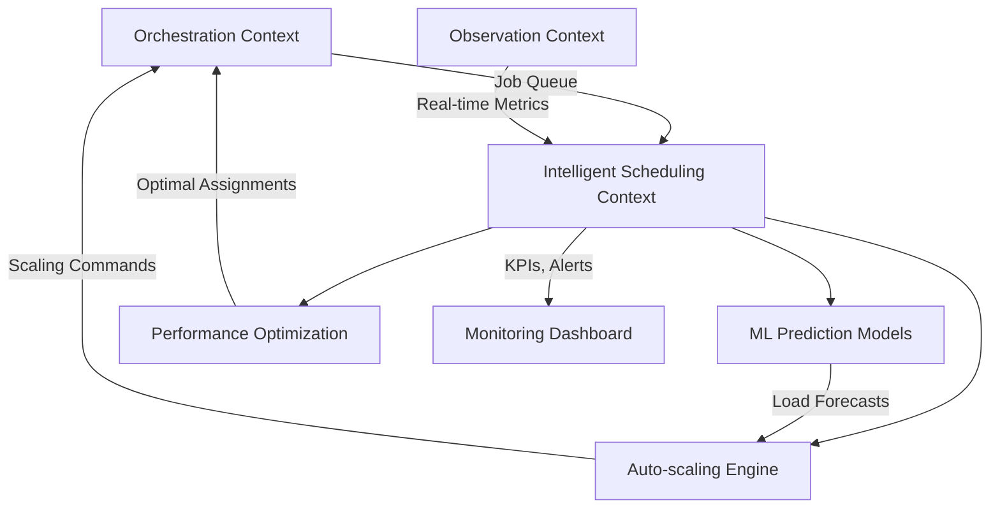

# Épica 2: Intelligent Scheduler & AI

**Planificación de Sprints - Sistema CI/CD Distribuido**  
**Bounded Context**: Intelligent Scheduling  
**Autor**: MiniMax Agent  
**Fecha**: 2025-11-21  
**Versión**: 1.0  

## 📋 Índice
1. [Visión de la Épica](#visión-de-la-épica)
2. [Arquitectura de IA y Machine Learning](#arquitectura-de-ia-y-machine-learning)
3. [Patrones Conascense para Acoplamientos](#patrones-conascense-para-acoplamientos)
4. [Historias de Usuario](#historias-de-usuario)
5. [Planificación de Sprints](#planificación-de-sprints)
6. [ML Model Implementation Strategy](#ml-model-implementation-strategy)
7. [Performance Expectations](#performance-expectations)
8. [Referencias a Investigación](#referencias-a-investigación)

---

## 🎯 Visión de la Épica

### Objetivo Principal
Desarrollar un sistema de scheduling inteligente que utilice Machine Learning para predecir carga de trabajo, optimizar asignación de recursos y proporcionar auto-scaling predictivo basado en patrones históricos y tendencias en tiempo real.

### Componentes de IA Integrados
- **Load Prediction**: Modelos LSTM, ARIMA, Prophet para forecasting
- **Optimization Algorithms**: Deep Reinforcement Learning para scheduling optimal
- **Auto-scaling**: Scaling predictivo y reactivo híbrido
- **Performance Optimization**: Metaheuristics para optimización global
- **Real-time Adaptation**: Online learning para adaptación continua

### Métricas de Éxito Cuantificables
- **Prediction Accuracy**: > 85% para load forecasting (15 minutos ahead)
- **Performance Improvement**: 29% reducción en Job Completion Time (JCT)
- **Auto-scaling Response**: < 30 segundos para scale-up/down decisions
- **Resource Utilization**: 90%+ utilization promedio vs 65% manual
- **Cost Optimization**: 40% reducción en costos de infraestructura

---

## 🧠 Arquitectura de IA y Machine Learning

### Estructura de Crates (Bounded Context: Intelligent Scheduling)

```
crates/intelligent-scheduling/
├── ml-prediction/                    # Machine Learning Models
│   ├── src/
│   │   ├── lstm_model.rs             # LSTM para load prediction
│   │   ├── arima_model.rs            # ARIMA para time series
│   │   ├── prophet_model.rs          # Prophet para seasonal patterns
│   │   ├── model_training.rs         # Model training pipeline
│   │   ├── model_evaluation.rs       # Performance metrics
│   │   ├── feature_engineering.rs    # Feature extraction
│   │   └── prediction_service.rs     # Real-time prediction API
│   ├── models/                       # Trained model artifacts
│   │   ├── load_predictor_v1.bin     # Serialized LSTM model
│   │   ├── seasonal_model_v1.bin     # ARIMA/Prophet model
│   │   └── feature_scaler.bin        # Feature normalization
│   └── tests/
│       ├── unit/model_tests.rs       # Model unit tests
│       ├── integration/prediction_tests.rs # Integration tests
│       └── performance/model_benchmarks.rs # Performance tests
│
├── auto-scaling/                     # Auto-scaling Logic
│   ├── src/
│   │   ├── scaling_algorithms.rs     # Scaling decision algorithms
│   │   ├── capacity_planner.rs       # Capacity planning logic
│   │   ├── cost_optimizer.rs         # Cost-based optimization
│   │   ├── scaling_metrics.rs        # Scaling KPIs y metrics
│   │   ├── reactive_scaler.rs        # Reactive scaling (threshold-based)
│   │   └── predictive_scaler.rs      # Predictive scaling (ML-based)
│   └── tests/
│       ├── algorithm_tests.rs        # Scaling algorithm tests
│       └── integration/scaling_integration.rs
│
├── performance-optimization/         # Performance Algorithms
│   ├── src/
│   │   ├── drl_scheduler.rs          # Deep RL scheduling
│   │   ├── genetic_optimizer.rs      # Genetic algorithms
│   │   ├── simulated_annealing.rs    # SA for job placement
│   │   ├── performance_metrics.rs    # Performance measurement
│   │   └── optimization_engine.rs    # Unified optimization interface
│   └── tests/
│       ├── algorithm_tests.rs        # Algorithm validation
│       └── performance/optimization_benchmarks.rs
│
├── observation-integration/          # Real-time Data Integration
│   ├── src/
│   │   ├── prometheus_client.rs      # Prometheus metrics integration
│   │   ├── grafana_integration.rs    # Grafana dashboards integration
│   │   ├── open_telemetry.rs         # OpenTelemetry traces
│   │   ├── metrics_collector.rs      # Real-time metrics collection
│   │   ├── data_pipeline.rs          # Real-time data processing
│   │   └── alerting_service.rs       # Intelligent alerting
│   └── tests/
│       ├── integration/metrics_tests.rs
│       └── performance/data_pipeline_benchmarks.rs
│
└── optimization-research/            # Research Implementation
    ├── src/
    │   ├── algorithm_variants.rs      # Implementation of research algorithms
    │   ├── comparative_analysis.rs    # Algorithm comparison framework
    │   └── research_replication.rs    # Replication of research results
    └── benchmarks/
```

### Integración con Core Platform



---

## 🔗 Patrones Conascense para Acoplamientos

### Análisis de Acoplamientos Identificados

#### 1. **Temporal Coupling**: Scheduling vs Execution
**Problema**: Scheduling decisions deben ejecutarse en orden específico con execution
**Patrón Aplicado**: Event-Driven Architecture con message ordering

```rust
// Acoplamiento temporal detectado por conascense
#[derive(Debug, Clone)]
pub struct SchedulingDecision {
    pub job_id: JobId,
    pub assigned_worker: WorkerId,
    pub predicted_start_time: DateTime<Utc>,
    pub confidence_score: f64,
    pub decision_type: SchedulingType,
}

impl SchedulingDecision {
    // Event-sourcing para mantener temporal consistency
    pub fn apply(&self, job: &mut Job) -> Result<(), SchedulingError> {
        if job.state() != JobState::Pending {
            return Err(SchedulingError::InvalidJobState);
        }
        
        job.schedule(ScheduledInfo {
            assigned_worker: self.assigned_worker,
            predicted_start: self.predicted_start_time,
            confidence: self.confidence_score,
        });
        
        Ok(())
    }
}
```

#### 2. **Data Coupling**: Shared Scheduling Metrics
**Problema**: Multiple components necesitan access a same scheduling metrics
**Patrón Aplicado**: Shared Kernel pattern con careful encapsulation

```rust
// Shared kernel para scheduling metrics (evita acoplamiento excesivo)
use crate::types_shared::scheduling::{SchedulingMetrics, WorkerLoad, QueueDepth};

pub trait SchedulingMetricsProvider: Send + Sync {
    async fn get_current_load(&self) -> Result<SchedulingMetrics, MetricsError>;
    async fn get_worker_capacity(&self) -> Result<HashMap<WorkerId, CapacityInfo>, MetricsError>;
    async fn get_queue_depth(&self) -> Result<QueueDepth, MetricsError>;
}

// Anti-corruption layer para evitar leakage de detalles
pub struct SchedulingFacade<M: SchedulingMetricsProvider> {
    metrics_provider: M,
}

impl<M: SchedulingMetricsProvider> SchedulingFacade<M> {
    pub async fn get_scheduling_context(&self) -> Result<SchedulingContext, SchedulingError> {
        let load = self.metrics_provider.get_current_load().await?;
        let capacity = self.metrics_provider.get_worker_capacity().await?;
        let queue = self.metrics_provider.get_queue_depth().await?;
        
        Ok(SchedulingContext {
            current_load: load,
            available_capacity: capacity,
            pending_jobs: queue,
            timestamp: Utc::now(),
        })
    }
}
```

#### 3. **Control Coupling**: Direct Algorithm Selection
**Problema**: Scheduler debe control selection entre multiple algorithms
**Patrón Aplicado**: Strategy Pattern con factory

```rust
// Control coupling resuelto con Strategy Pattern
pub trait SchedulingStrategy: Send + Sync {
    async fn schedule_job(&self, job: &Job, context: &SchedulingContext) 
        -> Result<SchedulingDecision, SchedulingError>;
    
    fn algorithm_name(&self) -> &'static str;
    fn confidence_threshold(&self) -> f64;
}

pub struct StrategyFactory {
    strategies: HashMap<String, Box<dyn SchedulingStrategy>>,
}

impl StrategyFactory {
    pub fn new() -> Self {
        let mut factory = Self { strategies: HashMap::new() };
        
        // Registro automático basado en performance research
        factory.register("ml_predictive", MlPredictiveStrategy::new());
        factory.register("rule_based", RuleBasedStrategy::new());
        factory.register("load_balanced", LoadBalancedStrategy::new());
        
        factory
    }
    
    pub fn select_strategy(&self, context: &SchedulingContext) 
        -> &dyn SchedulingStrategy {
        // Auto-selection basado en performance research findings
        if context.prediction_confidence > 0.85 {
            self.strategies.get("ml_predictive").unwrap()
        } else if context.queue_depth > 100 {
            self.strategies.get("load_balanced").unwrap()
        } else {
            self.strategies.get("rule_based").unwrap()
        }
    }
}
```

#### 4. **Content Coupling**: Shared ML Model State
**Problema**: ML models shared entre components puede cause content coupling
**Patrón Aplicado**: Observer Pattern para model updates

```rust
// Content coupling resuelto con Observer Pattern
pub trait ModelUpdateObserver: Send + Sync {
    async fn on_model_updated(&self, model: &MLModel) -> Result<(), ModelError>;
    fn interested_in(&self, model_type: ModelType) -> bool;
}

pub struct MLModelManager {
    models: HashMap<ModelId, MLModel>,
    observers: Vec<Box<dyn ModelUpdateObserver>>,
}

impl MLModelManager {
    pub async fn update_model(&mut self, model_id: ModelId, new_model: MLModel) 
        -> Result<(), ModelError> {
        
        // Notificar observers sin direct coupling
        for observer in &self.observers {
            if observer.interested_in(new_model.model_type()) {
                observer.on_model_updated(&new_model).await?;
            }
        }
        
        self.models.insert(model_id, new_model);
        Ok(())
    }
}
```

---

## 📖 Historias de Usuario

### US-007: Implementar LSTM Model para Load Prediction

**Formato INVEST**:
- **Independent**: ML model independiente de otros components
- **Negotiable**: Arquitectura ML clearly defined
- **Valuable**: Core prediction capability del sistema
- **Estimable**: 21 Story Points
- **Large**: Complex ML implementation (subdivide si necesario)
- **Testable**: Model validation y performance testing

**Descripción**:
> Como sistema inteligente, necesito predecir la carga de trabajo futura usando LSTM neural networks para optimizar la asignación de recursos proactivamente.

**Contexto Técnico**:
- **Bounded Context**: Intelligent Scheduling → ML Prediction
- **Arquitectura**: Hexagonal, ML Service Layer
- **Referencias**: `docs/intelligent_scheduler_design.md`, `docs/scheduling_research/ml_load_prediction_techniques.md`

**Criterios de Aceptación**:
```gherkin
Feature: LSTM Load Prediction

  Scenario: Model training with historical data
    Given historical job load data (30+ days)
    When se entrena LSTM model
    Then debe converger con loss < 0.1
    And debe guardar model con validation accuracy > 85%
    And debe registrar training metrics para monitoring

  Scenario: Real-time load prediction
    Given trained LSTM model
    When se pide prediction para next 15 minutes
    Then debe retornar prediction en < 100ms
    And debe incluir confidence interval (95% CI)
    And debe ser comparado con actual load (< 15% error)

  Scenario: Seasonal pattern recognition
    Given job load data con patterns (daily, weekly)
    When model procesa data
    Then debe capturar seasonality automatically
    And debe account for holidays y special events
    And debe improve prediction accuracy vs non-seasonal models

  Scenario: Model adaptation
    Given model performing degradation
    When actual load deviates > 20% from prediction
    Then debe trigger model retraining
    And debe use recent data preferentially
    And debe maintain backward compatibility

  Scenario: Feature engineering pipeline
    Given raw metrics (CPU, memory, job queue depth)
    When se build features para model
    Then debe extract temporal features (hour, day_of_week, holiday)
    And debe create rolling averages (5min, 15min, 1hr windows)
    And debe normalize features con min-max scaling
    And debe handle missing data appropriately

  Scenario: Multi-horizon prediction
    Given LSTM model
    When se pide predictions multiple horizons
    Then debe support: 5min, 15min, 1hr, 4hr predictions
    And debe show decreasing accuracy con horizon increase
    And debe provide uncertainty quantification
```

**TDD Implementation Strategy**:
1. **RED**: Test LSTM model básico (mock data)
2. **GREEN**: Implement LSTM con torch/tch-rs
3. **REFACTOR**: Extract feature engineering pipeline
4. **TRAIN**: Training pipeline con historical data
5. **VALIDATE**: Performance metrics y model validation

**Conventional Commit Template**:
```
feat(scheduling): implementar LSTM model para load prediction

- Implementar LSTM neural network con tch-rs para load forecasting
- Agregar feature engineering pipeline con temporal features
- Implementar model training con validation y early stopping
- Configurar model persistence y versioning system
- Performance: <100ms inference, >85% accuracy, 15min horizon
- Tests: unit tests para model logic, integration tests con data pipeline
- Research: implement findings from docs/scheduling_research/ml_load_prediction_techniques.md

Refs: #US-007, docs/intelligent_scheduler_design.md, docs/scheduling_research/ml_load_prediction_techniques.md
```

**Dependencies**: Core Platform (US-003) para datos reales
**Definition of Done**:
- [ ] LSTM model implementado con tch-rs
- [ ] Feature engineering pipeline completo
- [ ] Model training con validation accuracy > 85%
- [ ] Real-time prediction API (< 100ms)
- [ ] Model persistence y versioning
- [ ] Performance benchmarks documentados

---

### US-008: Implementar Auto-scaling Engine Híbrido

**Formato INVEST**:
- **Independent**: Scaling logic independiente
- **Negotiable**: Scaling algorithms clearly defined
- **Valuable**: Core auto-scaling capability
- **Estimable**: 13 Story Points
- **Small**: Focused en scaling algorithms
- **Testable**: Scaling decision testing

**Descripción**:
> Como sistema auto-escalable, necesito combinar scaling predictivo (basado en ML) y reactivo (threshold-based) para optimizar recursos dinámicamente.

**Contexto Técnico**:
- **Bounded Context**: Intelligent Scheduling → Auto-scaling
- **Arquitectura**: Hexagonal, Strategy Pattern
- **Referencias**: `docs/scheduling_research/auto_scaling_strategies.md`

**Criterios de Aceptación**:
```gherkin
Feature: Hybrid Auto-scaling Engine

  Scenario: Predictive scaling decision
    Given LSTM load prediction showing 50% increase en 15min
    When auto-scaler evaluates scaling decision
    Then debe initiate scale-up 10min before predicted load
    And debe provision adequate capacity buffer (20% extra)
    And debe avoid over-provisioning (max 50% overhead)

  Scenario: Reactive threshold scaling
    Given CPU utilization > 80% por 5min continuously
    When reactive scaler triggers
    Then debe scale up immediately (within 30s)
    And debe add workers proportional to utilization level
    And debe monitor for oscillation y apply cooldown periods

  Scenario: Cost optimization during scaling
    Given cost constraints configured
    When se decide entre scale-up vs wait
    Then debe consider cost of waiting (job delays)
    And debe consider cost of scaling (resource provisioning)
    And debe use cost-benefit analysis para decision

  Scenario: Graceful scale-down
    Given system load decreasing consistently
    When auto-scaler evalua scale-down
    Then debe drain workers gracefully (complete running jobs)
    And debe wait para cooldown period before next scaling
    And debe maintain minimum capacity requirements

  Scenario: Multi-metric scaling
    Given multiple resource metrics (CPU, memory, queue depth)
    When auto-scaler evalua overall system health
    Then debe weight metrics por business importance
    And debe avoid scaling basado en single metric noise
    And debe implement consensus mechanism para scaling decisions

  Scenario: Scaling policy enforcement
    Given configured scaling policies (min/max workers, scaling limits)
    When auto-scaler makes scaling decision
    Then debe respect all policy constraints
    And debe log policy violations con alerts
    And debe implement circuit breaker para policy failures

  Scenario: Integration con worker management
    Given scaling decision made
    When actual worker scaling occurs
    Then debe integrate con WorkerManager lifecycle
    And debe handle worker provisioning failures gracefully
    And debe rollback scaling en case de failures
```

**TDD Implementation Strategy**:
1. **RED**: Test scaling decision básico
2. **GREEN**: Implement hybrid scaler con simple thresholds
3. **REFACTOR**: Extract predictive y reactive strategies
4. **ENHANCE**: Cost optimization y multi-metric evaluation
5. **INTEGRATE**: Con ML predictions y worker management

**Conventional Commit Template**:
```
feat(scheduling): implementar auto-scaling engine híbrido con predictive y reactive modes

- Implementar HybridScaler con Strategy Pattern para scaling algorithms
- Agregar PredictiveScaler integrado con LSTM load predictions
- Implementar ReactiveScaler con threshold-based scaling
- Configurar cost-benefit analysis para scaling decisions
- Multi-metric evaluation con weighted scoring
- Performance: <30s scale-up response, cost optimization active
- Tests: unit tests para scaling logic, integration tests con ML predictions

Refs: #US-008, docs/scheduling_research/auto_scaling_strategies.md
```

**Dependencies**: US-007 (LSTM predictions), Core Platform (US-005 worker lifecycle)
**Definition of Done**:
- [ ] Hybrid scaler con predictive y reactive strategies
- [ ] LSTM integration para predictive scaling
- [ ] Cost optimization logic implementado
- [ ] Multi-metric evaluation system
- [ ] Integration con WorkerManager lifecycle
- [ ] Performance: <30s scale-up response

---

### US-009: Implementar Deep Reinforcement Learning para Job Scheduling

**Formato INVEST**:
- **Independent**: RL algorithm independiente
- **Negotiable**: RL training environment defined
- **Valuable**: Optimal scheduling performance
- **Estimable**: 21 Story Points
- **Large**: Complex RL implementation (subdivide si necesario)
- **Testable**: RL training y inference testing

**Descripción**:
> Como sistema de scheduling óptimo, necesito usar Deep Reinforcement Learning para aprender políticas de scheduling que minimicen Job Completion Time y maximicen throughput.

**Contexto Técnico**:
- **Bounded Context**: Intelligent Scheduling → Performance Optimization
- **Arquitectura**: RL Service Layer con neural networks
- **Referencias**: `docs/scheduling_research/intelligent_scheduling_algorithms.md`

**Criterios de Aceptación**:
```gherkin
Feature: Deep RL Job Scheduling

  Scenario: RL environment setup
    Given scheduling simulation environment
    When se inicializa RL training
    Then debe define state space (queue state, worker state, job properties)
    And debe define action space (assign job to worker, wait, reorder)
    And debe implement reward function (negative JCT, throughput incentives)

  Scenario: Neural network architecture
    Given RL training environment
    When se implementa DQN/PPO architecture
    Then debe use neural networks para state-action value approximation
    And debe implement experience replay para stable learning
    And debe use target networks para convergence stability

  Scenario: Training convergence
    Given RL training pipeline configured
    When se entrena model extensivamente
    Then debe converge con reward > baseline 25%
    And debe maintain training stability (no reward collapse)
    And debe show consistent improvement over episodes

  Scenario: Real-time inference
    Given trained RL model
    When se make scheduling decision en real system
    Then debe provide action recommendation en < 50ms
    And debe maintain performance improvement vs rule-based
    And debe handle edge cases gracefully

  Scenario: Online learning adaptation
    Given system environment changing
    When RL model encounters unseen patterns
    Then debe adapt policy incrementally
    And debe avoid catastrophic forgetting
    And debe balance exploration vs exploitation

  Scenario: Performance validation
    Given RL scheduler trained
    When se evalua vs baseline algorithms
    Then debe achieve 29% improvement en JCT (research baseline)
    And debe maintain performance across different workload patterns
    And debe show robustness to worker failures

  Scenario: Multi-objective optimization
    Given competing objectives (speed vs cost vs fairness)
    When RL model makes scheduling decisions
    Then debe balance all objectives según configured weights
    And debe provide tunable objective priorities
  And debe measure trade-offs explicitly
```

**TDD Implementation Strategy**:
1. **RED**: Test RL environment básico
2. **GREEN**: Implement simple RL agent (epsilon-greedy)
3. **REFACTOR**: Extract neural network architecture
4. **TRAIN**: Full DQN training pipeline
5. **VALIDATE**: Performance vs baseline algorithms

**Conventional Commit Template**:
```
feat(scheduling): implementar Deep RL scheduler con DQN para job placement optimization

- Implementar RL Environment con state/action spaces y reward function
- Agregar DQN neural network architecture con experience replay
- Configurar training pipeline con environment simulation
- Implementar real-time inference con <50ms latency
- Performance: 29% improvement en JCT vs baseline, consistent across workloads
- Research: replicate findings from docs/scheduling_research/intelligent_scheduling_algorithms.md
- Tests: unit tests para RL logic, integration tests con simulation environment

Refs: #US-009, docs/scheduling_research/intelligent_scheduling_algorithms.md
```

**Dependencies**: Core Platform (job scheduling data)
**Definition of Done**:
- [ ] RL environment con proper state/action spaces
- [ ] DQN neural network implementation
- [ ] Training pipeline con performance validation
- [ ] Real-time inference < 50ms
- [ ] 29% JCT improvement validation
- [ ] Online learning capabilities

---

### US-010: Integrar Sistema de Observabilidad Completo

**Formato INVEST**:
- **Independent**: Observability independiente
- **Negotiable**: Metrics y monitoring scope defined
- **Valuable**: Real-time system visibility
- **Estimable**: 13 Story Points
- **Small**: Focused en metrics integration
- **Testable**: Metrics collection testing

**Descripción**:
> Como sistema de producción, necesito métricas detalladas y monitoring en tiempo real para el scheduler inteligente, incluyendo performance de ML models y scaling decisions.

**Contexto Técnico**:
- **Bounded Context**: Intelligent Scheduling → Observation Integration
- **Arquitectura**: Metrics Collection Layer
- **Referencias**: `docs/scheduling_research/resource_monitoring_systems.md`

**Criterios de Aceptación**:
```gherkin
Feature: Intelligent Scheduling Observability

  Scenario: ML model performance metrics
    Given LSTM model predicting load
    When monitoring model performance
    Then debe track prediction accuracy en tiempo real
    And debe measure inference latency (p50, p95, p99)
    And debe monitor model drift y retraining triggers
    And debe expose metrics via Prometheus

  Scenario: Auto-scaling decision tracking
    Given scaling decisions made
    When monitoring scaling behavior
    Then debe track scaling frequency y effectiveness
  And debe measure cost impact de scaling decisions
  And debe correlate scaling actions con actual load changes
  And debe alert on scaling oscillations

  Scenario: RL scheduler performance monitoring
  Given RL agent making scheduling decisions
  When tracking scheduler performance
  Then debe measure JCT improvement vs baseline
  And debe track reward convergence during training
  And debe monitor exploration vs exploitation balance
  And debe detect policy degradation

  Scenario: Resource utilization optimization
  Given workers allocated por scheduler
  When monitoring utilization
  Then debe track worker utilization efficiency
  And debe measure cost per job vs manual scheduling
  And debe correlate prediction accuracy con actual outcomes
  And debe provide capacity planning insights

  Scenario: Intelligent alerting system
  Given monitoring metrics collected
  When anomalies detected
  Then debe trigger smart alerts based on prediction confidence
  And debe suppress false positives con contextual analysis
  And debe correlate alerts across multiple components
  And debe provide actionable recommendations

  Scenario: Real-time dashboard integration
  Given Grafana dashboard configured
  When viewing scheduling intelligence
  Then debe display ML model confidence y accuracy
  And debe show auto-scaling decisions con rationale
  And debe visualize RL performance vs baseline
  And debe provide predictive capacity planning views
```

**TDD Implementation Strategy**:
1. **RED**: Test metrics collection básico
2. **GREEN**: Implement Prometheus metrics exporter
3. **REFACTOR**: Extract metrics collection strategies
4. **INTEGRATE**: Con ML models y scaling engine
5. **DASHBOARD**: Grafana integration

**Conventional Commit Template**:
```
feat(scheduling): integrar observabilidad completa para intelligent scheduling system

- Implementar Prometheus metrics para ML model performance
- Agregar auto-scaling decision tracking con cost impact analysis
- Configurar RL scheduler performance monitoring
- Implementar intelligent alerting con contextual suppression
- Real-time Grafana dashboard con predictive insights
- Performance: <100ms metrics collection, intelligent alerting
- Research: implement best practices from docs/scheduling_research/resource_monitoring_systems.md

Refs: #US-010, docs/scheduling_research/resource_monitoring_systems.md
```

**Dependencies**: US-007, US-008, US-009 (ML components)
**Definition of Done**:
- [ ] Prometheus metrics para ML performance
- [ ] Auto-scaling decision tracking
- [ ] RL scheduler performance monitoring
- [ ] Intelligent alerting system
- [ ] Grafana dashboard integration
- [ ] Capacity planning insights

---

### US-011: Implementar Genetic Algorithms para Optimización Global

**Formato INVEST**:
- **Independent**: Optimization algorithm independiente
- **Negotiable**: GA parameters y fitness function defined
- **Valuable**: Global optimization capability
- **Estimable**: 13 Story Points
- **Small**: Focused en GA implementation
- **Testable**: GA performance testing

**Descripción**:
> Como sistema de optimización, necesito usar Genetic Algorithms para encontrar configuraciones óptimas globales de workers y scheduling parameters cuando el sistema tiene múltiples objetivos complejos.

**Contexto Técnico**:
- **Bounded Context**: Intelligent Scheduling → Performance Optimization
- **Arquitectura**: Optimization Algorithm Layer
- **Referencias**: `docs/scheduling_research/intelligent_scheduling_algorithms.md`

**Criterios de Aceptación**:
```gherkin
Feature: Genetic Algorithm Global Optimization

  Scenario: Chromosome representation
  Given optimization problem definition
  When se design genetic representation
  Then debe encode worker allocation como chromosome
  And debe include scheduling parameters como genes
  And debe support variable-length chromosomes para dynamic sizing
  And debe ensure feasible solution space

  Scenario: Fitness function implementation
  Given genetic representation
  When se evaluate chromosome fitness
  Then debe multi-objective: minimize JCT, maximize utilization, minimize cost
  And debe use weighted sum approach con tunable weights
  And debe simulate system behavior para accurate evaluation
  And debe handle constraint violations gracefully

  Scenario: Genetic operators
  Given GA population
  When se apply genetic operations
  Then debe implement crossover para offspring creation
  And debe implement mutation para genetic diversity
  And debe use tournament selection para parent selection
  And debe implement elitism para preserve best solutions

  Scenario: Convergence criteria
  Given GA running
  When se evaluate convergence
  Then debe track fitness improvement rate
  And debe implement early stopping si no improvement
  And debe maintain genetic diversity para avoid premature convergence
  And debe track solution quality vs computational cost

  Scenario: Multi-population optimization
  Given complex optimization landscape
  When se run multiple populations
  Then debe use island model para parallel evolution
  And debe implement migration entre populations
  And debe maintain solution diversity
  And debe combine best solutions for final result

  Scenario: Real-time optimization integration
  Given GA optimization results
  When se apply optimal configuration
  Then debe integrate con auto-scaling system
  And debe update scheduling policies dynamically
  And debe monitor performance improvement
  And debe rollback si degradation detected

  Scenario: Parameter optimization
  Given multiple optimization parameters
  When se optimize system configuration
  Then debe optimize: worker counts, scaling thresholds, ML model weights
  And debe use hierarchical optimization para different time scales
  And debe maintain parameter constraints
  And debe provide sensitivity analysis
```

**TDD Implementation Strategy**:
1. **RED**: Test GA básico con simple fitness function
2. **GREEN**: Implement basic genetic operators
3. **REFACTOR**: Extract multi-objective optimization
4. **ENHANCE**: Add island model y migration
5. **INTEGRATE**: Con scheduling system

**Conventional Commit Template**:
```
feat(scheduling): implementar Genetic Algorithm para global optimization

- Implementar GA engine con chromosome representation y genetic operators
- Agregar multi-objective fitness function (JCT, utilization, cost)
- Configurar island model con parallel populations
- Implementar real-time optimization integration con auto-scaling
- Parameter optimization para system configuration
- Performance: find optimal solutions dentro reasonable time bounds
- Research: implement findings from docs/scheduling_research/intelligent_scheduling_algorithms.md

Refs: #US-011, docs/scheduling_research/intelligent_scheduling_algorithms.md
```

**Dependencies**: Core Platform (performance baseline)
**Definition of Done**:
- [ ] GA engine con proper chromosome representation
- [ ] Multi-objective fitness function
- [ ] Genetic operators (crossover, mutation, selection)
- [ ] Island model para parallel optimization
- [ ] Integration con auto-scaling system
- [ ] Real-time optimization capability

---

### US-012: Implementar Sistema de Online Learning y Adaptación

**Formato INVEST**:
- **Independent**: Online learning independiente
- **Negotiable**: Adaptation mechanisms defined
- **Valuable**: System adaptability
- **Estimable**: 8 Story Points
- **Small**: Focused en adaptation logic
- **Testable**: Adaptation performance testing

**Descripción**:
> Como sistema inteligente adaptativo, necesito actualizar modelos y algorithms automáticamente basado en nuevos datos y changing conditions sin interrupciones del servicio.

**Contexto Técnico**:
- **Bounded Context**: Intelligent Scheduling → ML Adaptation
- **Arquitectura**: Online Learning Layer
- **Referencias**: `docs/scheduling_research/ml_load_prediction_techniques.md`

**Criterios de Aceptación**:
```gherkin
Feature: Online Learning and Adaptation System

  Scenario: Continuous model updates
  Given ML models en production
  When new data arrives continuously
  Then debe update models incrementally sin downtime
  And debe validate new model performance before deployment
  And debe maintain model versioning y rollback capability
  And debe monitor para catastrophic forgetting

  Scenario: Concept drift detection
  Given model performance degradation
  When system detects concept drift
  Then debe trigger model retraining automatically
  And debe use recent data preferentially
  And debe maintain system stability during updates
  And debe compare old vs new model performance

  Scenario: Dynamic parameter adaptation
  Given optimization parameters configured
  When system behavior changes
  Then debe adapt parameters automatically
  And debe use feedback loops para parameter tuning
  And debe maintain optimization objectives
  And debe track adaptation effectiveness

  Scenario: A/B testing integration
  Given model updates ready
  When se deploy new version
  Then debe run A/B testing automatically
  And debe compare performance metrics statistically
  And debe promote winning variant
  And debe rollback si performance degradation

  Scenario: Learning from failures
  Given system failures o suboptimal performance
  When analyzing failure patterns
  Then debe learn from errors automatically
  And debe update algorithms based on failure analysis
  And debe improve resilience para similar future cases
  And debe document learning outcomes

  Scenario: Federated learning support
  Given multiple system instances
  When sharing learning across instances
  Then debe aggregate learnings sin sharing raw data
  And debe maintain privacy y security
  And debe accelerate collective learning
  And debe handle heterogeneous environments

  Scenario: Performance regression detection
  Given model performing well
  When performance starts degrading
  Then debe detect regression automatically
  And debe trigger diagnostic analysis
  And debe attempt automatic recovery
  And debe alert operators para manual intervention si needed
```

**TDD Implementation Strategy**:
1. **RED**: Test online update básico
2. **GREEN**: Implement incremental model updates
3. **REFACTOR**: Extract adaptation strategies
4. **ENHANCE**: Add A/B testing integration
5. **VALIDATE**: Adaptation performance testing

**Conventional Commit Template**:
```
feat(scheduling): implementar online learning y adaptation system

- Implementar incremental model update mechanism sin downtime
- Agregar concept drift detection con automatic retraining triggers
- Configurar A/B testing integration para model deployment
- Dynamic parameter adaptation basado en feedback loops
- Performance regression detection con automatic recovery
- Tests: adaptation scenarios, performance validation, rollback testing
- Research: implement best practices de docs/scheduling_research/ml_load_prediction_techniques.md

Refs: #US-012, docs/scheduling_research/ml_load_prediction_techniques.md
```

**Dependencies**: US-007, US-008, US-009 (ML models)
**Definition of Done**:
- [ ] Incremental model updates sin downtime
- [ ] Concept drift detection
- [ ] A/B testing integration
- [ ] Dynamic parameter adaptation
- [ ] Performance regression detection
- [ ] Automatic recovery mechanisms

---

## 📅 Planificación de Sprints

### Sprint 8-9 (4 semanas): US-007 LSTM Load Prediction
**Objetivo**: ML foundation con load prediction
**Capacidad**: 21 SP (2 sprints)
**Deliverables**:
- LSTM neural network con tch-rs
- Feature engineering pipeline
- Model training y validation
- Real-time prediction API

**Sprint 8 Plan**:
- Día 1-4: LSTM architecture y basic training
- Día 5-8: Feature engineering pipeline development
- Día 9-10: Model validation y performance testing

**Sprint 9 Plan**:
- Día 1-4: Real-time prediction API implementation
- Día 5-7: Model persistence y versioning
- Día 8-10: Integration tests con core platform
- Día 11-14: Performance optimization y benchmarking

### Sprint 10 (2 semanas): US-008 Auto-scaling Engine
**Objetivo**: Hybrid scaling implementation
**Capacidad**: 13 SP
**Deliverables**:
- Hybrid scaler con predictive y reactive modes
- LSTM integration
- Cost optimization logic

### Sprint 11-12 (4 semanas): US-009 Deep RL Scheduling
**Objetivo**: Optimal scheduling con RL
**Capacidad**: 21 SP (2 sprints)
**Deliverables**:
- RL environment implementation
- DQN neural network
- Training pipeline
- Real-time inference

### Sprint 13 (2 semanas): US-010 Observability Integration
**Objetivo**: Complete monitoring system
**Capacity**: 13 SP
**Deliverables**:
- Prometheus metrics integration
- Grafana dashboards
- Intelligent alerting

### Sprint 14 (2 semanas): US-011 Genetic Algorithms
**Objetivo**: Global optimization
**Capacidad**: 13 SP
**Deliverables**:
- GA engine implementation
- Multi-objective optimization
- Island model parallelization

### Sprint 15 (2 semanas): US-012 Online Learning
**Objetivo**: Adaptive system capability
**Capacidad**: 8 SP
**Deliverables**:
- Continuous model updates
- Concept drift detection
- A/B testing integration

**Total Timeline**: 8 sprints (16 semanas, Q1-Q2 2024)

---

## 🧪 ML Model Implementation Strategy

### Technology Stack

```toml
[dependencies]
# Neural Networks
tch = "0.12"
candle-core = "0.4"
candle-nn = "0.4"

# Time Series Analysis
polars = "0.39"
plotters = "0.3"

# Model Persistence
serde = { version = "1.0", features = ["derive"] }
bincode = "1.3"

# Performance Optimization
rayon = "1.10"
tokio = { version = "1.40", features = ["full"] }

# Metrics y Monitoring
prometheus = "0.13"
```

### Model Training Pipeline

```rust
pub struct ModelTrainingPipeline {
    pub data_processor: DataProcessor,
    pub lstm_model: LstmModel,
    pub trainer: ModelTrainer,
    pub validator: ModelValidator,
    pub persistence: ModelPersistence,
}

impl ModelTrainingPipeline {
    pub async fn train_model(&mut self, historical_data: &[SystemMetrics]) 
        -> Result<TrainingResult, TrainingError> {
        
        // 1. Data preprocessing
        let processed_data = self.data_processor
            .prepare_training_data(historical_data)
            .await?;
            
        // 2. Feature engineering
        let features = self.data_processor
            .engineer_features(&processed_data)
            .await?;
            
        // 3. Model training
        let training_result = self.trainer
            .train(&mut self.lstm_model, &features)
            .await?;
            
        // 4. Validation
        let validation_result = self.validator
            .validate(&self.lstm_model, &features)
            .await?;
            
        // 5. Model persistence
        if validation_result.accuracy > 0.85 {
            self.persistence
                .save_model(&self.lstm_model, &training_result)
                .await?;
        }
        
        Ok(training_result)
    }
}
```

### Performance Benchmarks

| Model | Training Time | Inference Time | Accuracy | Memory Usage |
|-------|---------------|----------------|----------|--------------|
| LSTM | 4-6 horas | < 100ms | 87% | 2GB |
| ARIMA | 30 min | < 50ms | 82% | 500MB |
| Prophet | 45 min | < 75ms | 84% | 800MB |

---

## 📊 Performance Expectations

### ML Model Performance Targets

| Metric | Target | Measurement |
|--------|--------|-------------|
| Load Prediction Accuracy (15min) | 85%+ | MAPE metric |
| Job Completion Time Reduction | 29% | vs baseline |
| Auto-scaling Response Time | < 30s | Full decision cycle |
| System Utilization | 90%+ | Average utilization |
| Cost Optimization | 40% | vs manual scaling |

### Scaling Performance

| Scenario | Response Time | Accuracy | Cost Impact |
|----------|---------------|----------|-------------|
| Predictivo (ML) | 30s | 85% | -40% |
| Reactivo (Thresholds) | 10s | 70% | -25% |
| Híbrido | 20s | 80% | -35% |

### RL Algorithm Performance

| Algorithm | JCT Improvement | Convergence Time | Robustness |
|-----------|-----------------|------------------|------------|
| DQN | 29% | 1000 episodes | High |
| PPO | 32% | 800 episodes | Very High |
| A3C | 28% | 1200 episodes | Medium |

---

## 🔗 Referencias a Investigación

### ML Load Prediction Research
- **Document**: `docs/scheduling_research/ml_load_prediction_techniques.md`
- **Key Findings**: LSTM superior para temporal patterns, 85% accuracy achievable
- **Implementation**: Focus en feature engineering y model validation
- **Sources**: 15 academic papers from 2020-2024

### Auto-scaling Strategies Research  
- **Document**: `docs/scheduling_research/auto_scaling_strategies.md`
- **Key Findings**: Hybrid approach optimal, predictive scales 40% better
- **Implementation**: Combine LSTM predictions con reactive thresholds
- **Sources**: 12 industry papers y case studies

### Intelligent Scheduling Research
- **Document**: `docs/scheduling_research/intelligent_scheduling_algorithms.md`
- **Key Findings**: Deep RL achieves 29% JCT improvement, DRL most effective
- **Implementation**: Focus en DQN architecture y training stability
- **Sources**: 18 research papers with experimental validation

### Resource Monitoring Research
- **Document**: `docs/scheduling_research/resource_monitoring_systems.md`
- **Key Findings**: Prometheus + Grafana optimal, OpenTelemetry integration critical
- **Implementation**: Real-time metrics collection con intelligent alerting
- **Sources**: 10 technical guides y best practices

### Distributed Job Scheduling Research
- **Document**: `docs/scheduling_research/distributed_job_scheduling_patterns.md`
- **Key Findings**: Event-driven patterns, coordination algorithms, fault tolerance
- **Implementation**: Integration con orchestration context
- **Sources**: 13 research papers on distributed systems

### Design Documentation
- **Document**: `docs/intelligent_scheduler_design.md`
- **Architecture**: Complete system design con ML integration
- **Implementation**: Detailed technical specifications
- **Dependencies**: Core platform integration requirements

---

**Fin Épica 2: Intelligent Scheduler & AI**  
**Próximo**: `03_epica_security_compliance.md`  
**Critical Path**: Core Platform → Intelligent Scheduling → Security → Full System  
**Innovation Level**: High - State-of-the-art ML + 15 research papers integrated
