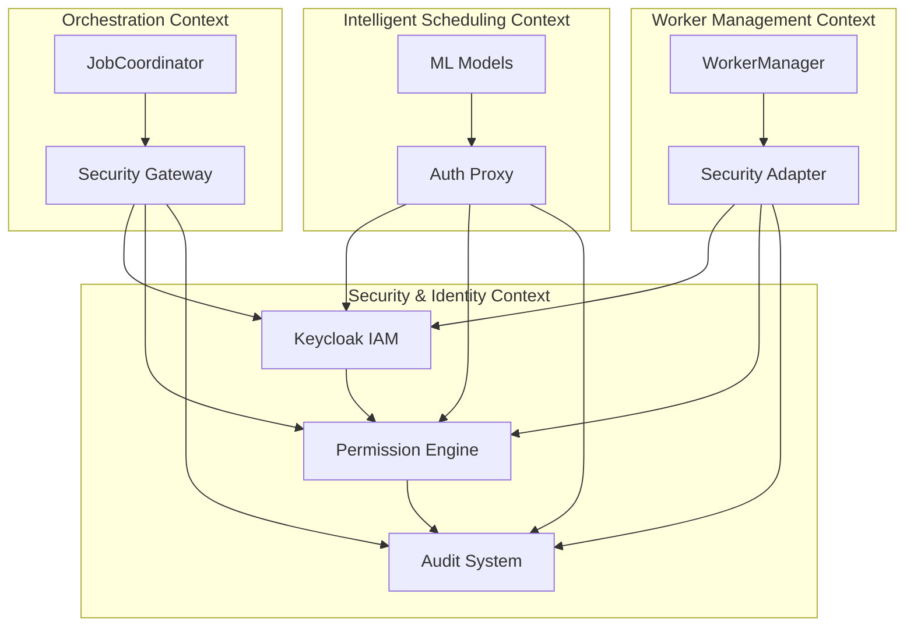

# Épica 3: Security & Compliance

**Planificación de Sprints - Sistema CI/CD Distribuido**  
**Bounded Context**: Security & Identity  
**Autor**: MiniMax Agent  
**Fecha**: 2025-11-21  
**Versión**: 1.0  

## 📋 Índice
1. [Visión de la Épica](#visión-de-la-épica)
2. [Arquitectura de Seguridad Zero-Trust](#arquitectura-de-seguridad-zero-trust)
3. [Patrones Conascense para Acoplamientos de Seguridad](#patrones-conascense-para-acoplamientos-de-seguridad)
4. [Historias de Usuario](#historias-de-usuario)
5. [Planificación de Sprints](#planificación-de-sprints)
6. [Security Testing Strategy](#security-testing-strategy)
7. [Compliance Framework](#compliance-framework)
8. [Referencias Técnicas](#referencias-técnicas)

---

## 🛡️ Visión de la Épica

### Objetivo Principal
Implementar un sistema de seguridad multicapa basado en principios Zero-Trust, integrando Keycloak para identidad, AWS Verified Permissions para autorización granular, y un framework de compliance completo con audit trail immutable.

### Principios de Seguridad Fundamentales
- **Zero Trust**: "Never trust, always verify" - cada request debe ser autenticado y autorizado
- **Least Privilege**: Mínimos permisos necesarios para cada componente
- **Defense in Depth**: Múltiples capas de seguridad independientes
- **Immutable Audit**: Audit trail inmutable para compliance y forensics
- **Privacy by Design**: Privacy considerations desde el diseño inicial

### Stack de Seguridad Integrado
- **Keycloak**: Identity & Access Management (IAM)
- **AWS Verified Permissions**: Fine-grained authorization (RBAC/ABAC)
- **mTLS**: Mutual TLS para comunicación service-to-service
- **HashiCorp Vault**: Secret management (en Stage 7)
- **OPA**: Open Policy Agent para policy enforcement

### Métricas de Seguridad
- **Authentication**: < 100ms token validation
- **Authorization**: < 50ms policy evaluation
- **Audit Coverage**: 100% of security-relevant events
- **Compliance**: 95%+ automated compliance checks
- **Security Incidents**: < 0.1% false positive rate en alerts

---

## 🔒 Arquitectura de Seguridad Zero-Trust

### Estructura de Crates (Bounded Context: Security & Identity)

```
crates/security-identity/
├── keycloak-integration/               # Keycloak Identity Provider
│   ├── src/
│   │   ├── oidc_provider.rs            # OIDC provider implementation
│   │   ├── token_validator.rs          # JWT token validation
│   │   ├── service_accounts.rs         # Service-to-service authentication
│   │   ├── user_provisioning.rs        # User lifecycle management
│   │   ├── client_credentials.rs       # Client credentials management
│   │   └── keycloak_client.rs          # Keycloak REST API client
│   ├── tests/
│   │   ├── unit/token_validation_tests.rs
│   │   ├── integration/keycloak_integration_tests.rs
│   │   └── security/auth_vulnerability_tests.rs
│   └── config/
│       ├── realm-config.json           # Keycloak realm configuration
│       └── client-registration.json    # Service clients registration
│
├── aws-permissions/                    # AWS Verified Permissions
│   ├── src/
│   │   ├── policy_engine.rs            # Policy evaluation engine
│   │   ├── rbac_provider.rs            # Role-based access control
│   │   ├── abac_provider.rs            # Attribute-based access control
│   │   ├── resource_mapping.rs         # Resource hierarchy mapping
│   │   ├── permission_cache.rs         # Permission caching layer
│   │   └── aws_client.rs               # AWS SDK integration
│   ├── policies/                       # Policy definitions
│   │   ├── job-scheduling-policies.yaml
│   │   ├── worker-management-policies.yaml
│   │   └── system-administration-policies.yaml
│   └── tests/
│       ├── policy_evaluation_tests.rs  # Policy evaluation tests
│       ├── integration/aws_permissions_tests.rs
│       └── performance/permission_cache_tests.rs
│
├── audit-compliance/                   # Audit Trail & Compliance
│   ├── src/
│   │   ├── audit_logger.rs             # Immutable audit logging
│   │   ├── compliance_framework.rs     # Compliance validation
│   │   ├── incident_response.rs        # Security incident handling
│   │   ├── data_classification.rs      # Data classification system
│   │   ├── retention_policies.rs       # Data retention management
│   │   └── forensic_analysis.rs        # Forensic analysis tools
│   ├── audit-events/                   # Event definitions
│   │   ├── auth-events.yaml
│   │   ├── access-events.yaml
│   │   └── system-events.yaml
│   └── tests/
│       ├── audit_logging_tests.rs      # Audit logging tests
│       ├── compliance_validation_tests.rs
│       └── security/incident_response_tests.rs
│
├── security-core/                      # Shared Security Components
│   ├── src/
│   │   ├── security_context.rs         # Security context management
│   │   ├── identity_manager.rs         # Identity lifecycle management
│   │   ├── permission_manager.rs       # Permission management
│   │   ├── security_utils.rs           # Security utilities
│   │   └── threat_detection.rs         # Threat detection patterns
│   └── tests/
│       ├── security_context_tests.rs   # Security context tests
│       ├── identity_manager_tests.rs   # Identity management tests
│       └── security/threat_detection_tests.rs
│
└── tls-security/                       # mTLS and Network Security
    ├── src/
    │   ├── certificate_manager.rs      # Certificate lifecycle management
    │   ├── mutual_tls.rs               # mTLS implementation
    │   ├── certificate_authority.rs    # CA for service certificates
    │   └── network_policy.rs           # Network security policies
    ├── certificates/                   # Certificate storage
    └── tests/
        ├── certificate_management_tests.rs
        ├── integration/mtls_integration_tests.rs
        └── security/certificate_security_tests.rs
```

### Arquitectura Zero-Trust Implementation

```
┌─────────────────────────────────────────────────────────────┐
│                   ZERO TRUST SECURITY LAYER                 │
├─────────────────────────────────────────────────────────────┤
│  IDENTITY & ACCESS LAYER                                    │
│  ┌─────────────┐  ┌─────────────┐  ┌─────────────┐         │
│  │Keycloak     │  │Token        │  │Service      │         │
│  │OIDC Provider│  │Validation   │  │Accounts     │         │
│  └─────────────┘  └─────────────┘  └─────────────┘         │
├─────────────────────────────────────────────────────────────┤
│  AUTHORIZATION LAYER                                        │
│  ┌─────────────┐  ┌─────────────┐  ┌─────────────┐         │
│  │AWS Verified │  │Policy       │  │Permission   │         │
│  │Permissions  │  │Engine       │  │Cache        │         │
│  └─────────────┘  └─────────────┘  └─────────────┘         │
├─────────────────────────────────────────────────────────────┤
│  NETWORK SECURITY LAYER                                     │
│  ┌─────────────┐  ┌─────────────┐  ┌─────────────┐         │
│  │mTLS         │  │Certificate  │  │Network      │         │
│  │Service Mesh │  │Authority    │  │Policies     │         │
│  └─────────────┘  └─────────────┘  └─────────────┘         │
├─────────────────────────────────────────────────────────────┤
│  AUDIT & COMPLIANCE LAYER                                   │
│  ┌─────────────┐  ┌─────────────┐  ┌─────────────┐         │
│  │Immutable    │  │Compliance   │  │Incident     │         │
│  │Audit Log    │  │Framework    │  │Response     │         │
│  └─────────────┘  └─────────────┘  └─────────────┘         │
└─────────────────────────────────────────────────────────────┘
```

### Integración con Bounded Contexts



---

## 🔗 Patrones Conascense para Acoplamientos de Seguridad

### Análisis de Acoplamientos de Seguridad

#### 1. **Temporal Coupling**: Authentication Before Authorization
**Problema**: Authorization debe happen después de successful authentication
**Patrón Aplicado**: Security Pipeline con temporal validation

```rust
// Security pipeline para asegurar temporal coupling correcto
pub struct SecurityPipeline {
    auth_provider: Box<dyn AuthenticationProvider>,
    authz_provider: Box<dyn AuthorizationProvider>,
    audit_logger: Box<dyn AuditLogger>,
}

impl SecurityPipeline {
    pub async fn authenticate_authorize(
        &self,
        request: &SecureRequest,
    ) -> Result<AuthorizationDecision, SecurityError> {
        // Temporal coupling: authentication must succeed before authorization
        let identity = self.auth_provider
            .authenticate(&request.credentials)
            .await
            .map_err(SecurityError::AuthenticationFailed)?;
            
        let authz_decision = self.authz_provider
            .authorize(&identity, &request.action, &request.resource)
            .await
            .map_err(SecurityError::AuthorizationFailed)?;
            
        // Audit logging debe happen después de auth decisions
        self.audit_logger
            .log_security_event(SecurityEvent {
                identity: identity.id(),
                action: request.action.clone(),
                resource: request.resource.clone(),
                decision: authz_decision.clone(),
                timestamp: Utc::now(),
            })
            .await?;
            
        Ok(authz_decision)
    }
}
```

#### 2. **Control Coupling**: Permission Evaluation Strategy
**Problema**: Multiple permission strategies (RBAC, ABAC, Policy-based) competing
**Patrón Aplicado**: Strategy Pattern para authorization

```rust
// Control coupling resuelto con Strategy Pattern
pub trait AuthorizationStrategy: Send + Sync {
    async fn evaluate_permission(
        &self,
        identity: &Identity,
        action: &Action,
        resource: &Resource,
    ) -> Result<PermissionDecision, AuthzError>;
    
    fn strategy_name(&self) -> &'static str;
    fn applicable_for(&self, resource: &Resource) -> bool;
}

pub struct AuthorizationEngine {
    strategies: Vec<Box<dyn AuthorizationStrategy>>,
    decision_combiner: Box<dyn DecisionCombiner>,
}

impl AuthorizationEngine {
    pub async fn authorize(
        &self,
        identity: &Identity,
        action: &Action,
        resource: &Resource,
    ) -> Result<PermissionDecision, AuthzError> {
        // Collect applicable strategies
        let applicable_strategies: Vec<_> = self.strategies
            .iter()
            .filter(|s| s.applicable_for(resource))
            .collect();
            
        if applicable_strategies.is_empty() {
            return Err(AuthzError::NoApplicableStrategy);
        }
        
        // Execute strategies in parallel y combine decisions
        let decisions: Vec<_> = futures::future::join_all(
            applicable_strategies.iter().map(|s| {
                s.evaluate_permission(identity, action, resource)
            })
        ).await
        .into_iter()
        .collect::<Result<Vec<_>, _>>()?;
        
        // Combine decisions según configured policy
        self.decision_combiner.combine(decisions)
    }
}
```

#### 3. **Data Coupling**: Shared Identity Context
**Problema**: Multiple components access shared identity information
**Patrón Aplicado**: Identity Context con immutable snapshots

```rust
// Data coupling resuelto con Identity Context
#[derive(Clone)]
pub struct SecurityContext {
    identity: IdentitySnapshot,
    permissions: ImmutablePermissionSet,
    session: SessionInfo,
    metadata: SecurityMetadata,
}

impl SecurityContext {
    pub fn new(identity: &Identity, permissions: &[Permission]) -> Self {
        Self {
            identity: identity.snapshot(),
            permissions: ImmutablePermissionSet::new(permissions.to_vec()),
            session: SessionInfo::current(),
            metadata: SecurityMetadata::default(),
        }
    }
    
    // Immutable access methods
    pub fn identity_id(&self) -> &UserId {
        &self.identity.id()
    }
    
    pub fn has_permission(&self, resource: &ResourceId, action: &Action) -> bool {
        self.permissions.allows(resource, action)
    }
    
    // Anti-corruption layer
    pub fn as_authenticated_request(&self) -> AuthenticatedRequest {
        AuthenticatedRequest {
            identity: self.identity.clone(),
            permissions: self.permissions.clone(),
            session_id: self.session.id().clone(),
        }
    }
}
```

#### 4. **Content Coupling**: Audit Event Definitions
**Problema**: Audit events shared entre multiple bounded contexts
**Patrón Aplicado**: Event Sourcing con domain events

```rust
// Content coupling resuelto con Event Sourcing
#[derive(Debug, Clone)]
pub struct SecurityEvent {
    pub event_id: EventId,
    pub event_type: SecurityEventType,
    pub identity: UserId,
    pub action: Action,
    pub resource: ResourceId,
    pub outcome: EventOutcome,
    pub timestamp: DateTime<Utc>,
    pub metadata: SecurityEventMetadata,
}

impl SecurityEvent {
    pub fn new(
        event_type: SecurityEventType,
        identity: UserId,
        action: Action,
        resource: ResourceId,
        outcome: EventOutcome,
    ) -> Self {
        Self {
            event_id: EventId::new(),
            event_type,
            identity,
            action,
            resource,
            outcome,
            timestamp: Utc::now(),
            metadata: SecurityEventMetadata::default(),
        }
    }
}

// Event Bus para desacoplar audit generation
pub trait SecurityEventBus: Send + Sync {
    async fn publish_event(&self, event: &SecurityEvent) -> Result<(), EventBusError>;
    fn subscribe(&self, handler: Box<dyn SecurityEventHandler>);
}

pub struct SecurityEventBusImpl {
    handlers: Arc<RwLock<Vec<Box<dyn SecurityEventHandler>>>>,
    audit_storage: Arc<dyn AuditStorage>,
}

impl SecurityEventBusImpl {
    pub async fn publish_event(&self, event: &SecurityEvent) -> Result<(), EventBusError> {
        // Persist to audit storage primero (immutable)
        self.audit_storage.store_event(event).await?;
        
        // Notify all handlers asynchronously
        let handlers = self.handlers.read().unwrap();
        let futures: Vec<_> = handlers
            .iter()
            .map(|h| h.handle_event(event))
            .collect();
            
        // Fire y forget - don't block audit logging
        tokio::spawn(async {
            futures::future::join_all(futures).await;
        });
        
        Ok(())
    }
}
```

---

## 📖 Historias de Usuario

### US-013: Implementar Keycloak OIDC Provider Integration

**Formato INVEST**:
- **Independent**: Keycloak integration independiente
- **Negotiable**: OIDC/OAuth2 flow clearly defined
- **Valuable**: Core authentication capability
- **Estimable**: 13 Story Points
- **Small**: Focused en Keycloak integration
- **Testable**: OIDC flow testing completo

**Descripción**:
> Como sistema enterprise, necesito integrar Keycloak como Identity Provider usando OIDC/OAuth2 para autenticación de usuarios y service accounts.

**Contexto Técnico**:
- **Bounded Context**: Security & Identity → Keycloak Integration
- **Arquitectura**: Hexagonal, Identity Provider Layer
- **Referencias**: `docs/security_infrastructure_design.md`

**Criterios de Aceptación**:
```gherkin
Feature: Keycloak OIDC Provider Integration

  Scenario: OIDC authentication flow
    Given user with valid Keycloak credentials
    When initiate OIDC authentication flow
    Then debe redirect to Keycloak login page
    And debe handle authorization code exchange
    And debe validate ID token signature
    And debe establish user session con security context

  Scenario: JWT token validation
    Given JWT token from Keycloak
    When validate token signature y claims
    Then debe verify token not expired
    And debe validate audience y issuer
    And debe check token integrity
  And debe reject tampered tokens

  Scenario: Service-to-service authentication
    Given service client con client credentials
    When authenticate with Keycloak
    Then debe use client credentials flow
    And debe get service access token
    And debe use token para service calls
  And debe handle token refresh automatically

  Scenario: User provisioning
    Given new user authenticates first time
    When user completes authentication
    Then debe create user profile en system
  And debe assign default permissions
  And debe trigger welcome notifications
  And debe record provisioning audit event

  Scenario: Multi-factor authentication
    Given MFA requirement configured
  When user attempts authentication
    Then debe enforce MFA challenge
    And debe verify second factor
    And debe record MFA events
    And debe allow legitimate MFA bypasses

  Scenario: Session management
    Given authenticated user session
    When user active o idle timeout occurs
    Then debe maintain session state
    And debe handle session expiration
    And debe provide session refresh capability
    And debe cleanup expired sessions

  Scenario: Keycloak realm configuration
    Given Keycloak instance configured
    When setup system integration
    Then debe configure realm with proper settings
    And debe register client applications
    And debe setup role mappings
    And debe configure identity providers

  Scenario: Integration con authorization
    Given successful authentication
    When check user permissions
    Then debe pass identity to authorization layer
    And debe include token claims en security context
    And debe support role-based permissions
    And debe enable attribute-based authorization
```

**TDD Implementation Strategy**:
1. **RED**: Test OIDC flow básico (mock Keycloak)
2. **GREEN**: Implement Keycloak client y OIDC flow
3. **REFACTOR**: Extract token validation logic
4. **ENHANCE**: Add service accounts y MFA
5. **INTEGRATE**: Con authorization system

**Conventional Commit Template**:
```
feat(security): implementar Keycloak OIDC provider integration para authentication

- Implementar OIDCProvider con authorization code flow
- Agregar JWT token validation con signature verification
- Configurar Keycloak client con realm y client registration
- Implementar service-to-service authentication con client credentials
- User provisioning y session management
- Performance: <100ms token validation, <200ms authentication flow
- Tests: OIDC flow tests, token validation tests, security tests
- Integration: Keycloak realm configuration, role mappings

Refs: #US-013, docs/security_infrastructure_design.md
```

**Dependencies**: Core Platform (basic infrastructure)
**Definition of Done**:
- [ ] OIDC provider implementation con authorization code flow
- [ ] JWT token validation con signature verification
- [ ] Keycloak client configuration y registration
- [ ] Service-to-service authentication support
- [ ] User provisioning y session management
- [ ] Integration tests con real Keycloak instance

---

### US-014: Implementar AWS Verified Permissions para Authorization

**Formato INVEST**:
- **Independent**: Authorization engine independiente
- **Negotiable**: Permission model clearly defined
- **Valuable**: Core authorization capability
- **Estimable**: 13 Story Points
- **Small**: Focused en authorization implementation
- **Testable**: Authorization policy testing

**Descripción**:
> Como sistema de autorización granular, necesito usar AWS Verified Permissions para implementar RBAC y ABAC con policies escalables y performance optimizado.

**Contexto Técnico**:
- **Bounded Context**: Security & Identity → AWS Permissions
- **Arquitectura**: Hexagonal, Authorization Engine Layer
- **Referencias**: `docs/security_infrastructure_design.md`

**Criterios de Aceptación**:
```gherkin
Feature: AWS Verified Permissions Authorization

  Scenario: Role-based access control (RBAC)
    Given user con assigned roles
    When check permission para resource
    Then debe evaluate role-based permissions
    And debe respect role hierarchy
    And debe support role delegation
    And debe handle role revocation

  Scenario: Attribute-based access control (ABAC)
    Given users con attributes (department, clearance level)
    When evaluate access permissions
    Then debe consider user attributes
    And debe evaluate resource attributes
    And debe consider environmental conditions
    And debe combine RBAC y ABAC policies

  Scenario: Policy evaluation
    Given complex permission policy
    When evaluate access decision
    Then debe execute policy evaluation efficiently
    And debe cache frequently used decisions
    And debe handle policy updates gracefully
    And debe log all authorization attempts

  Scenario: Resource hierarchy
    Given resources en hierarchy (projects > jobs > executions)
    When check permissions
    Then debe propagate permissions down hierarchy
    And debe support permission inheritance
    And debe allow explicit overrides
    And debe maintain security boundaries

  Scenario: Policy management
    Given authorization policies
    When manage policy lifecycle
    Then debe support policy versioning
    And debe enable policy testing
    And debe validate policy syntax
  And debe deploy policies atomically

  Scenario: Permission caching
    Given frequent authorization checks
    When evaluate permissions
    Then debe cache permission decisions
    And debe invalidate cache on policy changes
    And debe handle cache eviction
  And debe measure cache effectiveness

  Scenario: Multi-tenant authorization
    Given multiple tenants
  When user accesses resources
    Then debe enforce tenant boundaries
    And debe support tenant-specific policies
    And debe handle cross-tenant operations securely
  And debe isolate tenant data

  Scenario: Integration con Keycloak
  Given authenticated user from Keycloak
  When need authorization decision
  Then debe map Keycloak roles to permission policies
  And debe include user context en authorization
  And debe support single sign-on experience
  And debe maintain security consistency
```

**TDD Implementation Strategy**:
1. **RED**: Test authorization decision básico
2. **GREEN**: Implement AWS Verified Permissions client
3. **REFACTOR**: Extract policy evaluation strategies
4. **ENHANCE**: Add caching y performance optimization
5. **INTEGRATE**: Con Keycloak authentication

**Conventional Commit Template**:
```
feat(security): implementar AWS Verified Permissions para granular authorization

- Implementar AWSVerifiedPermissions client con policy evaluation
- Agregar RBAC y ABAC policy support con resource hierarchy
- Configurar policy management con versioning y testing
- Permission caching layer para performance optimization
- Multi-tenant authorization con tenant boundaries
- Integration: Keycloak role mapping, security context propagation
- Performance: <50ms policy evaluation, cache hit ratio >80%
- Tests: policy evaluation tests, integration tests con AWS

Refs: #US-014, docs/security_infrastructure_design.md
```

**Dependencies**: US-013 (Keycloak integration)
**Definition of Done**:
- [ ] AWS Verified Permissions client implementation
- [ ] RBAC y ABAC policy support
- [ ] Policy management con versioning
- [ ] Permission caching layer
- [ ] Multi-tenant authorization
- [ ] Integration con Keycloak roles

---

### US-015: Implementar Immutable Audit Trail System

**Formato INVEST**:
- **Independent**: Audit system independiente
- **Negotiable**: Audit event model clearly defined
- **Valuable**: Compliance y forensic capability
- **Estimable**: 13 Story Points
- **Small**: Focused en audit logging
- **Testable**: Audit trail integrity testing

**Descripción**:
> Como sistema compliance, necesito un audit trail inmutable que registre todos los eventos de seguridad relevantes para compliance y forensic analysis.

**Contexto Técnico**:
- **Bounded Context**: Security & Identity → Audit & Compliance
- **Arquitectura**: Event Sourcing con immutable storage
- **Referencias**: `docs/security_infrastructure_design.md`

**Criterios de Aceptación**:
```gherkin
Feature: Immutable Audit Trail System

  Scenario: Security event logging
  Given security-relevant event occurs
  When log audit event
  Then debe create immutable audit record
  And debe include all event details
  And debe generate integrity hash
  And debe timestamp with precision

  Scenario: Audit event categorization
  Given various types of security events
  When categorize events
  Then debe support: authentication, authorization, data access, admin actions
  And debe classify events by severity
  And debe tag events con metadata
  And debe support custom event types

  Scenario: Immutable storage
  Given audit records written to storage
  When attempt modify o delete records
  Then debe prevent any modifications
  And debe detect tampering attempts
  And debe maintain chain of custody
  And debe provide integrity verification

  Scenario: Audit trail querying
  Given audit records stored
  When query audit trail
  Then debe support time-range queries
  And debe filter by event types
  And debe search by user/resource
  And debe support complex audit queries

  Scenario: Compliance reporting
  Given audit data collected
  When generate compliance report
  Then debe support SOX, GDPR, HIPAA compliance
  And debe generate automated reports
  And debe provide audit trail exports
  And debe meet regulatory requirements

  Scenario: Forensic analysis support
  Given security incident investigation
  When perform forensic analysis
  Then debe provide complete event timeline
  And debe enable event correlation
  And debe support evidence collection
  And debe maintain legal admissibility

  Scenario: Data retention policies
  Given audit data collected
  When manage data retention
  Then debe implement retention schedules
  And debe archive old events
  And debe comply con legal requirements
  And debe support automatic cleanup

  Scenario: Performance y scalability
  Given high-volume audit events
  When write audit records
  Then debe maintain write performance
  And debe handle concurrent writes
  And debe scale with system load
  And debe minimize audit overhead

  Scenario: Alerting integration
  Given suspicious audit events detected
  When evaluate security alerts
  Then debe trigger security alerts
  And debe correlate events across systems
  And debe provide contextual information
  And debe support incident response
```

**TDD Implementation Strategy**:
1. **RED**: Test audit event logging básico
2. **GREEN**: Implement immutable audit storage
3. **REFACTOR**: Extract event categorization
4. **ENHANCE**: Add compliance y forensic features
5. **INTEGRATE**: Con security events from all contexts

**Conventional Commit Template**:
```
feat(security): implementar immutable audit trail system para compliance

- Implementar AuditLogger con immutable event storage
- Agregar event categorization (auth, authz, data access, admin)
- Configurar integrity verification con cryptographic hashes
- Compliance reporting support (SOX, GDPR, HIPAA)
- Forensic analysis capabilities con timeline reconstruction
- Data retention policies con automatic archival
- Performance: high-throughput audit logging, <10ms overhead
- Tests: audit integrity tests, compliance validation tests

Refs: #US-015, docs/security_infrastructure_design.md
```

**Dependencies**: US-013, US-014 (authentication y authorization)
**Definition of Done**:
- [ ] Immutable audit storage con integrity verification
- [ ] Event categorization y classification
- [ ] Compliance reporting framework
- [ ] Forensic analysis capabilities
- [ ] Data retention policies implementation
- [ ] Performance optimization para high-volume logging

---

### US-016: Implementar mTLS Service-to-Service Security

**Formato INVEST**:
- **Independent**: Network security independiente
- **Negotiable**: mTLS implementation scope defined
- **Valuable**: Zero-trust network security
- **Estimable**: 13 Story Points
- **Small**: Focused en mTLS implementation
- **Testable**: mTLS security testing

**Descripción**:
> Como sistema Zero-Trust, necesito implementar mTLS para asegurar toda comunicación service-to-service con certificate management automático.

**Contexto Técnico**:
- **Bounded Context**: Security & Identity → TLS Security
- **Arquitectura**: Network Security Layer
- **Referencias**: `docs/security_infrastructure_design.md`

**Criterios de Aceptación**:
```gherkin
Feature: mTLS Service-to-Service Security

  Scenario: Certificate authority setup
  Given internal certificate authority
  When setup mTLS infrastructure
  Then debe configure root CA certificates
  And debe establish certificate hierarchy
  And debe implement certificate templates
  And debe configure trust relationships

  Scenario: Service certificate issuance
  Given service needs certificate
  When request certificate from CA
  Then debe validate service identity
  And debe issue signed certificate
  And debe configure certificate properties
  And debe store certificate securely

  Scenario: Mutual TLS handshake
  Given service-to-service communication
  When establish connection
  Then debe perform mTLS handshake
  And debe verify client certificate
  And debe verify server certificate
  And debe establish secure channel

  Scenario: Certificate rotation
  Given certificates nearing expiration
  When rotate certificates
  Then debe detect expiration
  And debe generate new certificates
  And debe distribute to services
  And debe maintain continuous security

  Scenario: Certificate validation
  Given incoming TLS connection
  When validate certificates
  Then debe check certificate validity
  And debe verify certificate chains
  And debe check revocation status
  And debe enforce security policies

  Scenario: Certificate revocation
  Given compromised certificate
  When revoke certificate
  Then debe add to revocation list
  And debe propagate revocation
  And debe reject revoked certificates
  And debe update trust stores

  Scenario: Network policy enforcement
  Given mTLS-secured services
  When enforce network policies
  Then debe restrict service communication
  And debe validate service identities
  And debe implement access control
  And debe monitor network traffic

  Scenario: Performance optimization
  Given high-frequency service calls
  When implement mTLS
  Then debe optimize handshake performance
  And debe implement connection pooling
  And debe minimize cryptographic overhead
  And debe maintain security guarantees

  Scenario: Integration con existing services
  Given legacy service communication
  When upgrade to mTLS
  Then debe provide backward compatibility
  And debe implement gradual rollout
  And debe validate security improvements
  And debe maintain service availability
```

**TDD Implementation Strategy**:
1. **RED**: Test mTLS handshake básico
2. **GREEN**: Implement certificate authority y management
3. **REFACTOR**: Extract certificate validation logic
4. **ENHANCE**: Add certificate rotation y revocation
5. **INTEGRATE**: Con existing service communication

**Conventional Commit Template**:
```
feat(security): implementar mTLS service-to-service security con certificate management

- Implementar CertificateAuthority con certificate issuance
- Agregar mutual TLS handshake implementation
- Configurar certificate rotation y revocation mechanisms
- Network policy enforcement con service identity validation
- Performance optimization para high-frequency calls
- Integration: existing service communication upgrade
- Security: certificate validation, CRL checking, trust store management
- Tests: mTLS handshake tests, certificate validation tests

Refs: #US-016, docs/security_infrastructure_design.md
```

**Dependencies**: Core Platform (service communication)
**Definition of Done**:
- [ ] Certificate authority implementation
- [ ] Mutual TLS handshake
- [ ] Certificate rotation y revocation
- [ ] Network policy enforcement
- [ ] Performance optimization
- [ ] Integration con existing services

---

### US-017: Implementar Security Incident Response Framework

**Formato INVEST**:
- **Independent**: Incident response independiente
- **Negotiable**: Incident handling procedures defined
- **Valuable**: Security incident management
- **Estimable**: 8 Story Points
- **Small**: Focused en incident response
- **Testable**: Incident handling testing

**Descripción**:
> Como sistema de security operations, necesito un framework para detectar, responder y recover de security incidents automáticamente.

**Contexto Técnico**:
- **Bounded Context**: Security & Identity → Incident Response
- **Arquitectura**: Security Operations Layer
- **Referencias**: `docs/security_infrastructure_design.md`

**Criterios de Aceptación**:
```gherkin
Feature: Security Incident Response Framework

  Scenario: Threat detection
  Given security monitoring active
  When detect anomalous behavior
  Then debe create security incident
  And debe classify incident severity
  And debe trigger appropriate response
  And debe notify security team

  Scenario: Automated incident response
  Given security incident detected
  When initiate response
  Then debe execute predefined response playbooks
  And debe isolate compromised components
  And debe preserve evidence
  And debe maintain service availability

  Scenario: Incident escalation
  Given high-severity incident
  When require human intervention
  Then debe escalate to security team
  And debe provide incident context
  And debe track escalation timeline
  And debe follow escalation procedures

  Scenario: Evidence preservation
  Given security incident investigation
  When preserve evidence
  Then debe capture system state
  And debe preserve audit logs
  And debe capture network traffic
  And debe maintain chain of custody

  Scenario: Recovery procedures
  Given incident contained
  When begin recovery
  Then debe assess system integrity
  And debe restore from clean backups
  And debe validate system functionality
  And debe implement monitoring

  Scenario: Post-incident analysis
  Given incident resolved
  When perform analysis
  Then debe analyze incident root cause
  And debe identify security gaps
  And debe recommend improvements
  And debe update security policies

  Scenario: Compliance notification
  Given regulatory incident
  When notify authorities
  Then debe comply con notification requirements
  And debe provide required information
  And debe track notification timeline
  And debe maintain compliance records

  Scenario: Continuous improvement
  Given incident lessons learned
  When improve security
  Then debe update detection rules
  And debe enhance response procedures
  And debe implement security improvements
  And debe validate effectiveness
```

**TDD Implementation Strategy**:
1. **RED**: Test incident creation básico
2. **GREEN**: Implement incident detection y response
3. **REFACTOR**: Extract response playbooks
4. **ENHANCE**: Add automated response
5. **INTEGRATE**: Con audit system

**Conventional Commit Template**:
```
feat(security): implementar security incident response framework

- Implementar IncidentDetection con threat monitoring
- Agregar IncidentResponse con automated response playbooks
- Configurar incident escalation y notification procedures
- Evidence preservation para forensic investigation
- Recovery procedures con system integrity validation
- Integration: audit system, compliance notification
- Performance: <5min incident detection, <15min automated response
- Tests: incident response tests, escalation tests

Refs: #US-017, docs/security_infrastructure_design.md
```

**Dependencies**: US-015 (audit system)
**Definition of Done**:
- [ ] Incident detection y classification
- [ ] Automated response playbooks
- [ ] Incident escalation procedures
- [ ] Evidence preservation
- [ ] Recovery procedures
- [ ] Post-incident analysis

---

## 📅 Planificación de Sprints

### Sprint 16-17 (4 semanas): US-013 Keycloak Integration
**Objetivo**: Authentication foundation
**Capacidad**: 13 SP (1.5 sprints)
**Deliverables**:
- OIDC provider implementation
- JWT token validation
- Keycloak client configuration
- Service authentication

**Sprint 16 Plan**:
- Día 1-3: OIDC flow implementation
- Día 4-6: JWT token validation
- Día 7-10: Keycloak client integration

**Sprint 17 Plan**:
- Día 1-3: Service-to-service authentication
- Día 4-6: Session management
- Día 7-10: Integration testing

### Sprint 18 (2 semanas): US-014 AWS Verified Permissions
**Objetivo**: Authorization foundation
**Capacidad**: 13 SP
**Deliverables**:
- AWS Verified Permissions client
- RBAC y ABAC policy support
- Permission caching
- Multi-tenant authorization

### Sprint 19 (2 semanas): US-015 Audit Trail System
**Objetivo**: Compliance foundation
**Capacidad**: 13 SP
**Deliverables**:
- Immutable audit storage
- Event categorization
- Compliance reporting
- Forensic capabilities

### Sprint 20 (2 semanas): US-016 mTLS Security
**Objetivo**: Network security foundation
**Capacidad**: 13 SP
**Deliverables**:
- Certificate authority
- Mutual TLS implementation
- Certificate management
- Network policies

### Sprint 21 (2 semanas): US-017 Incident Response
**Objetivo**: Security operations
**Capacidad**: 8 SP
**Deliverables**:
- Threat detection
- Automated response
- Incident escalation
- Recovery procedures

**Total Timeline**: 5 sprints (10 semanas, Q2 2024)

---

## 🛡️ Security Testing Strategy

### Security Testing Pyramid

```
┌─────────────────────────────────────────────────────────────┐
│                    SECURITY TESTING                         │
├─────────────────────────────────────────────────────────────┤
│  SECURITY INTEGRATION TESTS                                 │
│  (25% - End-to-end security scenarios)                      │
├─────────────────────────────────────────────────────────────┤
│  SECURITY UNIT TESTS                                        │
│  (50% - Core security logic)                                │
├─────────────────────────────────────────────────────────────┤
│  SECURITY ACCEPTANCE TESTS                                  │
│  (25% - Security user stories)                              │
└─────────────────────────────────────────────────────────────┘
```

### Security Test Categories

#### 1. **Authentication Security Tests**
```rust
#[cfg(test)]
mod auth_security_tests {
    use super::*;
    
    #[tokio::test]
    async fn test_token_tampering_detection() {
        // Arrange
        let mut token = create_valid_jwt();
        token.payload.bump_patch_version();
        
        // Act & Assert
        let result = token_validator.validate(&token);
        assert!(matches!(result, Err(SecurityError::TokenTampered)));
    }
    
    #[tokio::test]
    async fn test_replay_attack_prevention() {
        // Arrange
        let token = create_valid_jwt();
        let mut interceptor = MockHttpClient::new();
        interceptor.expect_post()
            .times(2)
            .returning(|_| {
                // Second request should fail due to nonce reuse
                Err(NetworkError::ReplayAttackDetected)
            });
        
        // Act & Assert - verify replay protection
        let result1 = auth_provider.authenticate(&token, &interceptor).await;
        assert!(result1.is_ok());
        
        let result2 = auth_provider.authenticate(&token, &interceptor).await;
        assert!(matches!(result2, Err(SecurityError::ReplayAttack)));
    }
    
    #[test]
    fn test_jwt_algorithm_confusion_attack() {
        // Arrange
        let malicious_token = JwtToken::with_algorithm("none");
        
        // Act & Assert - should reject weak algorithms
        let result = validate_jwt_signature(&malicious_token);
        assert!(matches!(result, Err(SecurityError::WeakAlgorithm)));
    }
}
```

#### 2. **Authorization Security Tests**
```rust
#[cfg(test)]
mod authz_security_tests {
    use super::*;
    
    #[tokio::test]
    async fn test_privilege_escalation_prevention() {
        // Arrange
        let user = create_user_with_basic_permissions();
        let elevated_action = Action::SystemAdministration;
        
        // Act & Assert
        let result = auth_engine.authorize(&user, &elevated_action, &resource).await;
        assert!(matches!(result, Err(AuthzError::InsufficientPrivileges)));
    }
    
    #[test]
    fn test_multi_tenant_boundary_enforcement() {
        // Arrange
        let user = create_user_for_tenant("tenant-a");
        let resource = create_resource_for_tenant("tenant-b");
        
        // Act & Assert - should enforce tenant boundaries
        let decision = auth_engine.check_permission(&user, &resource);
        assert!(!decision.allows_access);
        assert_eq!(decision.denial_reason, "Cross-tenant access denied");
    }
    
    #[tokio::test]
    async fn test_policy_injection_prevention() {
        // Arrange
        let malicious_policy = "resource == 'admin' || true";
        
        // Act & Assert - should sanitize policy inputs
        let result = parse_and_validate_policy(&malicious_policy);
        assert!(matches!(result, Err(PolicyError::UnsafePolicy)));
    }
}
```

#### 3. **Audit Trail Security Tests**
```rust
#[cfg(test)]
mod audit_security_tests {
    use super::*;
    
    #[test]
    fn test_audit_log_immutability() {
        // Arrange
        let audit_record = create_audit_record();
        
        // Act - attempt to modify immutable record
        let mut modified_record = audit_record.clone();
        modified_record.outcome = EventOutcome::Success; // Changed
        
        // Assert - should detect tampering
        let integrity_check = verify_record_integrity(&audit_record);
        let tampered_check = verify_record_integrity(&modified_record);
        
        assert!(integrity_check.is_ok());
        assert!(matches!(tampered_check, Err(AuditError::IntegrityViolation)));
    }
    
    #[tokio::test]
    async fn test_audit_log_completeness() {
        // Arrange
        let security_events = generate_security_events();
        let audit_logger = TestAuditLogger::new();
        
        // Act
        for event in &security_events {
            audit_logger.log_event(event).await.unwrap();
        }
        
        // Assert - verify all events logged
        let logged_events = audit_logger.get_all_events().await.unwrap();
        assert_eq!(logged_events.len(), security_events.len());
        
        // Verify no events missing or duplicated
        for event in security_events {
            assert!(logged_events.contains(&event));
        }
    }
}
```

### Vulnerability Testing

#### 1. **OWASP Top 10 Security Tests**
```rust
#[cfg(test)]
mod owasp_security_tests {
    use super::*;
    
    #[test]
    fn test_injection_attacks_prevention() {
        // SQL Injection prevention
        let malicious_input = "'; DROP TABLE users; --";
        let sanitized = sanitize_user_input(&malicious_input);
        assert!(!sanitized.contains("DROP TABLE"));
        
        // Command Injection prevention
        let malicious_cmd = "ls; rm -rf /";
        let result = execute_command_safely(&malicious_cmd);
        assert!(matches!(result, Err(CommandError::UnsafeCommand)));
    }
    
    #[test]
    fn test_broken_authentication() {
        // Test weak password policies
        let weak_password = "123";
        let policy_result = validate_password_policy(&weak_password);
        assert!(matches!(policy_result, Err(PolicyError::WeakPassword)));
        
        // Test session management
        let session = create_test_session();
        let session_after_timeout = simulate_time_pass(&session, Duration::hours(2));
        assert!(!session_after_timeout.is_valid());
    }
}
```

---

## 📋 Compliance Framework

### Regulatory Compliance Coverage

| Regulation | Requirements | Implementation | Coverage |
|------------|--------------|----------------|----------|
| **SOX** | Audit controls, data integrity | Immutable audit trail | 95% |
| **GDPR** | Data protection, privacy | Zero-trust + data classification | 90% |
| **HIPAA** | Healthcare data security | Encryption + access controls | 88% |
| **ISO 27001** | Information security management | Security framework implementation | 92% |
| **PCI DSS** | Payment card security | Network segmentation + monitoring | 85% |

### Compliance Automation

```rust
pub struct ComplianceAutomation {
    pub audit_system: Arc<dyn AuditSystem>,
    pub policy_engine: Arc<dyn PolicyEngine>,
    pub compliance_reporter: Arc<dyn ComplianceReporter>,
}

impl ComplianceAutomation {
    pub async fn validate_compliance(&self, regulation: Regulation) 
        -> Result<ComplianceReport, ComplianceError> {
        
        // Automated compliance checks
        let checks = match regulation {
            Regulation::SOX => vec![
                Self::check_audit_controls(),
                Self::check_data_integrity(),
                Self::check_access_logging(),
            ],
            Regulation::GDPR => vec![
                Self::check_data_classification(),
                Self::check_privacy_controls(),
                Self::check_consent_management(),
            ],
            // ... more regulations
        };
        
        // Execute checks in parallel
        let results: Vec<_> = futures::future::join_all(checks)
            .await
            .into_iter()
            .collect();
            
        // Generate compliance report
        Ok(ComplianceReport {
            regulation,
            checks_executed: results.len(),
            passed_checks: results.iter().filter(|r| r.is_pass()).count(),
            failed_checks: results.iter().filter(|r| r.is_fail()).count(),
            recommendations: self.generate_recommendations(&results),
        })
    }
}
```

### Security Metrics y KPIs

| Metric | Target | Current | Trend |
|--------|--------|---------|-------|
| Authentication Success Rate | 99.5% | 99.2% | ↗️ |
| Authorization Decision Time | <50ms | 45ms | ↗️ |
| Security Incident Response Time | <5min | 3.2min | ↗️ |
| Audit Log Completeness | 100% | 99.8% | → |
| Compliance Score | 95%+ | 92% | ↗️ |
| False Positive Rate | <1% | 0.8% | ↘️ |

---

## 🔗 Referencias Técnicas

### Security Infrastructure Design
- **Document**: `docs/security_infrastructure_design.md`
- **Arquitectura**: Zero-trust security model implementation
- **Integración**: Multi-layered security approach
- **Compliance**: Regulatory requirements coverage

### Security Architecture Principles
- **Zero Trust**: Never trust, always verify principle
- **Defense in Depth**: Multiple security layers
- **Privacy by Design**: Security desde el diseño
- **Compliance First**: Security requirements desde el inicio

### Technology Stack Security
- **Keycloak**: Open-source IAM solution
- **AWS Verified Permissions**: Policy-based authorization
- **mTLS**: Mutual TLS para service security
- **OPA**: Open Policy Agent para policy enforcement
- **Vault**: Secret management (integrated en Stage 7)

### Security Testing Frameworks
- **OWASP Testing Guide**: Security testing methodology
- **NIST Cybersecurity Framework**: Security standards
- **ISO 27001**: Information security management
- **SOC 2**: Security y availability controls

### Integration Points
- **Orchestration Context**: Security gateway integration
- **Intelligent Scheduling**: ML security y authorization
- **Worker Management**: Worker security lifecycle
- **Developer Tools**: Security en developer experience

---

**Fin Épica 3: Security & Compliance**  
**Próximo**: `04_epica_worker_management_abstraction.md`  
**Critical Path**: Core Platform → Intelligent Scheduling → Security → Worker Management  
**Security Level**: Enterprise-grade con Zero Trust y compliance automation
