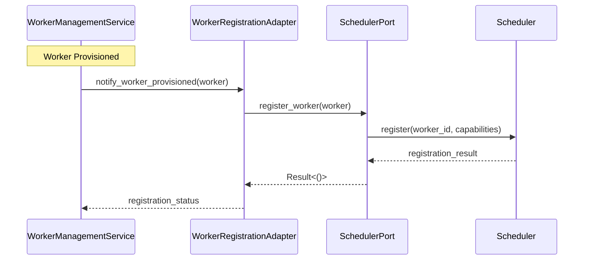

# User Story US-08.1.2: WorkerRegistrationAdapter Implementation

## 📋 Story Information

- **Story ID**: US-08.1.2
- **Epic**: EPIC-08 - Resource Pool Architecture Implementation
- **Sub-EPIC**: 08.1 - Auto-Registration System
- **Priority**: High
- **Estimated Effort**: 3 days
- **Dependencies**: US-08.1.1 (SchedulerPort Interface)
- **Assigned To**: Core Platform Team

---

## 🎯 Story Description

As a **Developer**, I want to **implement the WorkerRegistrationAdapter** so that **workers can automatically register themselves with the Scheduler after being provisioned**, enabling seamless integration between the WorkerManagementService and Scheduler.

---

## 📖 Context

After defining the SchedulerPort interface (US-08.1.1), we need to create the concrete implementation that will bridge our WorkerManagementService with the existing Scheduler. The WorkerRegistrationAdapter will:

1. Convert worker provisioning events into scheduler registration calls
2. Handle registration failures with exponential backoff retry logic
3. Support both static and dynamic worker registration
4. Implement timeout handling for slow scheduler responses
5. Provide observability for registration operations

### System Context



---

## ✅ Acceptance Criteria

### AC-1: WorkerRegistrationAdapter Structure
- [ ] WorkerRegistrationAdapter struct implements WorkerRegistrationPort trait
- [ ] Takes SchedulerPort and configuration (retries, timeout) in constructor
- [ ] Implements `register_worker()` method with proper error handling
- [ ] Implements `register_workers_batch()` for bulk registration
- [ ] Implements `unregister_worker()` for cleanup

### AC-2: Registration Logic
- [ ] Single worker registration attempts max 3 retries with exponential backoff
- [ ] Batch registration supports parallel execution with configurable concurrency
- [ ] Registration timeout configurable (default: 30 seconds)
- [ ] Failed registrations logged with context (worker_id, error_type, attempt_count)
- [ ] Successful registrations logged with duration metrics

### AC-3: Worker Type Support
- [ ] Support registration of static workers (pre-provisioned)
- [ ] Support registration of dynamic workers (on-demand)
- [ ] Extract and submit worker capabilities (CPU, memory, docker_enabled, etc.)
- [ ] Set worker metadata (namespace, labels, tags)
- [ ] Handle worker lifecycle events (provisioned, ready, terminated)

### AC-4: Error Handling
- [ ] Network errors: retry with backoff, fail after max attempts
- [ ] Scheduler unavailable: log warning, return retryable error
- [ ] Invalid worker data: log error, return permanent failure
- [ ] Timeout: return timeout error with partial context
- [ ] All errors mapped to custom error type: RegistrationError

### AC-5: Metrics & Observability
- [ ] Track registration attempts (total, success, failure)
- [ ] Track registration duration histogram
- [ ] Track retry count distribution
- [ ] Track failure rate by error type
- [ ] Export Prometheus metrics: `worker_registration_operations_total`, `worker_registration_duration_seconds`

---

## 🛠️ Implementation Details

### Architecture

#### File Location
`crates/adapters/src/worker_registration.rs`

#### Dependencies
```toml
[dependencies]
# Existing
hodei-ports = { path = "../ports" }
tokio = { version = "1.x", features = ["time"] }
tracing = "0.1"
thiserror = "1.0"
prometheus = "0.13"
```

#### Core Types

```rust
/// Configuration for WorkerRegistrationAdapter
#[derive(Debug, Clone)]
pub struct RegistrationConfig {
    pub max_retries: u32,
    pub base_backoff: Duration,
    pub registration_timeout: Duration,
    pub batch_concurrency: usize,
}

impl Default for RegistrationConfig {
    fn default() -> Self {
        Self {
            max_retries: 3,
            base_backoff: Duration::from_millis(100),
            registration_timeout: Duration::from_secs(30),
            batch_concurrency: 10,
        }
    }
}

/// Custom error types for registration operations
#[derive(Debug, thiserror::Error)]
pub enum RegistrationError {
    #[error("Scheduler unavailable: {0}")]
    SchedulerUnavailable(#[from] tonic::Status),

    #[error("Worker registration timeout after {0:?}")]
    Timeout(Duration),

    #[error("Invalid worker configuration: {0}")]
    InvalidWorker(String),

    #[error("Max retries exceeded: {attempts} attempts")]
    MaxRetriesExceeded { attempts: u32 },

    #[error("Unexpected error: {0}")]
    Unexpected(#[from] Box<dyn std::error::Error + Send + Sync>),
}
```

#### WorkerRegistrationAdapter Implementation

```rust
/// Adapter that registers workers with the Scheduler
#[derive(Debug)]
pub struct WorkerRegistrationAdapter<T>
where
    T: SchedulerPort,
{
    scheduler: T,
    config: RegistrationConfig,
    metrics: RegistrationMetrics,
}

impl<T> WorkerRegistrationAdapter<T>
where
    T: SchedulerPort,
{
    /// Create new adapter with scheduler client
    pub fn new(scheduler: T, config: RegistrationConfig) -> Self {
        Self {
            scheduler,
            config,
            metrics: RegistrationMetrics::new(),
        }
    }

    /// Register a single worker with automatic retry
    pub async fn register_worker(
        &self,
        worker: &DynamicWorker,
    ) -> Result<(), RegistrationError> {
        let worker_id = worker.id();
        let attempt = 0;

        loop {
            match self.do_register_worker(worker).await {
                Ok(_) => {
                    self.metrics.record_success();
                    tracing::info!(
                        worker_id = %worker_id,
                        attempt = attempt + 1,
                        "Worker registered successfully"
                    );
                    return Ok(());
                }
                Err(error) => {
                    self.metrics.record_failure(&error);

                    if attempt >= self.config.max_retries {
                        tracing::error!(
                            worker_id = %worker_id,
                            error = %error,
                            attempts = attempt + 1,
                            "Failed to register worker after max retries"
                        );
                        return Err(RegistrationError::MaxRetriesExceeded {
                            attempts: attempt + 1,
                        });
                    }

                    let backoff_duration = self.calculate_backoff(attempt);
                    tracing::warn!(
                        worker_id = %worker_id,
                        error = %error,
                        attempt = attempt + 1,
                        backoff_duration = ?backoff_duration,
                        "Worker registration failed, retrying"
                    );

                    tokio::time::sleep(backoff_duration).await;
                }
            }
        }
    }

    /// Register multiple workers in batch
    pub async fn register_workers_batch(
        &self,
        workers: Vec<DynamicWorker>,
    ) -> Vec<Result<(), RegistrationError>> {
        let semaphore = std::sync::Arc::new(tokio::sync::Semaphore::new(self.config.batch_concurrency));

        let mut tasks = Vec::with_capacity(workers.len());
        for worker in workers {
            let semaphore = semaphore.clone();
            let adapter = self;
            tasks.push(tokio::spawn(async move {
                let _permit = semaphore.acquire().await.unwrap();
                adapter.register_worker(&worker).await
            }));
        }

        futures::future::join_all(tasks).await
            .into_iter()
            .map(|result| match result {
                Ok(Ok(())) => Ok(()),
                Ok(Err(e)) => Err(e),
                Err(e) => Err(RegistrationError::Unexpected(Box::new(e))),
            })
            .collect()
    }

    /// Unregister a worker from scheduler
    pub async fn unregister_worker(
        &self,
        worker_id: &str,
    ) -> Result<(), RegistrationError> {
        self.scheduler
            .unregister_worker(worker_id)
            .await
            .map_err(|e| {
                self.metrics.record_failure(&RegistrationError::from(e));
                RegistrationError::from(e)
            })?;

        tracing::info!(worker_id = %worker_id, "Worker unregistered");
        Ok(())
    }

    /// Internal registration without retry
    async fn do_register_worker(
        &self,
        worker: &DynamicWorker,
    ) -> Result<(), RegistrationError> {
        let timeout_duration = self.config.registration_timeout;

        let register_future = async {
            let capabilities = self.extract_capabilities(worker);
            let metadata = self.extract_metadata(worker);

            self.scheduler
                .register_worker(worker.id(), capabilities, metadata)
                .await
        };

        tokio::time::timeout(timeout_duration, register_future)
            .await
            .map_err(|_| RegistrationError::Timeout(timeout_duration))?
            .map_err(RegistrationError::from)
    }

    /// Extract worker capabilities for scheduler
    fn extract_capabilities(&self, worker: &DynamicWorker) -> WorkerCapabilities {
        WorkerCapabilities {
            cpu_cores: worker.config.cpu_cores(),
            memory_mb: worker.config.memory_mb(),
            docker_enabled: worker.config.docker_enabled(),
            custom_resources: worker.config.custom_resources().clone(),
        }
    }

    /// Extract worker metadata for scheduler
    fn extract_metadata(&self, worker: &DynamicWorker) -> WorkerMetadata {
        WorkerMetadata {
            worker_type: worker.worker_type(),
            namespace: worker.namespace(),
            labels: worker.labels().clone(),
            tags: worker.tags().clone(),
            provision_timestamp: worker.created_at(),
        }
    }

    /// Calculate exponential backoff duration
    fn calculate_backoff(&self, attempt: u32) -> Duration {
        let base = self.config.base_backoff;
        let exp = 2u64.pow(attempt);
        base * exp
    }
}
```

#### Metrics Implementation

```rust
/// Prometheus metrics for worker registration
#[derive(Debug, Clone)]
pub struct RegistrationMetrics {
    operations_total: CounterVec,
    duration_seconds: HistogramVec,
    retry_count: HistogramVec,
}

impl RegistrationMetrics {
    pub fn new() -> Self {
        let operations_total = CounterVec::new(
            Opts::new(
                "worker_registration_operations_total",
                "Total number of worker registration operations",
            ),
            &["result", "worker_type"],
        ).unwrap();

        let duration_seconds = HistogramVec::new(
            HistogramOpts::new(
                "worker_registration_duration_seconds",
                "Duration of worker registration operations",
            )
            .buckets(vec![0.1, 0.5, 1.0, 2.5, 5.0, 10.0]),
            &["worker_type"],
        ).unwrap();

        let retry_count = HistogramVec::new(
            HistogramOpts::new(
                "worker_registration_retry_count",
                "Number of retries per registration attempt",
            )
            .buckets(vec![0.0, 1.0, 2.0, 3.0, 5.0]),
            &["worker_type"],
        ).unwrap();

        Self {
            operations_total,
            duration_seconds,
            retry_count,
        }
    }

    pub fn record_success(&self) {
        self.operations_total.with_label_values(&["success", "dynamic"]).inc();
    }

    pub fn record_failure(&self, error: &RegistrationError) {
        let error_type = match error {
            RegistrationError::SchedulerUnavailable(_) => "scheduler_unavailable",
            RegistrationError::Timeout(_) => "timeout",
            RegistrationError::InvalidWorker(_) => "invalid_worker",
            RegistrationError::MaxRetriesExceeded { .. } => "max_retries",
            RegistrationError::Unexpected(_) => "unexpected",
        };
        self.operations_total.with_label_values(&["failure", error_type]).inc();
    }

    pub fn record_duration(&self, duration: Duration, worker_type: &str) {
        self.duration_seconds
            .with_label_values(&[worker_type])
            .observe(duration.as_secs_f64());
    }

    pub fn record_retry(&self, count: u32, worker_type: &str) {
        self.retry_count.with_label_values(&[worker_type]).observe(count as f64);
    }
}
```

---

## 🧪 Test Cases

### Unit Tests

```rust
#[cfg(test)]
mod tests {
    use super::*;
    use crate::scheduler::MockSchedulerPort;

    #[tokio::test]
    async fn test_register_worker_success() {
        let mut mock_scheduler = MockSchedulerPort::new();
        mock_scheduler
            .expect_register_worker()
            .times(1)
            .returning(|_, _, _| Ok(()));

        let adapter = WorkerRegistrationAdapter::new(mock_scheduler, RegistrationConfig::default());
        let worker = create_test_worker();

        let result = adapter.register_worker(&worker).await;

        assert!(result.is_ok());
    }

    #[tokio::test]
    async fn test_register_worker_retry_on_failure() {
        let mut mock_scheduler = MockSchedulerPort::new();
        mock_scheduler
            .expect_register_worker()
            .times(4) // Initial attempt + 3 retries
            .returning(|_, _, _| Err(tonic::Status::unavailable("unavailable")));

        let adapter = WorkerRegistrationAdapter::new(mock_scheduler, RegistrationConfig::default());
        let worker = create_test_worker();

        let result = adapter.register_worker(&worker).await;

        assert!(matches!(result, Err(RegistrationError::MaxRetriesExceeded { .. })));
    }

    #[tokio::test]
    async fn test_register_worker_timeout() {
        let mut mock_scheduler = MockSchedulerPort::new();
        mock_scheduler
            .expect_register_worker()
            .times(1)
            .returning(|_, _, _| {
                tokio::time::sleep(Duration::from_secs(10)).await;
                Ok(())
            });

        let adapter = WorkerRegistrationAdapter::new(mock_scheduler, RegistrationConfig::default());
        let worker = create_test_worker();

        let result = tokio::time::timeout(Duration::from_secs(1), adapter.register_worker(&worker))
            .await;

        assert!(result.is_err());
    }

    #[tokio::test]
    async fn test_batch_registration_concurrency() {
        let mut mock_scheduler = MockSchedulerPort::new();
        mock_scheduler
            .expect_register_worker()
            .times(10)
            .returning(|_, _, _| Ok(()));

        let adapter = WorkerRegistrationAdapter::new(
            mock_scheduler,
            RegistrationConfig {
                batch_concurrency: 5,
                ..Default::default()
            },
        );

        let workers = (0..10).map(|_| create_test_worker()).collect();
        let results = adapter.register_workers_batch(workers).await;

        assert_eq!(results.len(), 10);
        assert!(results.into_iter().all(|r| r.is_ok()));
    }

    #[tokio::test]
    async fn test_calculate_backoff() {
        let config = RegistrationConfig::default();
        let adapter = WorkerRegistrationAdapter::new(MockSchedulerPort::new(), config);

        assert_eq!(adapter.calculate_backoff(0), Duration::from_millis(100));
        assert_eq!(adapter.calculate_backoff(1), Duration::from_millis(200));
        assert_eq!(adapter.calculate_backoff(2), Duration::from_millis(400));
        assert_eq!(adapter.calculate_backoff(3), Duration::from_millis(800));
    }

    fn create_test_worker() -> DynamicWorker {
        DynamicWorker::new(
            "test-worker",
            WorkerType::Docker,
            DynamicWorkerConfig::default(),
        )
    }
}
```

### Integration Tests

```rust
#[cfg(test)]
mod integration_tests {
    use super::*;
    use tonic::transport::Channel;

    #[tokio::test]
    async fn test_with_real_scheduler() {
        // Integration test with embedded scheduler or test double
        // This would require setting up a test scheduler instance
        // or using a mock gRPC server
    }
}
```

---

## 📊 Success Metrics

### Quantitative Metrics
- Registration success rate: > 99.5%
- Average registration time: < 2 seconds (p95)
- Failed registration rate by error type:
  - Network errors: < 0.1%
  - Timeout errors: < 0.2%
  - Invalid worker: < 0.1%
- Retry effectiveness: > 80% of retries succeed
- Batch registration throughput: > 100 workers/minute

### Qualitative Metrics
- Clear error messages for debugging
- Comprehensive logging for traceability
- Minimal operational overhead
- Easy to configure and deploy

---

## 🔗 Related Artifacts

- **Epic**: EPIC-08 - Resource Pool Architecture Implementation
- **Previous Story**: US-08.1.1 - SchedulerPort Interface
- **Next Story**: US-08.1.3 - Wiring Dependencies Between Services
- **Documentation**: 
  - `docs/architecture/resource_pool_architecture.md`
  - `docs/architecture/worker_lifecycle_management.md`
- **Code References**:
  - `crates/ports/src/scheduler_port.rs` (US-08.1.1)
  - `crates/adapters/src/lib.rs` (module exports)
  - `crates/modules/src/worker_management.rs` (integration point)

---

## 🚀 Deployment Checklist

- [ ] Code review completed
- [ ] All unit tests passing (100%)
- [ ] Integration tests passing
- [ ] Clippy linting clean
- [ ] Documentation updated
- [ ] Prometheus metrics verified
- [ ] Observability dashboard updated
- [ ] Load testing completed (100 workers concurrently)

---

## 📝 Notes

### Design Decisions

1. **Exponential Backoff**: Chosen to reduce scheduler load during outages while still retrying failed registrations

2. **Batch Concurrency Limit**: Configurable to prevent overwhelming the scheduler with too many parallel registrations

3. **Separate Metrics**: Metrics are optional and don't block core functionality

4. **Timeout Strategy**: Hard timeout per registration prevents indefinite waits

### Future Enhancements

- Circuit breaker pattern for repeated failures
- Dead letter queue for permanently failed registrations
- Automatic worker health checks post-registration
- Priority-based registration queues

---

**Story Status**: 📋 Draft
**Created**: 2025-11-24
**Updated**: 2025-11-24
