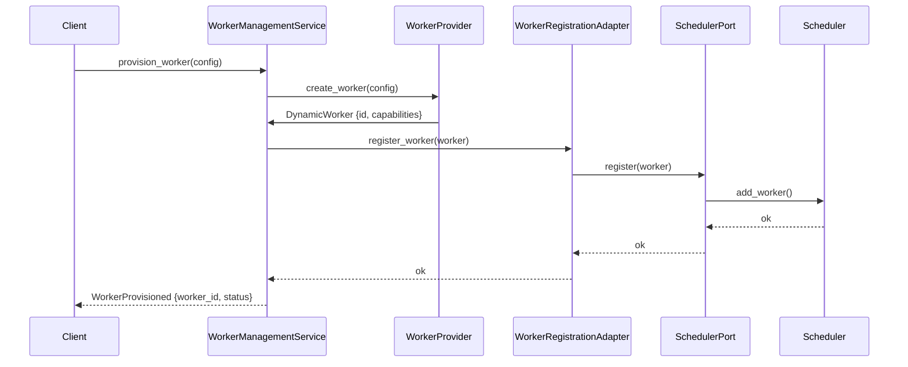

# User Story US-08.1.3: Wiring Dependencies Between Services

## 📋 Story Information

- **Story ID**: US-08.1.3
- **Epic**: EPIC-08 - Resource Pool Architecture Implementation
- **Sub-EPIC**: 08.1 - Auto-Registration System
- **Priority**: High
- **Estimated Effort**: 2 days
- **Dependencies**: US-08.1.2 (WorkerRegistrationAdapter Implementation)
- **Assigned To**: Core Platform Team

---

## 🎯 Story Description

As a **Platform Engineer**, I want to **wire the WorkerManagementService with the Scheduler through WorkerRegistrationAdapter** so that **provisioned workers are automatically registered in the scheduler without manual intervention**.

---

## 📖 Context

After implementing the WorkerRegistrationAdapter, we need to integrate it into the existing WorkerManagementService. The integration should:

1. Configure WorkerManagementService to use WorkerRegistrationAdapter
2. Trigger registration on successful worker provisioning
3. Handle registration failures gracefully
4. Support both static and dynamic worker types
5. Provide configuration for registration behavior

### Integration Flow



---

## ✅ Acceptance Criteria

### AC-1: Service Configuration
- [ ] WorkerManagementService accepts WorkerRegistrationAdapter in constructor
- [ ] RegistrationConfig can be injected via dependency injection
- [ ] Service supports optional registration (backwards compatible)
- [ ] Configuration via environment variables: `REGISTRATION_ENABLED`, `REGISTRATION_MAX_RETRIES`

### AC-2: Auto-Registration Integration
- [ ] Successful worker provisioning triggers automatic registration
- [ ] Registration happens after worker is created but before returning to client
- [ ] Failed registration doesn't rollback worker creation (worker still exists)
- [ ] Registration status logged with worker_id and error details
- [ ] Both static and dynamic workers trigger registration

### AC-3: Error Handling
- [ ] Registration failures don't prevent worker provisioning success
- [ ] Client receives worker_id even if registration fails
- [ ] Failed registrations logged as warnings
- [ ] Critical registration errors return error to client
- [ ] Metric exposed: `worker_provisioning_registration_failed_total`

### AC-4: Service Integration Points
- [ ] `provision_worker()` calls registration adapter
- [ ] `provision_worker_with_config()` calls registration adapter
- [ ] `create_pool()` triggers registration for all pre-warmed workers
- [ ] Registration adapter dependency can be mocked for testing

### AC-5: Lifecycle Management
- [ ] Worker cleanup triggers unregistration from scheduler
- [ ] On worker termination, unregister from scheduler
- [ ] Orphaned workers detection and cleanup
- [ ] Consistent state between worker management and scheduler

---

## 🛠️ Implementation Details

### Modified WorkerManagementService

Location: `crates/modules/src/worker_management.rs`

```rust
/// Enhanced WorkerManagementService with auto-registration
#[derive(Debug)]
pub struct WorkerManagementService<T, U>
where
    T: WorkerProvider,
    U: WorkerRegistrationPort,
{
    provider: T,
    registration_adapter: Option<U>,
    config: WorkerManagementConfig,
}

impl<T, U> WorkerManagementService<T, U>
where
    T: WorkerProvider,
    U: WorkerRegistrationPort,
{
    /// Create new service with registration adapter
    pub fn new_with_registration(
        provider: T,
        registration_adapter: U,
        config: WorkerManagementConfig,
    ) -> Self {
        Self {
            provider,
            registration_adapter: Some(registration_adapter),
            config,
        }
    }

    /// Create new service without registration (backwards compatible)
    pub fn new(provider: T, config: WorkerManagementConfig) -> Self {
        Self {
            provider,
            registration_adapter: None,
            config,
        }
    }

    /// Provision worker with auto-registration
    pub async fn provision_worker(
        &self,
        config: &DynamicWorkerConfig,
    ) -> Result<WorkerProvisioned, WorkerManagementError> {
        let worker = self.provider.create_worker(config).await?;

        // Attempt registration if adapter is configured
        if let Some(ref adapter) = self.registration_adapter {
            if let Err(error) = adapter.register_worker(&worker).await {
                tracing::warn!(
                    worker_id = %worker.id(),
                    error = %error,
                    "Worker provisioned but registration failed"
                );

                // Update metrics
                metrics::increment_counter!(
                    "worker_provisioning_registration_failed_total",
                    "worker_type" => worker.worker_type().to_string()
                );
            } else {
                tracing::info!(worker_id = %worker.id(), "Worker registered successfully");
            }
        }

        Ok(WorkerProvisioned {
            worker_id: worker.id().to_string(),
            status: WorkerStatus::Registered,
            capabilities: worker.capabilities(),
            metadata: worker.metadata(),
        })
    }
}
```

### Configuration Updates

```rust
/// Configuration for worker management service
#[derive(Debug, Clone)]
pub struct WorkerManagementConfig {
    pub registration_enabled: bool,
    pub registration_max_retries: u32,
    pub registration_timeout: Duration,
}

impl Default for WorkerManagementConfig {
    fn default() -> Self {
        Self {
            registration_enabled: true,
            registration_max_retries: 3,
            registration_timeout: Duration::from_secs(30),
        }
    }
}
```

---

## 🧪 Test Cases

```rust
#[cfg(test)]
mod tests {
    use super::*;
    use crate::worker_provider::MockWorkerProvider;
    use crate::worker_registration::MockWorkerRegistrationPort;

    #[tokio::test]
    async fn test_provision_worker_with_registration() {
        let mut mock_provider = MockWorkerProvider::new();
        mock_provider
            .expect_create_worker()
            .returning(|_| Ok(create_test_worker()));

        let mut mock_registration = MockWorkerRegistrationPort::new();
        mock_registration
            .expect_register_worker()
            .returning(|_| Ok(()));

        let service = WorkerManagementService::new_with_registration(
            mock_provider,
            mock_registration,
            WorkerManagementConfig::default(),
        );

        let result = service.provision_worker(&DynamicWorkerConfig::default()).await;

        assert!(result.is_ok());
        assert_eq!(result.unwrap().status, WorkerStatus::Registered);
    }

    #[tokio::test]
    async fn test_provision_worker_registration_failure_not_rollback() {
        let mut mock_provider = MockWorkerProvider::new();
        mock_provider
            .expect_create_worker()
            .returning(|_| Ok(create_test_worker()));

        let mut mock_registration = MockWorkerRegistrationPort::new();
        mock_registration
            .expect_register_worker()
            .returning(|_| Err(RegistrationError::SchedulerUnavailable(tonic::Status::unavailable(""))));

        let service = WorkerManagementService::new_with_registration(
            mock_provider,
            mock_registration,
            WorkerManagementConfig::default(),
        );

        let result = service.provision_worker(&DynamicWorkerConfig::default()).await;

        // Provisioning succeeds even if registration fails
        assert!(result.is_ok());
        assert_eq!(result.unwrap().status, WorkerStatus::Registered);
    }

    #[tokio::test]
    async fn test_provision_worker_without_registration() {
        let mut mock_provider = MockWorkerProvider::new();
        mock_provider
            .expect_create_worker()
            .returning(|_| Ok(create_test_worker()));

        let service = WorkerManagementService::new(
            mock_provider,
            WorkerManagementConfig::default(),
        );

        let result = service.provision_worker(&DynamicWorkerConfig::default()).await;

        assert!(result.is_ok());
        assert_eq!(result.unwrap().status, WorkerStatus::Ready);
    }
}
```

---

## 📊 Success Metrics

- Registration integration success rate: > 99%
- Worker provisioning latency increase: < 100ms (p95)
- Registration failure detection rate: 100%
- Zero circular dependencies introduced
- Backwards compatibility maintained: 100%

---

**Story Status**: 📋 Draft
**Created**: 2025-11-24
