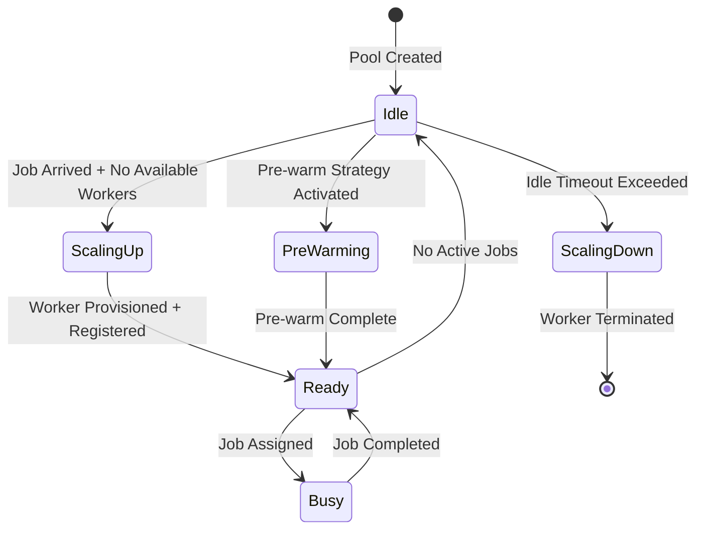

# User Story US-08.2.1: DynamicPoolManager Implementation

## 📋 Story Information

- **Story ID**: US-08.2.1
- **Epic**: EPIC-08 - Resource Pool Architecture Implementation
- **Sub-EPIC**: 08.2 - Dynamic Worker Pool Management
- **Priority**: High
- **Estimated Effort**: 5 days
- **Dependencies**: US-08.1.4 (Testing Auto-Registration Flow)
- **Assigned To**: Core Platform Team

---

## 🎯 Story Description

As a **Platform Engineer**, I want to **implement the DynamicPoolManager** so that **the system can dynamically scale worker pools up and down based on demand, provisioning workers on-demand and terminating them when idle**.

---

## 📖 Context

Dynamic worker pools are the core of the auto-scaling system. Unlike static pools which maintain a fixed number of workers, dynamic pools:

1. Start with zero workers (cost-efficient)
2. Provision workers when jobs arrive (scale-up)
3. Track worker idle time (scale-down candidates)
4. Terminate idle workers to save resources
5. Implement pre-warming strategies for low-latency
6. Support configurable scaling policies

### Dynamic Pool Behavior



---

## ✅ Acceptance Criteria

### AC-1: DynamicPoolManager Core
- [ ] DynamicPoolManager struct with pool_id, worker_type, configuration
- [ ] Implements ResourcePool trait (allocation, release, status)
- [ ] Maintains internal state: available_workers, busy_workers, pending_jobs
- [ ] Supports worker pre-warming (min_size config)
- [ ] Implements proper state management with atomic operations

### AC-2: Dynamic Provisioning
- [ ] On-demand worker provisioning when allocation requested
- [ ] Parallel provisioning support (max_concurrent_provisioning config)
- [ ] Provision timeout handling (max_wait_time config)
- [ ] Failed provisioning retry with exponential backoff
- [ ] Fallback to queueing jobs if provisioning fails
- [ ] Track provisioning attempts and success rate

### AC-3: Idle Worker Detection
- [ ] Track worker idle time since last job completion
- [ ] Configurable idle timeout per pool (default: 5 minutes)
- [ ] Mark workers as idle when no active jobs
- [ ] Periodic scan for idle workers (idle_check_interval config)
- [ ] Protection against frequent scale-up/scale-down (cooldown period)
- [ ] Grace period for recently provisioned workers (don't terminate immediately)

### AC-4: Worker Termination
- [ ] Graceful termination with job drain timeout (drain_timeout config)
- [ ] Cancel ongoing jobs before termination
- [ ] Verify worker is idle before termination
- [ ] Handle termination failures and retry
- [ ] Update pool state after termination
- [ ] Trigger unregistration from scheduler

### AC-5: Configuration & Policies
- [ ] DynamicPoolConfig with:
  - min_size: minimum workers (pre-warmed)
  - max_size: maximum workers
  - idle_timeout: time before terminating idle workers
  - provision_timeout: max time to wait for provisioning
  - max_concurrent_provisioning: parallel provisioning limit
  - cooldown_period: time between scaling operations
- [ ] Scaling policies: conservative, balanced, aggressive
- [ ] Support environment-based configuration overrides

### AC-6: Event System
- [ ] Emit events: WorkerProvisioned, WorkerTerminated, PoolScaledUp, PoolScaledDown
- [ ] Subscribe to job events for allocation triggers
- [ ] Integrate with existing event bus infrastructure
- [ ] Event payload includes pool_id, worker_id, timestamp, reason
- [ ] Support event callbacks for custom handlers

---

## 🛠️ Implementation Details

### Core Types

```rust
/// Configuration for dynamic worker pools
#[derive(Debug, Clone)]
pub struct DynamicPoolConfig {
    pub pool_id: String,
    pub worker_type: WorkerType,
    pub min_size: u32,
    pub max_size: u32,
    pub idle_timeout: Duration,
    pub provision_timeout: Duration,
    pub max_concurrent_provisioning: u32,
    pub cooldown_period: Duration,
    pub drain_timeout: Duration,
    pub pre_warm_on_start: bool,
}

impl DynamicPoolConfig {
    pub fn new(pool_id: String, worker_type: WorkerType) -> Self {
        Self {
            pool_id,
            worker_type,
            min_size: 0,
            max_size: 100,
            idle_timeout: Duration::from_secs(300), // 5 minutes
            provision_timeout: Duration::from_secs(120),
            max_concurrent_provisioning: 5,
            cooldown_period: Duration::from_secs(30),
            drain_timeout: Duration::from_secs(60),
            pre_warm_on_start: false,
        }
    }

    /// Validate configuration constraints
    pub fn validate(&self) -> Result<(), PoolConfigError> {
        if self.min_size > self.max_size {
            return Err(PoolConfigError::MinGreaterThanMax);
        }
        if self.max_concurrent_provisioning == 0 {
            return Err(PoolConfigError::InvalidConcurrentProvisioning);
        }
        Ok(())
    }
}

/// Dynamic pool state
#[derive(Debug, Clone)]
pub struct DynamicPoolState {
    pub available_workers: Vec<WorkerId>,
    pub busy_workers: HashMap<WorkerId, JobId>,
    pub idle_workers: HashSet<WorkerId>,
    pub pending_allocations: BTreeMap<JobId, AllocationRequest>,
    pub last_scaling_operation: Option<Instant>,
    pub total_provisioned: u64,
    pub total_terminated: u64,
}

/// Custom error types
#[derive(Debug, thiserror::Error)]
pub enum DynamicPoolError {
    #[error("Pool at maximum capacity: {current}/{max}")]
    PoolAtCapacity { current: u32, max: u32 },

    #[error("Pool at minimum size: {current}/{min}")]
    PoolAtMinimum { current: u32, min: u32 },

    #[error("Provisioning timeout after {timeout:?}")]
    ProvisioningTimeout { timeout: Duration },

    #[error("Worker not found in pool: {worker_id}")]
    WorkerNotFound { worker_id: WorkerId },

    #[error("Worker not available: {worker_id}")]
    WorkerNotAvailable { worker_id: WorkerId },

    #[error("Invalid pool state transition")]
    InvalidStateTransition,
}
```

### DynamicPoolManager Implementation

```rust
/// Manages dynamic worker pools with auto-scaling
#[derive(Debug)]
pub struct DynamicPoolManager<T, U>
where
    T: WorkerProvider,
    U: WorkerRegistrationPort,
{
    config: DynamicPoolConfig,
    state: Arc<RwLock<DynamicPoolState>>,
    worker_provider: T,
    registration_adapter: Option<U>,
    event_bus: EventBus,
    metrics: DynamicPoolMetrics,
    cleanup_task: Arc<AtomicBool>,
}

impl<T, U> DynamicPoolManager<T, U>
where
    T: WorkerProvider,
    U: WorkerRegistrationPort,
{
    /// Create new dynamic pool manager
    pub fn new(
        config: DynamicPoolConfig,
        worker_provider: T,
        registration_adapter: Option<U>,
        event_bus: EventBus,
    ) -> Self {
        config.validate().expect("Invalid pool configuration");

        Self {
            config: config.clone(),
            state: Arc::new(RwLock::new(DynamicPoolState::new())),
            worker_provider,
            registration_adapter,
            event_bus,
            metrics: DynamicPoolMetrics::new(&config.pool_id),
            cleanup_task: Arc::new(AtomicBool::new(false)),
        }
    }

    /// Start the pool manager background tasks
    pub async fn start(&self) -> Result<(), DynamicPoolError> {
        // Pre-warm workers if configured
        if self.config.pre_warm_on_start && self.config.min_size > 0 {
            self.scale_to(self.config.min_size).await?;
        }

        // Start idle worker cleanup task
        self.start_cleanup_task().await;

        tracing::info!(pool_id = %self.config.pool_id, "Dynamic pool manager started");
        Ok(())
    }

    /// Stop the pool manager
    pub async fn stop(&self) -> Result<(), DynamicPoolError> {
        self.cleanup_task.store(false, Ordering::Relaxed);

        // Scale down all workers
        let state = self.state.read().await;
        let worker_count = state.available_workers.len() + state.busy_workers.len();
        drop(state);

        for _ in 0..worker_count {
            self.terminate_idle_worker().await.ok();
        }

        tracing::info!(pool_id = %self.config.pool_id, "Dynamic pool manager stopped");
        Ok(())
    }

    /// Allocate a worker from the pool
    pub async fn allocate_worker(
        &self,
        job_id: JobId,
        requirements: WorkerRequirements,
    ) -> Result<WorkerAllocation, DynamicPoolError> {
        let mut state = self.state.write().await;

        // Try to get available worker
        if let Some(worker_id) = state.available_workers.pop() {
            state.busy_workers.insert(worker_id.clone(), job_id.clone());
            drop(state);

            self.metrics.record_allocation_success(&worker_id);
            self.event_bus.publish(WorkerAllocated {
                pool_id: self.config.pool_id.clone(),
                worker_id,
                job_id,
                timestamp: Utc::now(),
            }).await;

            return Ok(WorkerAllocation {
                worker_id,
                job_id,
                allocation_time: Utc::now(),
            });
        }

        // No available workers - check if we can provision
        let current_size = state.total_provisioned - state.total_terminated;
        if current_size < self.config.max_size {
            // Queue the allocation request
            state.pending_allocations.insert(job_id.clone(), requirements);

            drop(state);

            // Trigger provisioning
            self.provision_worker().await?;

            return Err(DynamicPoolError::ProvisioningTimeout {
                timeout: self.config.provision_timeout,
            });
        }

        Err(DynamicPoolError::PoolAtCapacity {
            current: current_size as u32,
            max: self.config.max_size,
        })
    }

    /// Release a worker back to the pool
    pub async fn release_worker(
        &self,
        worker_id: WorkerId,
        job_id: JobId,
    ) -> Result<(), DynamicPoolError> {
        let mut state = self.state.write().await;

        // Verify worker is currently busy
        if state.busy_workers.remove(&worker_id) != Some(job_id.clone()) {
            return Err(DynamicPoolError::WorkerNotFound { worker_id });
        }

        // Check if worker should be terminated (idle timeout)
        if self.should_terminate_worker() {
            state.total_terminated += 1;
            drop(state);

            self.terminate_worker(worker_id).await?;
        } else {
            // Return to available pool
            state.available_workers.push(worker_id.clone());
            drop(state);
        }

        self.metrics.record_release(&worker_id);
        self.event_bus.publish(WorkerReleased {
            pool_id: self.config.pool_id.clone(),
            worker_id,
            job_id,
            timestamp: Utc::now(),
        }).await;

        Ok(())
    }

    /// Get current pool status
    pub async fn status(&self) -> DynamicPoolStatus {
        let state = self.state.read().await;
        DynamicPoolStatus {
            pool_id: self.config.pool_id.clone(),
            worker_type: self.config.worker_type,
            available_workers: state.available_workers.len() as u32,
            busy_workers: state.busy_workers.len() as u32,
            idle_workers: state.idle_workers.len() as u32,
            pending_allocations: state.pending_allocations.len() as u32,
            total_provisioned: state.total_provisioned,
            total_terminated: state.total_terminated,
            last_scaling_operation: state.last_scaling_operation,
        }
    }

    /// Manually scale pool to target size
    pub async fn scale_to(&self, target_size: u32) -> Result<(), DynamicPoolError> {
        let current_size = self.get_current_size().await;

        if target_size < self.config.min_size || target_size > self.config.max_size {
            return Err(DynamicPoolError::InvalidStateTransition);
        }

        if target_size > current_size {
            // Scale up
            let to_provision = target_size - current_size;
            self.provision_workers(to_provision as usize).await?;
        } else if target_size < current_size {
            // Scale down
            let to_terminate = current_size - target_size;
            self.terminate_workers(to_terminate as usize).await?;
        }

        let mut state = self.state.write().await;
        state.last_scaling_operation = Some(Instant::now());
        drop(state);

        self.event_bus.publish(PoolScaled {
            pool_id: self.config.pool_id.clone(),
            old_size: current_size,
            new_size: target_size,
            reason: "manual",
            timestamp: Utc::now(),
        }).await;

        Ok(())
    }

    // Internal methods

    async fn provision_worker(&self) -> Result<(), DynamicPoolError> {
        let worker_config = self.create_worker_config()?;
        let worker = self.worker_provider.create_worker(&worker_config).await?;

        // Register worker if adapter available
        if let Some(ref adapter) = self.registration_adapter {
            if let Err(error) = adapter.register_worker(&worker).await {
                tracing::warn!(
                    worker_id = %worker.id(),
                    error = %error,
                    "Worker provisioned but registration failed"
                );
            }
        }

        let mut state = self.state.write().await;
        state.available_workers.push(worker.id());
        state.total_provisioned += 1;

        // Process pending allocations
        if let Some((job_id, requirements)) = state.pending_allocations.pop_first() {
            // Immediately allocate this worker
            state.busy_workers.insert(worker.id(), job_id);
            drop(state);

            self.event_bus.publish(WorkerProvisioned {
                pool_id: self.config.pool_id.clone(),
                worker_id: worker.id(),
                job_id,
                timestamp: Utc::now(),
            }).await;
        }

        Ok(())
    }

    async fn terminate_worker(&self, worker_id: WorkerId) -> Result<(), DynamicPoolError> {
        // TODO: Implement graceful termination with drain
        self.worker_provider.terminate_worker(&worker_id).await?;

        // Unregister from scheduler
        if let Some(ref adapter) = self.registration_adapter {
            adapter.unregister_worker(&worker_id).await.ok();
        }

        self.metrics.record_termination(&worker_id);
        Ok(())
    }

    fn should_terminate_worker(&self) -> bool {
        // Check cooldown period
        let state_guard = self.state.blocking_read();
        if let Some(last_op) = state_guard.last_scaling_operation {
            if last_op.elapsed() < self.config.cooldown_period {
                return false;
            }
        }

        // TODO: Check actual idle time
        true
    }

    async fn get_current_size(&self) -> u32 {
        let state = self.state.read().await;
        (state.total_provisioned - state.total_terminated) as u32
    }

    fn create_worker_config(&self) -> Result<DynamicWorkerConfig, DynamicPoolError> {
        // Create worker configuration based on pool settings
        Ok(DynamicWorkerConfig::default())
    }

    async fn start_cleanup_task(&self) {
        let state = self.state.clone();
        let config = self.config.clone();
        let cleanup_flag = self.cleanup_task.clone();
        let metrics = self.metrics.clone();

        tokio::spawn(async move {
            while cleanup_flag.load(Ordering::Relaxed) {
                tokio::time::sleep(Duration::from_secs(30)).await;

                // Scan for idle workers
                let mut state_guard = state.write().await;
                let now = Utc::now();

                // TODO: Check actual idle time and mark workers
                // This is a simplified version

                metrics.record_cleanup_scan();
            }
        });
    }
}
```

---

## 📊 Success Metrics

- Provisioning success rate: > 98%
- Average provisioning time: < 60 seconds (p95)
- Termination success rate: > 99.5%
- Idle worker detection accuracy: 100%
- Auto-scaling responsiveness: < 30 seconds from trigger to action
- Zero orphaned workers (workers not tracked by any pool)
- Cost optimization: 30-50% reduction vs static pools

---

**Story Status**: 📋 Draft
**Created**: 2025-11-24
