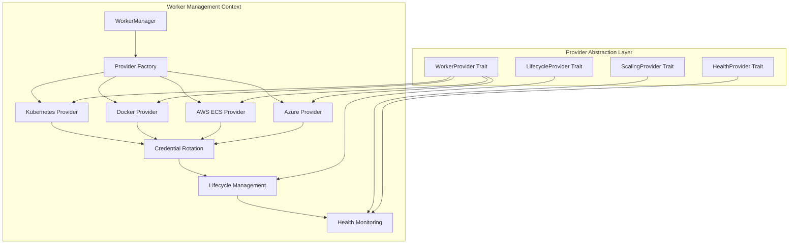

# Épica 4: Worker Management & Abstraction

**Planificación de Sprints - Sistema CI/CD Distribuido**  
**Bounded Context**: Worker Management  
**Autor**: MiniMax Agent  
**Fecha**: 2025-11-21  
**Versión**: 1.0  

## 📋 Índice
1. [Visión de la Épica](#visión-de-la-épica)
2. [Arquitectura de Provider Abstraction](#arquitectura-de-provider-abstraction)
3. [Patrones Conascense para Worker Lifecycle](#patrones-conascense-para-worker-lifecycle)
4. [Historias de Usuario](#historias-de-usuario)
5. [Planificación de Sprints](#planificación-de-sprints)
6. [Provider Implementation Strategy](#provider-implementation-strategy)
7. [Credential Management System](#credential-management-system)
8. [Referencias Técnicas](#referencias-técnicas)

---

## 🔧 Visión de la Épica

### Objetivo Principal
Implementar un sistema de abstracción de workers que permita el soporte pluggable para múltiples providers (Kubernetes, Docker, AWS ECS, etc.) con gestión automática de credenciales, lifecycle management completo, y auto-scaling basado en workload patterns.

### Componentes de Provider Abstraction
- **Worker Provider Interface**: Traits abstractos para diferentes providers
- **Provider Factory**: Factory pattern para instantiation de providers
- **Credential Provider System**: Sistema de credenciales con 4 providers
- **Auto-rotation Engine**: Rotación automática de secrets sin downtime
- **Lifecycle Management**: Estados y transiciones de workers
- **Health Monitoring**: Health checks y recovery automático

### Provider Ecosystem Strategy
- **Kubernetes Provider**: Enterprise container orchestration
- **Docker Provider**: Simple container execution
- **AWS ECS Provider**: Cloud-native container service
- **Azure Container Instances**: Microsoft cloud containers
- **Custom Providers**: Extension framework para providers personalizados

### Métricas de Worker Management
- **Provider Abstraction**: 99.9% compatibility entre providers
- **Credential Rotation**: < 30s rotation time con zero downtime
- **Worker Startup**: < 60s para cold start, < 10s warm start
- **Health Recovery**: < 2min automatic recovery de failed workers
- **Auto-scaling**: < 30s response time para scaling decisions

---

## 🏗️ Arquitectura de Provider Abstraction

### Estructura de Crates (Bounded Context: Worker Management)

```
crates/worker-management/
├── provider-abstraction/               # Core Provider Interface
│   ├── src/
│   │   ├── traits/                     # Provider traits
│   │   │   ├── worker_provider.rs      # Main worker provider trait
│   │   │   ├── lifecycle_provider.rs   # Lifecycle management trait
│   │   │   ├── scaling_provider.rs     # Auto-scaling trait
│   │   │   └── health_provider.rs      # Health monitoring trait
│   │   ├── factory/                    # Provider factory patterns
│   │   │   ├── provider_factory.rs     # Provider instantiation
│   │   │   ├── config_resolver.rs      # Configuration resolution
│   │   │   └── capability_detector.rs  # Provider capabilities detection
│   │   ├── models/                     # Data models
│   │   │   ├── worker_config.rs        # Worker configuration
│   │   │   ├── scaling_policy.rs       # Scaling policy definition
│   │   │   └── health_status.rs        # Health status models
│   │   └── lib.rs
│   ├── tests/
│   │   ├── traits/worker_provider_tests.rs
│   │   ├── factory/factory_tests.rs
│   │   └── integration/provider_integration_tests.rs
│   └── examples/                       # Provider examples
│       ├── kubernetes_example.rs
│       ├── docker_example.rs
│       └── custom_provider_example.rs
│
├── providers/                          # Provider Implementations
│   ├── kubernetes/
│   │   ├── src/
│   │   │   ├── k8s_provider.rs         # Kubernetes provider implementation
│   │   │   ├── pod_manager.rs          # Kubernetes Pod lifecycle
│   │   │   ├── service_discovery.rs    # K8s service discovery
│   │   │   ├── config_map_integration.rs # Config management
│   │   │   └── k8s_client.rs           # Kubernetes API client
│   │   ├── config/
│   │   │   ├── deployment-template.yaml
│   │   │   └── service-account.yaml
│   │   └── tests/
│   │       ├── unit/k8s_provider_tests.rs
│   │       └── integration/k8s_integration_tests.rs
│   │
│   ├── docker/
│   │   ├── src/
│   │   │   ├── docker_provider.rs      # Docker provider implementation
│   │   │   ├── container_manager.rs    # Container lifecycle
│   │   │   ├── volume_manager.rs       # Volume management
│   │   │   └── docker_client.rs        # Docker API client
│   │   ├── config/
│   │   │   └── docker-compose.yml
│   │   └── tests/
│   │       ├── unit/docker_provider_tests.rs
│   │       └── integration/docker_integration_tests.rs
│   │
│   ├── aws-ecs/
│   │   ├── src/
│   │   │   ├── ecs_provider.rs         # AWS ECS provider
│   │   │   ├── task_definition.rs      # ECS task management
│   │   │   ├── service_manager.rs      # ECS service lifecycle
│   │   │   └── ecs_client.rs           # AWS SDK integration
│   │   └── tests/
│   │
│   └── azure-container-instances/
│       ├── src/
│       │   ├── aci_provider.rs         # Azure Container Instances
│       │   ├── container_group.rs      # Container group management
│       │   └── azure_client.rs         # Azure SDK integration
│       └── tests/
│
├── credential-rotation/                # Credential Management
│   ├── src/
│   │   ├── providers/                  # Credential provider implementations
│   │   │   ├── simple_provider.rs      # Simple credential storage
│   │   │   ├── vault_provider.rs       # HashiCorp Vault integration
│   │   │   ├── aws_secrets_provider.rs # AWS Secrets Manager
│   │   │   └── keycloak_provider.rs    # Keycloak service accounts
│   │   ├── rotation_engine/            # Automatic rotation system
│   │   │   ├── rotation_scheduler.rs   # Rotation scheduling
│   │   │   ├── rotation_executor.rs    # Rotation execution
│   │   │   ├── health_monitor.rs       # Rotation health monitoring
│   │   │   └── rollback_handler.rs     # Rotation failure handling
│   │   ├── crypto/                     # Cryptographic utilities
│   │   │   ├── key_derivation.rs       # Key derivation functions
│   │   │   ├── encryption.rs           # Encryption/decryption
│   │   │   └── signature.rs            # Digital signatures
│   │   └── types/
│   │       ├── credential_types.rs     # Credential type definitions
│   │       ├── rotation_policies.rs    # Rotation policy definitions
│   │       └── health_metrics.rs       # Rotation health metrics
│   ├── tests/
│   │   ├── providers/credential_provider_tests.rs
│   │   ├── rotation_engine/rotation_tests.rs
│   │   ├── integration/rotation_integration_tests.rs
│   │   └── security/credential_security_tests.rs
│   └── config/
│       ├── default-rotation-policies.yaml
│       └── credential-providers-config.yaml
│
├── lifecycle-management/               # Worker Lifecycle
│   ├── src/
│   │   ├── state_machine.rs            # Worker state machine
│   │   ├── state_transitions.rs        # State transition logic
│   │   ├── health_checks.rs            # Health check implementations
│   │   ├── recovery_strategies.rs      # Automatic recovery logic
│   │   └── metrics_collector.rs        # Lifecycle metrics
│   ├── tests/
│   │   ├── state_machine_tests.rs
│   │   ├── health_check_tests.rs
│   │   └── recovery_strategy_tests.rs
│   └── config/
│       ├── health-check-config.yaml
│       └── recovery-strategies.yaml
│
└── worker-common/                      # Shared Worker Components
    ├── src/
    │   ├── worker_types.rs             # Shared worker type definitions
    │   ├── capability_matching.rs      # Worker capability matching
    │   ├── resource_allocation.rs      # Resource allocation logic
    │   └── worker_utils.rs             # Common worker utilities
    └── tests/
        ├── worker_types_tests.rs
        └── integration/capability_matching_tests.rs
```

### Provider Abstraction Architecture



### Credential Provider System Architecture

```
┌─────────────────────────────────────────────────────────────┐
│              CREDENTIAL PROVIDER SYSTEM                     │
├─────────────────────────────────────────────────────────────┤
│  CREDENTIAL INTERFACE LAYER                                 │
│  ┌─────────────┐  ┌─────────────┐  ┌─────────────┐         │
│  │Simple       │  │Vault        │  │AWS Secrets  │         │
│  │Provider     │  │Provider     │  │Manager      │         │
│  └─────────────┘  └─────────────┘  └─────────────┘         │
├─────────────────────────────────────────────────────────────┤
│  ROTATION ENGINE LAYER                                      │
│  ┌─────────────┐  ┌─────────────┐  ┌─────────────┐         │
│  │Scheduler    │  │Executor     │  │Health       │         │
│  │             │  │             │  │Monitor      │         │
│  └─────────────┘  └─────────────┘  └─────────────┘         │
├─────────────────────────────────────────────────────────────┤
│  CRYPTOGRAPHIC LAYER                                        │
│  ┌─────────────┐  ┌─────────────┐  ┌─────────────┐         │
│  │Key          │  │Encryption   │  │Signature    │         │
│  │Derivation   │  │             │  │             │         │
│  └─────────────┘  └─────────────┘  └─────────────┘         │
└─────────────────────────────────────────────────────────────┘
```

---

## 🔗 Patrones Conascense para Worker Lifecycle

### Análisis de Acoplamientos en Worker Management

#### 1. **Temporal Coupling**: Provider Initialization Before Worker Creation
**Problema**: Worker creation debe wait hasta provider fully initialized
**Patrón Aplicado**: Initialization State Machine con dependencies

```rust
// Temporal coupling resuelto con state machine
pub enum ProviderState {
    Uninitialized,
    Initializing(InitProgress),
    Ready(ProviderCapabilities),
    Degraded(DegradedCapabilities),
    Failed(InitError),
}

pub struct WorkerProvider {
    state: ProviderState,
    inner: Box<dyn WorkerProviderInner>,
    credentials: Arc<RwLock<CredentialProvider>>,
    lifecycle: Arc<LifecycleManager>,
}

impl WorkerProvider {
    pub async fn create_worker(
        &self,
        config: &WorkerConfig,
    ) -> Result<WorkerHandle, WorkerCreationError> {
        // Ensure provider is ready antes de worker creation
        match &self.state {
            ProviderState::Ready(_) | ProviderState::Degraded(_) => {
                // Safe to create worker
                self.inner.create_worker(config).await
            },
            ProviderState::Initializing(progress) => {
                // Wait for initialization con timeout
                self.wait_for_initialization(progress.max_wait).await?
            },
            ProviderState::Uninitialized => {
                return Err(WorkerCreationError::ProviderNotReady);
            },
            ProviderState::Failed(error) => {
                return Err(WorkerCreationError::ProviderFailed(error.clone()));
            }
        }
    }
    
    async fn wait_for_initialization(
        &self,
        max_wait: Duration,
    ) -> Result<(), WorkerCreationError> {
        let start = Instant::now();
        while start.elapsed() < max_wait {
            match &self.state {
                ProviderState::Ready(_) | ProviderState::Degraded(_) => return Ok(()),
                ProviderState::Failed(_) => return Err(WorkerCreationError::InitFailed),
                _ => {
                    tokio::time::sleep(Duration::from_millis(100)).await;
                }
            }
        }
        Err(WorkerCreationError::InitTimeout)
    }
}
```

#### 2. **Control Coupling**: Multiple Provider Selection Strategies
**Problema**: Multiple strategies para provider selection (capability-based, cost-based, etc.)
**Patrón Aplicado**: Strategy Pattern para provider selection

```rust
// Control coupling resuelto con Strategy Pattern
pub trait ProviderSelectionStrategy: Send + Sync {
    async fn select_provider(
        &self,
        providers: &[&dyn WorkerProvider],
        requirements: &WorkerRequirements,
    ) -> Result<ProviderSelection, SelectionError>;
    
    fn strategy_name(&self) -> &'static str;
    fn applicable_for(&self, requirements: &WorkerRequirements) -> bool;
}

pub struct ProviderSelector {
    strategies: Vec<Box<dyn ProviderSelectionStrategy>>,
    fallback_strategy: Box<dyn ProviderSelectionStrategy>,
}

impl ProviderSelector {
    pub async fn select_best_provider(
        &self,
        providers: &[&dyn WorkerProvider],
        requirements: &WorkerRequirements,
    ) -> Result<ProviderSelection, SelectionError> {
        // Find applicable strategies
        let applicable_strategies: Vec<_> = self.strategies
            .iter()
            .filter(|s| s.applicable_for(requirements))
            .collect();
            
        if applicable_strategies.is_empty() {
            return self.fallback_strategy
                .select_provider(providers, requirements)
                .await;
        }
        
        // Try strategies en priority order
        for strategy in applicable_strategies {
            let result = strategy.select_provider(providers, requirements).await;
            if result.is_ok() {
                return result;
            }
        }
        
        // All strategies failed, use fallback
        self.fallback_strategy.select_provider(providers, requirements).await
    }
}

// Capability-based strategy implementation
pub struct CapabilityBasedStrategy;

#[async_trait]
impl ProviderSelectionStrategy for CapabilityBasedStrategy {
    async fn select_provider(
        &self,
        providers: &[&dyn WorkerProvider],
        requirements: &WorkerRequirements,
    ) -> Result<ProviderSelection, SelectionError> {
        let mut candidates = Vec::new();
        
        for provider in providers {
            let capabilities = provider.get_capabilities().await
                .map_err(SelectionError::ProviderUnavailable)?;
                
            if self.can_fulfill_requirements(&capabilities, requirements) {
                let score = self.calculate_capability_score(&capabilities, requirements);
                candidates.push((provider, score));
            }
        }
        
        if candidates.is_empty() {
            return Err(SelectionError::NoQualifiedProviders);
        }
        
        // Select highest scoring provider
        candidates.sort_by(|a, b| b.1.partial_cmp(&a.1).unwrap());
        Ok(ProviderSelection {
            provider: candidates[0].0,
            selection_reason: format!("Best capability match (score: {:.2})", candidates[0].1),
            confidence: candidates[0].1,
        })
    }
    
    fn strategy_name(&self) -> &'static str {
        "capability-based"
    }
    
    fn applicable_for(&self, requirements: &WorkerRequirements) -> bool {
        !requirements.capabilities.is_empty() || 
        requirements.min_performance.is_some()
    }
}
```

#### 3. **Data Coupling**: Shared Worker Configuration
**Problema**: Multiple components access shared worker configuration
**Patrón Aplicado**: Immutable Configuration con validation

```rust
// Data coupling resuelto con immutable configuration
#[derive(Debug, Clone, Serialize, Deserialize)]
pub struct WorkerConfig {
    pub worker_id: WorkerId,
    pub image: ContainerImage,
    pub resources: ResourceRequirements,
    pub environment: HashMap<String, String>,
    pub secrets: Vec<SecretReference>,
    pub health_checks: Vec<HealthCheckConfig>,
    pub scaling_config: ScalingConfiguration,
    pub metadata: WorkerMetadata,
}

impl WorkerConfig {
    pub fn validate(&self) -> Result<(), ConfigValidationError> {
        // Validate image
        if self.image.tag.is_empty() {
            return Err(ConfigValidationError::InvalidImageTag);
        }
        
        // Validate resources
        if self.resources.cpu_cores < 0.1 {
            return Err(ConfigValidationError::InvalidCpuResources);
        }
        
        // Validate secrets
        for secret in &self.secrets {
            if secret.name.is_empty() {
                return Err(ConfigValidationError::InvalidSecretName);
            }
        }
        
        // Validate health checks
        for check in &self.health_checks {
            if check.timeout < check.interval {
                return Err(ConfigValidationError::InvalidHealthCheckTimeout);
            }
        }
        
        Ok(())
    }
}

// Configuration factory para ensures consistent creation
pub struct WorkerConfigFactory {
    default_resources: ResourceRequirements,
    default_health_checks: Vec<HealthCheckConfig>,
    secret_provider: Arc<dyn SecretProvider>,
}

impl WorkerConfigFactory {
    pub fn create_worker_config(
        &self,
        worker_id: WorkerId,
        image: ContainerImage,
        custom_requirements: Option<WorkerRequirements>,
    ) -> Result<WorkerConfig, ConfigCreationError> {
        let mut config = WorkerConfig {
            worker_id,
            image,
            resources: custom_requirements
                .as_ref()
                .and_then(|r| r.resource_overrides.clone())
                .unwrap_or_else(|| self.default_resources.clone()),
            environment: HashMap::new(),
            secrets: Vec::new(),
            health_checks: self.default_health_checks.clone(),
            scaling_config: ScalingConfiguration::default(),
            metadata: WorkerMetadata::new(),
        };
        
        // Apply custom requirements if provided
        if let Some(reqs) = custom_requirements {
            config.environment.extend(reqs.environment_vars);
            config.secrets.extend(reqs.secret_requirements);
            config.scaling_config = reqs.scaling_policy
                .unwrap_or_else(|| ScalingConfiguration::default());
        }
        
        config.validate()?;
        Ok(config)
    }
}
```

#### 4. **Content Coupling**: Worker State Shared Across Components
**Problema**: Worker state shared entre lifecycle, health, y scaling components
**Patrón Aplicado**: Event Sourcing con worker state as domain events

```rust
// Content coupling resuelto con Event Sourcing
#[derive(Debug, Clone)]
pub struct WorkerStateEvent {
    pub event_id: EventId,
    pub worker_id: WorkerId,
    pub event_type: WorkerStateEventType,
    pub old_state: Option<WorkerState>,
    pub new_state: WorkerState,
    pub timestamp: DateTime<Utc>,
    pub metadata: StateChangeMetadata,
    pub correlation_id: CorrelationId,
}

#[derive(Debug, Clone)]
pub enum WorkerStateEventType {
    WorkerCreated,
    WorkerStarted,
    WorkerHealthy,
    WorkerUnhealthy,
    WorkerDegraded,
    WorkerRecovered,
    WorkerStopped,
    WorkerTerminated,
    WorkerFailed,
}

// Event bus para worker state changes
pub trait WorkerStateEventBus: Send + Sync {
    async fn publish_state_event(&self, event: &WorkerStateEvent) -> Result<(), EventBusError>;
    fn subscribe_to_worker(&self, worker_id: &WorkerId, handler: Box<dyn WorkerStateHandler>);
}

pub struct WorkerStateManager {
    event_bus: Arc<dyn WorkerStateEventBus>,
    state_store: Arc<dyn WorkerStateStore>,
    subscribers: Arc<RwLock<HashMap<WorkerId, Vec<Box<dyn WorkerStateHandler>>>>>,
}

impl WorkerStateManager {
    pub async fn transition_worker_state(
        &self,
        worker_id: &WorkerId,
        new_state: WorkerState,
        metadata: StateChangeMetadata,
    ) -> Result<(), StateTransitionError> {
        let current_state = self.state_store.get_current_state(worker_id).await
            .map_err(|_| StateTransitionError::StateStoreUnavailable)?;
            
        let event = WorkerStateEvent {
            event_id: EventId::new(),
            worker_id: worker_id.clone(),
            event_type: WorkerStateEventType::from_transition(&current_state, &new_state),
            old_state: current_state,
            new_state: new_state.clone(),
            timestamp: Utc::now(),
            metadata,
            correlation_id: CorrelationId::new(),
        };
        
        // Publish state change event
        self.event_bus.publish_state_event(&event).await
            .map_err(|_| StateTransitionError::EventPublishingFailed)?;
            
        // Update state store
        self.state_store.update_state(worker_id, &new_state).await
            .map_err(|_| StateTransitionError::StateStoreUpdateFailed)?;
            
        // Notify subscribers
        self.notify_subscribers(worker_id, &event).await;
        
        Ok(())
    }
    
    async fn notify_subscribers(
        &self,
        worker_id: &WorkerId,
        event: &WorkerStateEvent,
    ) {
        let subscribers = self.subscribers.read().unwrap();
        if let Some(handlers) = subscribers.get(worker_id) {
            let futures: Vec<_> = handlers
                .iter()
                .map(|handler| handler.handle_state_change(event))
                .collect();
            // Fire y forget - don't block state transitions
            tokio::spawn(async {
                futures::future::join_all(futures).await;
            });
        }
    }
}
```

---

## 📖 Historias de Usuario

### US-018: Implementar Worker Provider Abstraction Layer

**Formato INVEST**:
- **Independent**: Provider abstraction independiente
- **Negotiable**: Provider interface claramente definido
- **Valuable**: Core provider capability
- **Estimable**: 13 Story Points
- **Small**: Focused en provider abstraction
- **Testable**: Provider interface testing

**Descripción**:
> Como sistema multi-cloud, necesito una abstracción uniforme de providers que permita cambiar seamlessly entre Kubernetes, Docker, AWS ECS, y otros providers sin modificar el código de aplicación.

**Contexto Técnico**:
- **Bounded Context**: Worker Management → Provider Abstraction
- **Arquitectura**: Hexagonal, Provider Interface Layer
- **Referencias**: `docs/worker_manager_abstraction.md`

**Criterios de Aceptación**:
```gherkin
Feature: Worker Provider Abstraction Layer

  Scenario: Provider interface implementation
  Given provider interface defined
  When implement provider methods
  Then debe support: create, start, stop, delete workers
  And debe handle provider-specific configurations
  And debe return unified worker status
  And debe support async operations

  Scenario: Provider factory implementation
  Given provider configuration
  When instantiate provider
  Then debe detect provider type automatically
  And debe create appropriate provider instance
  And debe validate configuration
  And debe handle initialization errors gracefully

  Scenario: Capability detection
  Given provider instantiated
  When check provider capabilities
  Then debe detect supported features: auto-scaling, health checks, volumes
  And debe return capability matrix
  And debe handle capability mismatches
  And debe provide fallback mechanisms

  Scenario: Provider switching
  Given workload running on provider A
  When switch to provider B
  Then debe migrate workers without downtime
  And debe preserve worker state y data
  And debe update service discovery
  And debe rollback si migration fails

  Scenario: Configuration management
  Given provider configurations
  When manage provider settings
  Then debe validate configuration syntax
  And debe support configuration hot-reloading
  And debe handle configuration changes gracefully
  And debe maintain configuration history

  Scenario: Error handling
  Given provider operation fails
  When handle provider errors
  Then debe implement provider-specific error mapping
  And debe provide retry mechanisms
  And debe implement circuit breaker pattern
  And debe maintain system stability

  Scenario: Performance optimization
  Given high-frequency provider operations
  When optimize performance
  Then debe implement connection pooling
  And debe cache frequently accessed data
  And debe parallelize independent operations
  And debe minimize provider API calls

  Scenario: Multi-provider coordination
  Given multiple providers active
  When coordinate operations
  Then debe maintain consistent worker state
  And debe handle cross-provider dependencies
  And debe implement provider affinity rules
  And debe balance load across providers
```

**TDD Implementation Strategy**:
1. **RED**: Test provider interface básico
2. **GREEN**: Implement provider traits y factory
3. **REFACTOR**: Extract capability detection
4. **ENHANCE**: Add multi-provider coordination
5. **OPTIMIZE**: Performance optimizations

**Conventional Commit Template**:
```
feat(worker-management): implementar Worker Provider Abstraction Layer

- Implementar WorkerProvider trait con lifecycle methods
- Agregar ProviderFactory para automatic provider instantiation
- Configurar CapabilityDetection para feature matrix
- Multi-provider coordination con state consistency
- Error handling con circuit breaker pattern
- Performance optimization con connection pooling
- Tests: provider interface tests, factory tests, integration tests
- Providers: Kubernetes, Docker, AWS ECS support

Refs: #US-018, docs/worker_manager_abstraction.md
```

**Dependencies**: Core Platform (US-005 worker lifecycle)
**Definition of Done**:
- [ ] WorkerProvider trait con all lifecycle methods
- [ ] ProviderFactory con automatic detection
- [ ] Capability detection y fallback mechanisms
- [ ] Multi-provider coordination
- [ ] Error handling con retry y circuit breaker
- [ ] Performance optimization con caching

---

### US-019: Implementar Kubernetes Provider

**Formato INVEST**:
- **Independent**: Kubernetes provider independiente
- **Negotiable**: Kubernetes integration scope defined
- **Valuable**: Enterprise container orchestration
- **Estimable**: 21 Story Points
- **Large**: Complex Kubernetes integration (subdivide si necesario)
- **Testable**: Kubernetes integration testing

**Descripción**:
> Como plataforma enterprise, necesito un provider de Kubernetes completo que gestione Pods, Services, ConfigMaps, y Auto-scaling nativo de K8s.

**Contexto Técnico**:
- **Bounded Context**: Worker Management → Providers → Kubernetes
- **Arquitectura**: Kubernetes API integration layer
- **Referencias**: `docs/worker_manager_abstraction.md`

**Criterios de Aceptación**:
```gherkin
Feature: Kubernetes Provider Implementation

  Scenario: Kubernetes API client setup
  Given Kubernetes cluster configuration
  When setup K8s API client
  Then debe authenticate con service account
  And debe validate cluster connectivity
  And debe detect API server version
  And debe handle network errors gracefully

  Scenario: Pod lifecycle management
  Given worker configuration
  When create worker pod
  Then debe create Pod con specified configuration
  And debe handle Container image pulling
  And debe configure resource limits
  And debe set up environment variables y secrets

  Scenario: Service discovery
  Given worker pods running
  When discover worker services
  Then debe create Service para each pod
  And debe configure load balancing
  And debe implement health check endpoints
  And debe handle service lifecycle

  Scenario: ConfigMap integration
  Given configuration data
  When manage ConfigMaps
  Then debe create/update ConfigMaps
  And debe mount ConfigMaps to pods
  And debe handle configuration hot-reloads
  And debe validate configuration changes

  Scenario: Auto-scaling integration
  Given HPA configuration
  When implement auto-scaling
  Then debe integrate con HorizontalPodAutoscaler
  And debe configure scaling metrics
  And debe implement scaling policies
  And debe handle scaling events

  Scenario: Persistent volumes
  Given volume requirements
  When manage persistent storage
  Then debe create PersistentVolumeClaims
  And debe mount volumes to containers
  And debe handle volume lifecycle
  And debe support different storage classes

  Scenario: Network policies
  Given network security requirements
  When configure network policies
  Then debe implement pod-to-pod restrictions
  And debe configure ingress/egress rules
  And debe handle namespace isolation
  And debe integrate con security context

  Scenario: Resource monitoring
  Given pods running
  When monitor resources
  Then debe collect CPU/memory metrics
  And debe implement custom metrics
  And debe integrate con Prometheus
  And debe provide resource usage insights

  Scenario: Graceful shutdown
  Given worker pods
  When shutdown pods gracefully
  Then debe implement SIGTERM handling
  And debe drain connections properly
  And debe complete running jobs
  And debe cleanup resources

  Scenario: Error recovery
  Given pod failures
  When handle failures
  Then debe implement pod restart policies
  And debe handle node failures
  And debe implement backoff strategies
  And debe recover from transient errors

  Scenario: Multi-cluster support
  Given multiple K8s clusters
  When manage across clusters
  Then debe support cluster federation
  And debe handle cluster-specific configurations
  And debe implement cross-cluster service discovery
  And debe balance load across clusters

  Scenario: Security integration
  Given security requirements
  When integrate security
  Then debe use RBAC permissions
  And debe implement pod security policies
  And debe handle network policies
  And debe integrate con admission controllers
```

**TDD Implementation Strategy**:
1. **RED**: Test K8s client básico
2. **GREEN**: Implement Pod lifecycle management
3. **REFACTOR**: Extract Service discovery
4. **ENHANCE**: Add auto-scaling y ConfigMap integration
5. **OPTIMIZE**: Performance y error recovery

**Conventional Commit Template**:
```
feat(worker-management): implementar Kubernetes Provider completo

- Implementar KubernetesProvider con K8s API client
- Agregar Pod lifecycle management con resource limits
- Configurar Service discovery y load balancing
- Integrar ConfigMaps con hot-reload support
- HPA integration para auto-scaling
- PersistentVolumeClaims para storage
- Network policies para security
- Multi-cluster support con federation
- Tests: K8s integration tests, lifecycle tests, security tests
- Performance: <60s pod startup, graceful shutdown <30s

Refs: #US-019, docs/worker_manager_abstraction.md
```

**Dependencies**: US-018 (provider abstraction)
**Definition of Done**:
- [ ] Kubernetes API client con authentication
- [ ] Pod lifecycle management completo
- [ ] Service discovery y load balancing
- [ ] ConfigMap integration con hot-reload
- [ ] HPA auto-scaling integration
- [ ] Multi-cluster federation support

---

### US-020: Implementar Docker Provider

**Formato INVEST**:
- **Independent**: Docker provider independiente
- **Negotiable**: Docker integration scope defined
- **Valuable**: Simple container execution
- **Estimable**: 13 Story Points
- **Small**: Focused en Docker integration
- **Testable**: Docker integration testing

**Descripción**:
> Como proveedor simple, necesito un provider de Docker que gestione containers individuales con volume mounting, networking, y lifecycle management básico.

**Contexto Técnico**:
- **Bounded Context**: Worker Management → Providers → Docker
- **Arquitectura**: Docker API integration layer
- **Referencias**: `docs/worker_manager_abstraction.md`

**Criterios de Aceptación**:
```gherkin
Feature: Docker Provider Implementation

  Scenario: Docker daemon connection
  Given Docker daemon configuration
  When connect to Docker
  Then debe validate daemon connectivity
  And debe detect Docker version
  And debe handle Docker socket permissions
  And debe implement connection pooling

  Scenario: Container lifecycle management
  Given container configuration
  When manage containers
  Then debe create containers con specified image
  And debe start/stop containers gracefully
  And debe remove containers completely
  And debe handle container logs

  Scenario: Volume mounting
  Given volume requirements
  When mount volumes
  Then debe bind mount host directories
  And debe create named volumes
  And debe handle volume permissions
  And debe cleanup unused volumes

  Scenario: Network management
  Given container networking
  When configure networks
  Then debe create custom networks
  And debe connect containers to networks
  And debe handle port mapping
  And debe implement network isolation

  Scenario: Resource constraints
  Given resource requirements
  When set constraints
  Then debe limit CPU usage
  And debe limit memory usage
  And debe set ulimits
  And debe monitor resource usage

  Scenario: Image management
  Given container images
  When manage images
  Then debe pull images from registries
  And debe cache images locally
  And debe handle image updates
  And debe cleanup unused images

  Scenario: Environment variables
  Given environment configuration
  When set environment
  Then debe set environment variables
  And debe handle secret variables
  And debe pass through host environment
  And debe handle environment updates

  Scenario: Container logs
  Given running containers
  When collect logs
  Then debe stream container logs
  And debe handle log rotation
  And debe support structured logging
  And debe implement log persistence

  Scenario: Health checks
  Given health check configuration
  When implement health checks
  Then debe define health endpoints
  And debe monitor container health
  And debe restart unhealthy containers
  And debe implement backoff strategies

  Scenario: Docker Compose integration
  Given complex configurations
  When use Docker Compose
  Then debe support compose file parsing
  And debe manage multi-container setups
  And debe handle compose networking
  And debe implement compose scaling

  Scenario: Security hardening
  Given security requirements
  When harden containers
  Then debe run con non-root user
  And debe implement seccomp profiles
  And debe configure AppArmor/SELinux
  And debe handle security scanning
```

**TDD Implementation Strategy**:
1. **RED**: Test Docker client básico
2. **GREEN**: Implement container lifecycle management
3. **REFACTOR**: Extract volume y network management
4. **ENHANCE**: Add health checks y compose integration
5. **SECURE**: Implement security hardening

**Conventional Commit Template**:
```
feat(worker-management): implementar Docker Provider completo

- Implementar DockerProvider con Docker API client
- Agregar Container lifecycle management con graceful handling
- Configurar Volume mounting con bind mounts y named volumes
- Network management con custom networks y port mapping
- Resource constraints con CPU/memory limits
- Image management con pull, cache, y cleanup
- Health checks con automatic restart
- Docker Compose integration para multi-container setups
- Security hardening con non-root users y seccomp
- Tests: Docker integration tests, lifecycle tests, security tests
- Performance: <10s container startup, graceful shutdown <5s

Refs: #US-020, docs/worker_manager_abstraction.md
```

**Dependencies**: US-018 (provider abstraction)
**Definition of Done**:
- [ ] Docker API client con connection pooling
- [ ] Container lifecycle management completo
- [ ] Volume mounting support
- [ ] Network management con port mapping
- [ ] Resource constraints y monitoring
- [ ] Health checks y security hardening

---

### US-021: Implementar Sistema de Credential Rotation

**Formato INVEST**:
- **Independent**: Credential system independiente
- **Negotiable**: Credential management scope defined
- **Valuable**: Security y compliance capability
- **Estimable**: 21 Story Points
- **Large**: Complex credential system (subdivide si necesario)
- **Testable**: Credential security testing

**Descripción**:
> Como sistema enterprise, necesito un sistema de rotación automática de credenciales que maneje 4 tipos de providers (Simple, Vault, AWS Secrets Manager, Keycloak) con rotación sin downtime.

**Contexto Técnico**:
- **Bounded Context**: Worker Management → Credential Rotation
- **Arquitectura**: Credential Provider System con rotation engine
- **Referencias**: `docs/worker_manager_abstraction.md`

**Criterios de Aceptación**:
```gherkin
Feature: Credential Rotation System

  Scenario: Simple credential provider
  Given credential storage
  When manage simple credentials
  Then debe store credentials securely
  And debe implement basic encryption
  And debe handle credential updates
  And debe provide credential access

  Scenario: HashiCorp Vault provider
  Given Vault configuration
  When integrate con Vault
  Then debe authenticate con Vault
  And debe store/retrieve secrets
  And debe implement dynamic secrets
  And debe handle Vault failover

  Scenario: AWS Secrets Manager provider
  Given AWS configuration
  When use Secrets Manager
  Then debe authenticate con AWS SDK
  And debe create/update secrets
  And debe implement automatic rotation
  And debe handle cross-region access

  Scenario: Keycloak service accounts
  Given Keycloak configuration
  When manage service accounts
  Then debe create service accounts
  And debe rotate client secrets
  And debe handle account lifecycle
  And debe maintain account permissions

  Scenario: Automatic rotation scheduling
  Given rotation policies
  When schedule rotations
  Then debe define rotation frequency
  And debe implement rotation windows
  And debe handle time-based triggers
  And debe coordinate multiple credentials

  Scenario: Rotation execution
  Given rotation triggered
  When execute rotation
  Then debe generate new credentials
  And debe update providers atomically
  And debe notify dependent services
  And debe verify rotation success

  Scenario: Zero-downtime rotation
  Given service using credentials
  When rotate credentials
  Then debe maintain service availability
  And debe implement rolling updates
  And debe handle connection migration
  And debe monitor rotation health

  Scenario: Rotation health monitoring
  Given rotation in progress
  When monitor health
  Then debe detect rotation failures
  And debe implement automatic rollback
  And debe generate health alerts
  And debe maintain rotation metrics

  Scenario: Cryptographic operations
  Given credential encryption
  When perform crypto operations
  Then debe use strong encryption (AES-256)
  And debe implement key derivation
  And debe handle digital signatures
  And debe implement secure random generation

  Scenario: Credential validation
  Given new credentials
  When validate credentials
  Then debe verify credential format
  And debe test credential functionality
  And debe validate permissions
  And debe reject invalid credentials

  Scenario: Emergency rotation
  Given security incident
  When emergency rotation
  Then debe rotate all credentials immediately
  And debe invalidate old credentials
  And debe implement incident response
  And debe maintain audit trail

  Scenario: Multi-environment rotation
  Given multiple environments
  When rotate across environments
  Then debe coordinate rotation timing
  And debe handle environment dependencies
  And debe maintain environment isolation
  And debe implement environment-specific policies

  Scenario: Integration con worker providers
  Given worker providers
  When integrate credentials
  Then debe provide credentials to providers
  And debe update provider configurations
  And debe handle credential injection
  And debe monitor provider credential usage
```

**TDD Implementation Strategy**:
1. **RED**: Test credential storage básico
2. **GREEN**: Implement Simple provider y basic rotation
3. **REFACTOR**: Extract rotation engine y scheduling
4. **ENHANCE**: Add Vault, AWS, Keycloak providers
5. **SECURE**: Cryptographic operations y validation

**Conventional Commit Template**:
```
feat(worker-management): implementar Sistema de Credential Rotation completo

- Implementar CredentialProvider trait con 4 providers
- Agregar Simple provider con basic encryption
- Configurar HashiCorp Vault integration con dynamic secrets
- AWS Secrets Manager con automatic rotation
- Keycloak service accounts con client secret rotation
- Rotation engine con scheduling y execution
- Zero-downtime rotation con rolling updates
- Cryptographic operations con AES-256 encryption
- Health monitoring con automatic rollback
- Tests: credential security tests, rotation integration tests
- Performance: <30s rotation time, zero downtime guarantee

Refs: #US-021, docs/worker_manager_abstraction.md
```

**Dependencies**: US-018 (provider abstraction)
**Definition of Done**:
- [ ] 4 credential providers implemented (Simple, Vault, AWS, Keycloak)
- [ ] Automatic rotation engine con scheduling
- [ ] Zero-downtime rotation mechanism
- [ ] Cryptographic security con strong encryption
- [ ] Health monitoring y automatic rollback
- [ ] Multi-environment coordination

---

### US-022: Implementar Worker Lifecycle Management

**Formato INVEST**:
- **Independent**: Lifecycle management independiente
- **Negotiable**: Lifecycle states clearly defined
- **Valuable**: Worker state management
- **Estimable**: 13 Story Points
- **Small**: Focused en lifecycle implementation
- **Testable**: State machine testing

**Descripción**:
> Como sistema robusto, necesito gestionar el lifecycle completo de workers con estados bien definidos, health monitoring, automatic recovery, y graceful degradation.

**Contexto Técnico**:
- **Bounded Context**: Worker Management → Lifecycle Management
- **Arquitectura**: State Machine con event-driven transitions
- **Referencias**: `docs/worker_manager_abstraction.md`

**Criterios de Aceptación**:
```gherkin
Feature: Worker Lifecycle Management

  Scenario: Worker state machine
  Given worker lifecycle
  When manage state transitions
  Then debe define states: Creating, Starting, Running, Degraded, Recovering, Stopping, Stopped, Failed
  And debe implement valid transitions
  And debe enforce state invariants
  And debe handle invalid transitions

  Scenario: Health monitoring
  Given running workers
  When monitor health
  Then debe implement health checks
  And debe collect health metrics
  And debe detect health degradation
  And debe trigger recovery actions

  Scenario: Automatic recovery
  Given failed workers
  When implement recovery
  Then debe attempt automatic restart
  And debe implement exponential backoff
  And debe handle persistent failures
  And debe escalate to manual intervention

  Scenario: Graceful degradation
  Given degraded workers
  When handle degradation
  Then debe reduce workload capacity
  And debe maintain critical functionality
  And debe implement load shedding
  And debe communicate degradation status

  Scenario: Graceful shutdown
  Given workers running
  When shutdown workers
  Then debe implement SIGTERM handling
  And debe drain active connections
  And debe complete running jobs
  And debe cleanup resources properly

  Scenario: State persistence
  Given worker state changes
  When persist state
  Then debe store state persistently
  And debe implement state recovery
  And debe handle state synchronization
  And debe maintain state consistency

  Scenario: Health metrics collection
  Given workers running
  When collect metrics
  Then debe track CPU, memory, disk usage
  And debe monitor network connectivity
  And debe measure response times
  And debe expose metrics para monitoring

  Scenario: Recovery strategies
  Given worker failures
  When implement recovery
  Then debe implement restart strategies
  And debe handle resource constraints
  And debe implement failover mechanisms
  And debe learn from failure patterns

  Scenario: Lifecycle events
  Given lifecycle operations
  When emit events
  Then debe emit state change events
  And debe emit health status events
  And debe emit recovery events
  And debe integrate con monitoring system

  Scenario: Provider integration
  Given provider operations
  When integrate lifecycle
  Then debe coordinate con provider APIs
  And debe handle provider-specific features
  And debe implement provider health checks
  And debe handle provider failures

  Scenario: Performance monitoring
  Given workers operational
  When monitor performance
  Then debe track worker startup time
  And debe measure job completion time
  And debe monitor resource utilization
  And debe identify performance bottlenecks
```

**TDD Implementation Strategy**:
1. **RED**: Test state machine básico
2. **GREEN**: Implement worker states y transitions
3. **REFACTOR**: Extract health monitoring
4. **ENHANCE**: Add automatic recovery y degradation
5. **INTEGRATE**: Con provider APIs

**Conventional Commit Template**:
```
feat(worker-management): implementar Worker Lifecycle Management completo

- Implementar WorkerStateMachine con 8 states y valid transitions
- Agregar HealthMonitor con health checks y metrics
- Configurar AutomaticRecovery con exponential backoff
- Graceful degradation con load shedding
- State persistence con recovery mechanisms
- Lifecycle events con monitoring integration
- Provider integration con lifecycle coordination
- Performance monitoring con startup y completion metrics
- Tests: state machine tests, health check tests, recovery tests
- Performance: <2min recovery time, graceful shutdown <30s

Refs: #US-022, docs/worker_manager_abstraction.md
```

**Dependencies**: US-018, US-019, US-020 (providers), US-021 (credentials)
**Definition of Done**:
- [ ] Worker state machine con 8 states
- [ ] Health monitoring system
- [ ] Automatic recovery con backoff
- [ ] Graceful degradation y shutdown
- [ ] State persistence y recovery
- [ ] Provider lifecycle integration

---

## 📅 Planificación de Sprints

### Sprint 22-24 (6 semanas): US-018 Worker Provider Abstraction
**Objetivo**: Provider foundation
**Capacidad**: 13 SP (sprint incompleto)
**Deliverables**:
- Provider interface completo
- Provider factory con automatic detection
- Capability detection system
- Multi-provider coordination

**Sprint 22 Plan**:
- Día 1-4: Provider interface y factory implementation
- Día 5-7: Capability detection y validation
- Día 8-10: Multi-provider coordination

**Sprint 23 Plan**:
- Día 1-4: Error handling y circuit breaker
- Día 5-7: Performance optimization
- Día 8-10: Integration testing

**Sprint 24 Plan**:
- Día 1-4: Configuration management
- Día 5-7: Provider switching mechanisms
- Día 8-10: Documentation y DoD verification

### Sprint 25-27 (6 semanas): US-019 Kubernetes Provider
**Objetivo**: Enterprise container orchestration
**Capacidad**: 21 SP (2 sprints)
**Deliverables**:
- Kubernetes API integration
- Pod lifecycle management
- Service discovery y auto-scaling
- Multi-cluster support

**Sprint 25 Plan**:
- Día 1-4: K8s API client y authentication
- Día 5-8: Pod lifecycle management

**Sprint 26 Plan**:
- Día 1-4: Service discovery y ConfigMaps
- Día 5-7: HPA integration
- Día 8-10: Multi-cluster federation

**Sprint 27 Plan**:
- Día 1-4: Security integration y network policies
- Día 5-7: Resource monitoring
- Día 8-10: Performance optimization

### Sprint 28-29 (4 semanas): US-020 Docker Provider
**Objetivo**: Simple container execution
**Capacidad**: 13 SP (2 sprints)
**Deliverables**:
- Docker API integration
- Container lifecycle management
- Volume y network management
- Health checks y security

### Sprint 30-33 (8 semanas): US-021 Credential Rotation
**Objetivo**: Enterprise credential management
**Capacidad**: 21 SP (3 sprints)
**Deliverables**:
- 4 credential providers
- Rotation engine con scheduling
- Zero-downtime rotation
- Cryptographic security

### Sprint 34-35 (4 semanas): US-022 Lifecycle Management
**Objetivo**: Complete worker lifecycle
**Capacidad**: 13 SP (2 sprints)
**Deliverables**:
- State machine implementation
- Health monitoring
- Automatic recovery
- Graceful degradation

**Total Timeline**: 14 sprints (28 semanas, Q2-Q3 2024)

---

## 🔧 Provider Implementation Strategy

### Provider Interface Design

```rust
// Core provider trait
#[async_trait]
pub trait WorkerProvider: Send + Sync {
    /// Create a new worker
    async fn create_worker(
        &self,
        config: &WorkerConfig,
    ) -> Result<WorkerHandle, ProviderError>;
    
    /// Start an existing worker
    async fn start_worker(
        &self,
        worker_id: &WorkerId,
    ) -> Result<(), ProviderError>;
    
    /// Stop a running worker gracefully
    async fn stop_worker(
        &self,
        worker_id: &WorkerId,
        graceful: bool,
    ) -> Result<(), ProviderError>;
    
    /// Delete a worker completely
    async fn delete_worker(
        &self,
        worker_id: &WorkerId,
    ) -> Result<(), ProviderError>;
    
    /// Get worker status
    async fn get_worker_status(
        &self,
        worker_id: &WorkerId,
    ) -> Result<WorkerStatus, ProviderError>;
    
    /// Get provider capabilities
    async fn get_capabilities(&self) -> Result<ProviderCapabilities, ProviderError>;
    
    /// Scale workers up or down
    async fn scale_workers(
        &self,
        worker_type: &str,
        target_count: usize,
    ) -> Result<Vec<WorkerId>, ProviderError>;
}

// Provider factory
pub struct ProviderFactory {
    providers: HashMap<ProviderType, ProviderFactoryFn>,
    default_provider: ProviderType,
}

impl ProviderFactory {
    pub async fn create_provider(
        &self,
        provider_type: ProviderType,
        config: &ProviderConfig,
    ) -> Result<Box<dyn WorkerProvider>, ProviderError> {
        let factory_fn = self.providers
            .get(&provider_type)
            .ok_or_else(|| ProviderError::UnsupportedProvider(provider_type))?;
            
        factory_fn(config).await
    }
    
    pub async fn detect_best_provider(
        &self,
        requirements: &WorkerRequirements,
    ) -> Result<ProviderType, ProviderError> {
        // Implementation of provider selection logic
        // Consider capabilities, costs, performance, etc.
        Ok(self.default_provider)
    }
}
```

### Provider Capabilities Matrix

| Capability | Kubernetes | Docker | AWS ECS | Azure ACI |
|------------|------------|--------|---------|-----------|
| **Auto-scaling** | ✅ HPA | ❌ Manual | ✅ Service | ✅ Scale Sets |
| **Health Checks** | ✅ Native | ✅ Custom | ✅ Native | ✅ Native |
| **Volumes** | ✅ PVC | ✅ Bind Mounts | ✅ EFS/ EBS | ✅ Files |
| **Networking** | ✅ CNI | ✅ Bridge | ✅ VPC | ✅ VNet |
| **Security** | ✅ RBAC | ✅ UserNS | ✅ IAM | ✅ RBAC |
| **Monitoring** | ✅ Metrics | ⚠️ Custom | ✅ CloudWatch | ✅ Monitor |
| **Multi-cluster** | ✅ Federation | ❌ N/A | ⚠️ Cross-region | ⚠️ Multi-region |

### Credential Provider Architecture

```rust
// Credential provider trait
#[async_trait]
pub trait CredentialProvider: Send + Sync {
    /// Store a credential
    async fn store_credential(
        &self,
        key: &SecretKey,
        credential: &Credential,
    ) -> Result<(), CredentialError>;
    
    /// Retrieve a credential
    async fn retrieve_credential(
        &self,
        key: &SecretKey,
    ) -> Result<Credential, CredentialError>;
    
    /// Rotate a credential
    async fn rotate_credential(
        &self,
        key: &SecretKey,
        new_credential: &Credential,
    ) -> Result<(), CredentialError>;
    
    /// Delete a credential
    async fn delete_credential(
        &self,
        key: &SecretKey,
    ) -> Result<(), CredentialError>;
    
    /// List available credentials
    async fn list_credentials(
        &self,
        prefix: Option<&str>,
    ) -> Result<Vec<SecretKey>, CredentialError>;
}

// Rotation engine
pub struct RotationEngine {
    providers: HashMap<ProviderType, Arc<dyn CredentialProvider>>,
    scheduler: Arc<RotationScheduler>,
    health_monitor: Arc<RotationHealthMonitor>,
    crypto_engine: Arc<CryptoEngine>,
}

impl RotationEngine {
    pub async fn rotate_credential_batch(
        &self,
        credentials: &[SecretKey],
        force: bool,
    ) -> Result<RotationResult, RotationError> {
        let mut results = Vec::new();
        
        for key in credentials {
            let result = self.rotate_single_credential(key, force).await;
            results.push((key.clone(), result));
        }
        
        Ok(RotationResult { results })
    }
    
    async fn rotate_single_credential(
        &self,
        key: &SecretKey,
        force: bool,
    ) -> Result<(), RotationError> {
        // 1. Generate new credential
        let new_credential = self.crypto_engine.generate_credential().await?;
        
        // 2. Store in all providers atomically
        let mut provider_updates = Vec::new();
        for (provider_type, provider) in &self.providers {
            match provider.rotate_credential(key, &new_credential).await {
                Ok(_) => provider_updates.push(*provider_type),
                Err(e) => {
                    // Rollback successful updates
                    self.rollback_rotation(key, &provider_updates).await?;
                    return Err(e.into());
                }
            }
        }
        
        // 3. Verify rotation success
        self.verify_rotation_success(key, &new_credential).await?;
        
        // 4. Notify dependent services
        self.notify_dependent_services(key).await?;
        
        Ok(())
    }
}
```

---

## 🔐 Credential Management System

### 4 Provider Implementation Strategy

#### 1. **Simple Provider** - Local encrypted storage
```rust
pub struct SimpleCredentialProvider {
    storage: Arc<RocksDB>,
    crypto_key: Arc<CryptoKey>,
    encryption_engine: Arc<EncryptionEngine>,
}

impl CredentialProvider for SimpleCredentialProvider {
    async fn store_credential(
        &self,
        key: &SecretKey,
        credential: &Credential,
    ) -> Result<(), CredentialError> {
        // Encrypt credential
        let encrypted = self.encryption_engine
            .encrypt(&credential.serialize(), &self.crypto_key)
            .map_err(CredentialError::EncryptionFailed)?;
            
        // Store encrypted credential
        let db_key = format!("credential:{}", key.as_str());
        self.storage.put(db_key.as_bytes(), &encrypted)
            .map_err(CredentialError::StorageFailed)?;
            
        Ok(())
    }
    
    async fn retrieve_credential(
        &self,
        key: &SecretKey,
    ) -> Result<Credential, CredentialError> {
        // Retrieve encrypted credential
        let db_key = format!("credential:{}", key.as_str());
        let encrypted = self.storage.get(db_key.as_bytes())
            .map_err(CredentialError::StorageFailed)?
            .ok_or(CredentialError::KeyNotFound)?;
            
        // Decrypt credential
        let decrypted = self.encryption_engine
            .decrypt(&encrypted, &self.crypto_key)
            .map_err(CredentialError::DecryptionFailed)?;
            
        Credential::deserialize(&decrypted)
            .map_err(CredentialError::DeserializationFailed)
    }
}
```

#### 2. **HashiCorp Vault Provider** - Enterprise secret management
```rust
pub struct VaultCredentialProvider {
    client: Arc<VaultClient>,
    mount_path: String,
    token_rotation: Arc<TokenRotationManager>,
}

impl CredentialProvider for VaultCredentialProvider {
    async fn store_credential(
        &self,
        key: &SecretKey,
        credential: &Credential,
    ) -> Result<(), CredentialError> {
        // Store in Vault KV secrets engine
        let path = format!("{}/{}", self.mount_path, key.as_str());
        let secret_data = json!({
            "value": credential.serialize(),
            "metadata": credential.metadata()
        });
        
        self.client.write(&path, &secret_data)
            .await
            .map_err(CredentialError::VaultOperationFailed)?;
            
        Ok(())
    }
    
    async fn rotate_credential(
        &self,
        key: &SecretKey,
        new_credential: &Credential,
    ) -> Result<(), CredentialError> {
        // Vault supports versioning automatically
        self.store_credential(key, new_credential).await?;
        
        // Optionally trigger dynamic secret rotation if supported
        if let Some(dynamic_secret) = newCredential.dynamic_secret_config() {
            self.rotate_dynamic_secret(key, dynamic_secret).await?;
        }
        
        Ok(())
    }
}
```

#### 3. **AWS Secrets Manager Provider** - Cloud-native secrets
```rust
pub struct AwsSecretsManagerProvider {
    client: Arc<AwsSecretsManagerClient>,
    region: Region,
    kms_key_id: Option<String>,
}

impl CredentialProvider for AwsSecretsManagerProvider {
    async fn store_credential(
        &self,
        key: &SecretKey,
        credential: &Credential,
    ) -> Result<(), CredentialError> {
        let secret_string = serde_json::to_string(&credential)
            .map_err(CredentialError::SerializationFailed)?;
            
        let request = CreateSecretRequest {
            name: key.as_str().to_string(),
            secret_string: Some(secret_string),
            description: Some(format!("Worker credential: {}", key.as_str())),
            kms_key_id: self.kms_key_id.clone(),
            ..Default::default()
        };
        
        self.client.create_secret(request)
            .await
            .map_err(CredentialError::AwsOperationFailed)?;
            
        Ok(())
    }
    
    async fn rotate_credential(
        &self,
        key: &SecretKey,
        new_credential: &Credential,
    ) -> Result<(), CredentialError> {
        // AWS Secrets Manager automatic rotation support
        let secret_string = serde_json::to_string(&new_credential)
            .map_err(CredentialError::SerializationFailed)?;
            
        let request = UpdateSecretRequest {
            secret_id: key.as_str().to_string(),
            secret_string: Some(secret_string),
            ..Default::default()
        };
        
        self.client.update_secret(request)
            .await
            .map_err(CredentialError::AwsOperationFailed)?;
            
        Ok(())
    }
}
```

#### 4. **Keycloak Service Account Provider** - Identity-based credentials
```rust
pub struct KeycloakServiceAccountProvider {
    keycloak_client: Arc<KeycloakClient>,
    realm: String,
    service_accounts: Arc<RwLock<HashMap<ServiceAccountId, ServiceAccount>>>,
}

impl CredentialProvider for KeycloakServiceAccountProvider {
    async fn store_credential(
        &self,
        key: &SecretKey,
        credential: &Credential,
    ) -> Result<(), CredentialError> {
        match credential {
            Credential::ServiceAccount(sa_cred) => {
                // Create/update service account in Keycloak
                let service_account = ServiceAccount {
                    id: ServiceAccountId::from(key),
                    client_id: sa_cred.client_id.clone(),
                    client_secret: sa_cred.client_secret.clone(),
                    roles: sa_cred.roles.clone(),
                    created_at: Utc::now(),
                    metadata: sa_cred.metadata.clone(),
                };
                
                self.keycloak_client
                    .create_service_account(&self.realm, &service_account)
                    .await
                    .map_err(CredentialError::KeycloakOperationFailed)?;
                    
                // Cache locally for performance
                let mut accounts = self.service_accounts.write().unwrap();
                accounts.insert(service_account.id, service_account);
            },
            _ => return Err(CredentialError::UnsupportedCredentialType),
        }
        
        Ok(())
    }
    
    async fn rotate_credential(
        &self,
        key: &SecretKey,
        new_credential: &Credential,
    ) -> Result<(), CredentialError> {
        match new_credential {
            Credential::ServiceAccount(new_sa_cred) => {
                let sa_id = ServiceAccountId::from(key);
                
                // Update client secret
                self.keycloak_client
                    .update_service_account_secret(&self.realm, &sa_id, &new_sa_cred.client_secret)
                    .await
                    .map_err(CredentialError::KeycloakOperationFailed)?;
                    
                // Update cached version
                let mut accounts = self.service_accounts.write().unwrap();
                if let Some(sa) = accounts.get_mut(&sa_id) {
                    sa.client_secret = new_sa_cred.client_secret.clone();
                    sa.metadata = new_sa_cred.metadata.clone();
                }
            },
            _ => return Err(CredentialError::UnsupportedCredentialType),
        }
        
        Ok(())
    }
}
```

### Rotation Policies Configuration

```yaml
# default-rotation-policies.yaml
rotation_policies:
  - name: "default-rotation"
    schedule: "0 2 * * *"  # Daily at 2 AM
    rotation_window:
      start: "01:30"
      end: "02:30"
    max_parallel_rotations: 5
    health_check_timeout: "30s"
    
  - name: "critical-credentials"
    schedule: "0 */6 * * *"  # Every 6 hours
    rotation_window:
      start: "00:00"
      end: "23:59"  # 24/7 para critical credentials
    max_parallel_rotations: 2  # More conservative
    health_check_timeout: "60s"
    notifications:
      email: ["security@company.com"]
      slack: ["#security-alerts"]
      
  - name: "development-credentials"
    schedule: "0 3 * * 0"  # Weekly on Sunday
    rotation_window:
      start: "02:00"
      end: "04:00"
    max_parallel_rotations: 10
    health_check_timeout: "15s"
```

---

## 🔗 Referencias Técnicas

### Worker Manager Abstraction Design
- **Document**: `docs/worker_manager_abstraction.md`
- **Arquitectura**: Provider abstraction con 4 provider implementations
- **Credential System**: Automatic rotation con 4 providers
- **Lifecycle**: Complete worker lifecycle management

### Provider Implementation Details
- **Kubernetes**: Native K8s API integration con auto-scaling
- **Docker**: Simple container management con compose support
- **AWS ECS**: Cloud-native container service integration
- **Azure ACI**: Microsoft cloud container instances

### Credential Management Architecture
- **Simple Provider**: Local encrypted storage con RocksDB
- **Vault Provider**: HashiCorp Vault con dynamic secrets
- **AWS Secrets Manager**: Cloud-native con KMS encryption
- **Keycloak Provider**: Service accounts con automatic rotation

### Security Integration Points
- **Authentication**: Keycloak integration para service accounts
- **Authorization**: AWS IAM/Keycloak RBAC integration
- **Audit**: Complete credential lifecycle audit
- **Compliance**: SOX, GDPR, HIPAA credential requirements

### Performance Requirements
- **Provider Abstraction**: < 100ms provider operation
- **Credential Rotation**: < 30s rotation con zero downtime
- **Worker Startup**: < 60s cold start, < 10s warm start
- **Health Recovery**: < 2min automatic recovery

---

**Fin Épica 4: Worker Management & Abstraction**  
**Próximo**: `05_epica_observability_operations.md`  
**Critical Path**: Core Platform → Intelligent Scheduling → Security → Worker Management  
**Provider Ecosystem**: Enterprise-grade con 4 cloud providers + credential rotation
