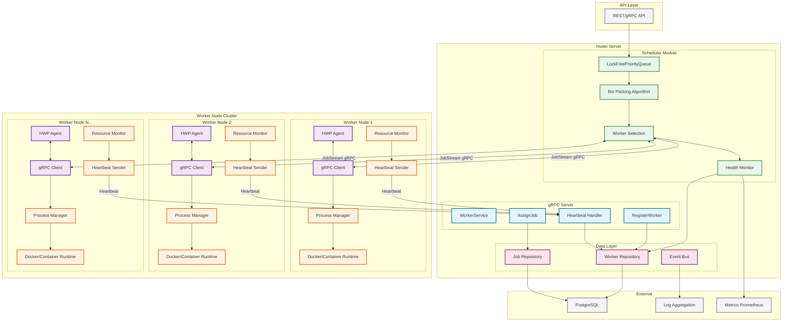
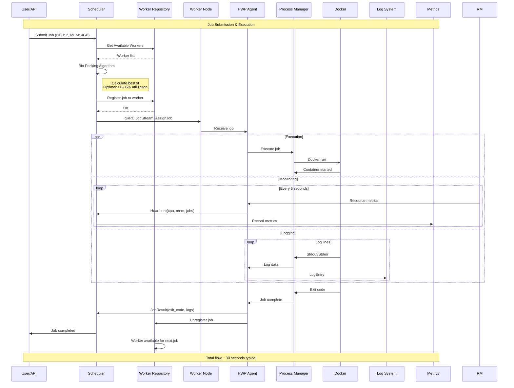
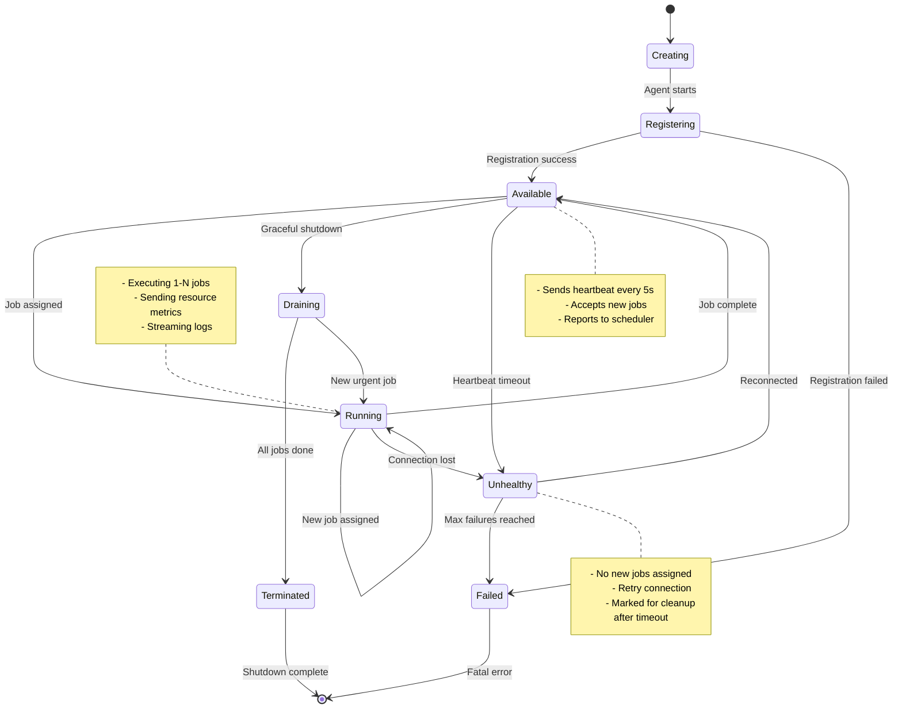
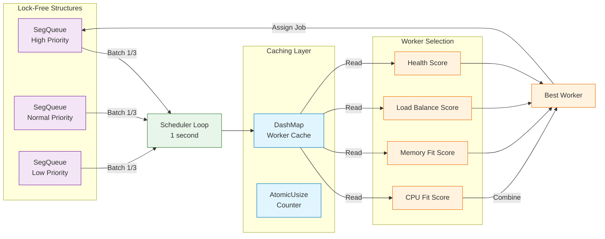
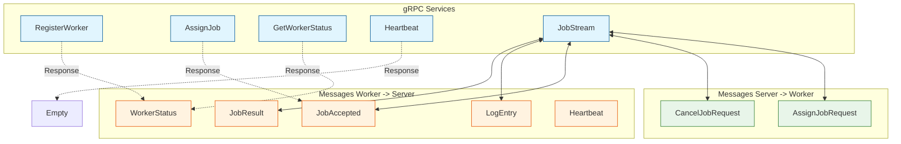
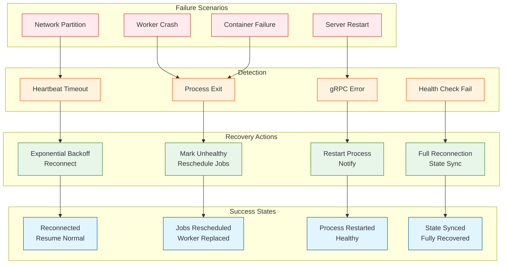
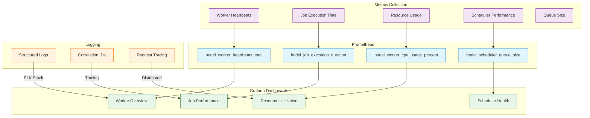

# Arquitectura del Sistema de Workers - Diagrama Visual

## Vista General del Sistema



---

## Flujo de Datos Detallado



---

## Estados de Transición



---

## Componentes de Performance



---

## Protocolo de Comunicación



---

## Resource Management

```mermaid
graph TB
    subgraph "Resource Quota"
        R1[CPU: 2000m<br/>2 Cores]
        R2[Memory: 4096MB<br/>4GB]
        R3[GPU: None]
    end

    subgraph "Worker Capabilities"
        C1[Total CPU: 8000m<br/>8 Cores]
        C2[Total Memory: 16384MB<br/>16GB]
        C3[Max Jobs: 4]
    end

    subgraph "Current Allocation"
        A1[Job 1: 2000m, 4GB]
        A2[Job 2: 2000m, 4GB]
        A3[Job 3: 2000m, 4GB]
        A4[Available: 2000m, 4GB]
    end

    subgraph "Utilization"
        U1[CPU: 6000m/8000m<br/>75%]
        U2[Memory: 12GB/16GB<br/>75%]
        U3[Jobs: 3/4<br/>75%]
    end

    R1 --> C1
    R2 --> C2
    R3 --> C3

    C1 --> A1
    C1 --> A2
    C1 --> A3
    C1 --> A4

    A1 --> U1
    A2 --> U1
    A3 --> U1
    A4 --> U1

    A1 --> U2
    A2 --> U2
    A3 --> U2
    A4 --> U2

    A1 --> U3
    A2 --> U3
    A3 --> U3
    A4 --> U3

    note right of U1
        Optimal range: 60-85%
        Current: 75% (Perfect!)
    end note

    classDef req fill:#e3f2fd,stroke:#1565c0
    classDef cap fill:#e8f5e9,stroke:#2e7d32
    classDef alloc fill:#fff3e0,stroke:#e65100
    classDef util fill:#fce4ec,stroke:#880e4f

    class R1,R2,R3 req
    class C1,C2,C3 cap
    class A1,A2,A3,A4 alloc
    class U1,U2,U3 util
```

---

## Error Handling & Recovery



---

## Monitoring & Observability


