# Sistema de Gestión de Workers - Análisis de Ingeniería Inversa

**Fecha:** 24 de noviembre de 2025
**Proyecto:** Hodei Jobs Platform
**Versión:** 1.0.0

---

## 📋 Resumen Ejecutivo

Este documento presenta un análisis de ingeniería inversa completo del sistema de gestión de workers de la plataforma Hodei Jobs. El sistema implementa una arquitectura distribuida con comunicación gRPC, scheduling inteligente basado en bin packing, y monitoring en tiempo real.

### Componentes Principales
- **Scheduler Module**: Orquestación y scheduling de jobs
- **HWP Agent**: Agente que corre en cada worker node
- **Worker Entity**: Dominio de worker con capacidades y estado
- **gRPC Protocol**: Protocolo de comunicación bidireccional
- **Heartbeat System**: Monitoring de salud y recursos

---

## 🏗️ Arquitectura General

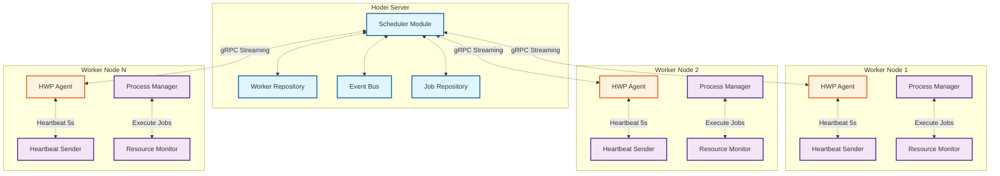

---

## 🔄 Ciclo de Vida de un Worker

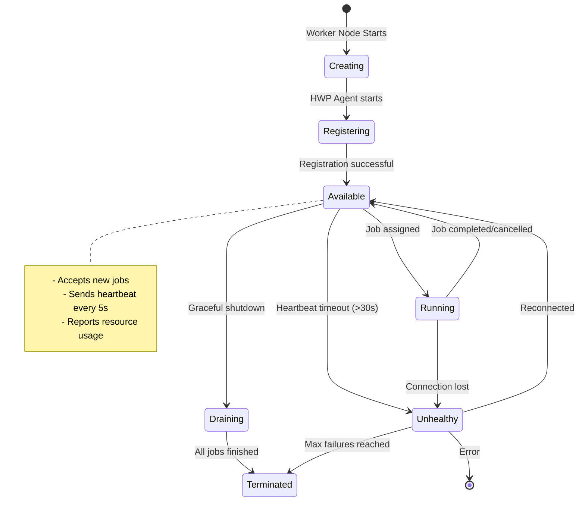

---

## 📡 Protocolo de Comunicación gRPC

### Servicios gRPC

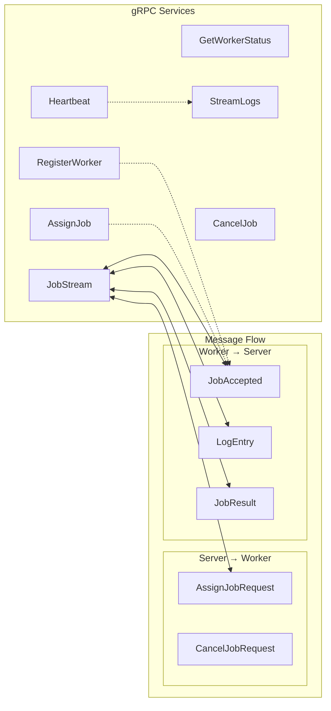

### Bidirectional Streaming (JobStream)

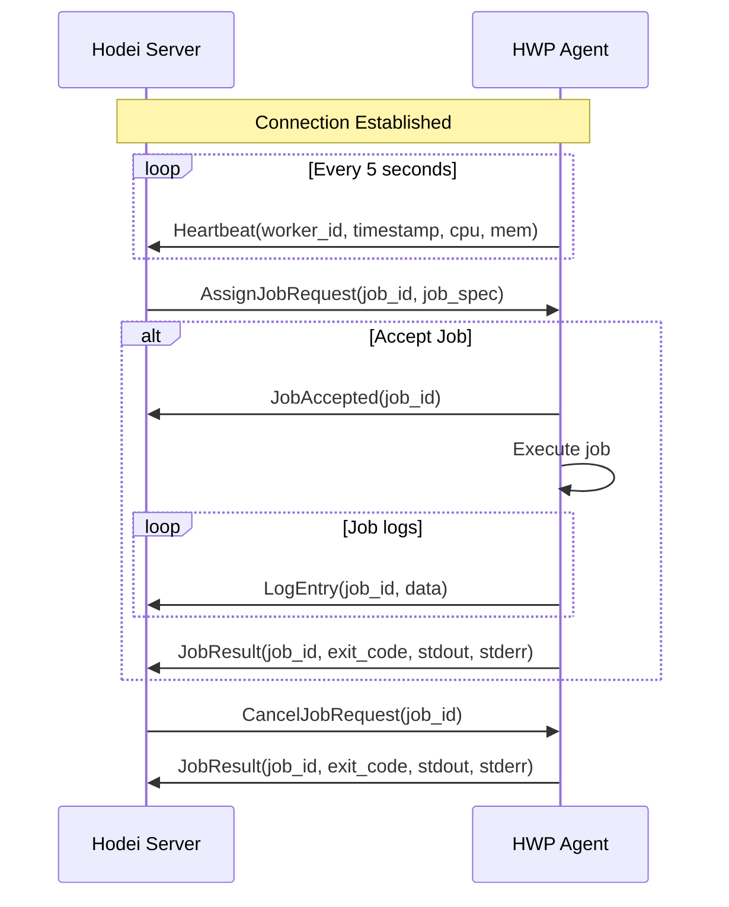

---

## 🧠 Algoritmo de Scheduling

### Worker Selection Flow

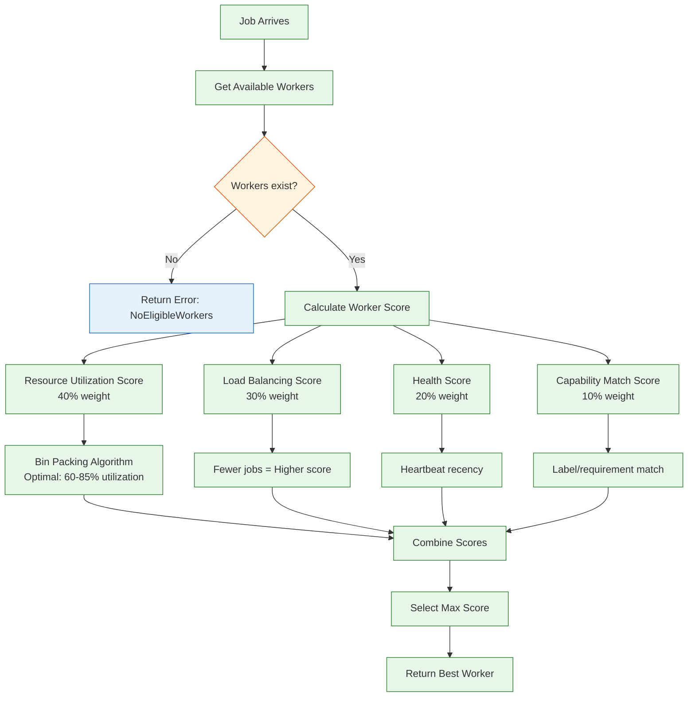

### Bin Packing Algorithm

```mermaid
graph TD
    A[Job Request: 2 CPU, 4GB RAM] --> B[Available Workers]

    B --> W1[Worker 1: 8 CPU, 16GB<br/>Current: 2 CPU, 8GB]
    B --> W2[Worker 2: 4 CPU, 8GB<br/>Current: 3 CPU, 6GB]
    B --> W3[Worker 3: 2 CPU, 4GB<br/>Current: 0 CPU, 0GB]

    W1 --> F1[Utilization: (2+2)/8 = 50%<br/>Score: 0.8]
    W2 --> F2[Utilization: (2+3)/4 = 125%<br/>Score: 0.1 (Over-provisioned)]
    W3 --> F3[Utilization: (2+0)/2 = 100%<br/>Score: 0.3 (Tight fit)]

    F1 --> P[Select Worker 1<br/>Best bin packing fit]

    note right of W1
        Optimal range:
        60-85%
    end note
```

---

## 💓 Sistema de Heartbeat

```mermaid
graph TB
    subgraph "Heartbeat Flow"
        C[Scheduler Config<br/>Timeout: 30s]

        subgraph "Worker Node"
            T1[Timer: 5s]
            RM[Resource Monitor<br/>CPU, Memory, PIDs]
            HS[Heartbeat Sender]
        end

        subgraph "Server Side"
            DB[(Worker Repository)]
            C1[Check Heartbeat]
            U1[Update Worker Status]
        end

        T1 -->|Every 5s| RM
        RM --> HS
        HS -->|gRPC: Heartbeat| C1
        C1 --> U1
        U1 --> DB

        DB -.->|is_healthy()?| C1
    end

    subgraph "Health States"
        H1[Healthy:< 30s old]
        H2[Unhealthy:> 30s old]
        H3[Marked for rescheduling]
    end

    C1 -->|Heartbeat recent| H1
    C1 -->|Heartbeat stale| H2
    H2 -->|No recovery| H3

    classDef config fill:#f5f5f5,stroke:#757575
    classDef process fill:#e8f5e9,stroke:#2e7d32
    classDef storage fill:#e1f5fe,stroke:#01579b
    classDef state fill:#fff3e0,stroke:#e65100

    class C config
    class T1,RM,HS,C1,U1 process
    class DB storage
    class H1,H2,H3 state
```

---

## 🏭 Worker Entity (Dominio)

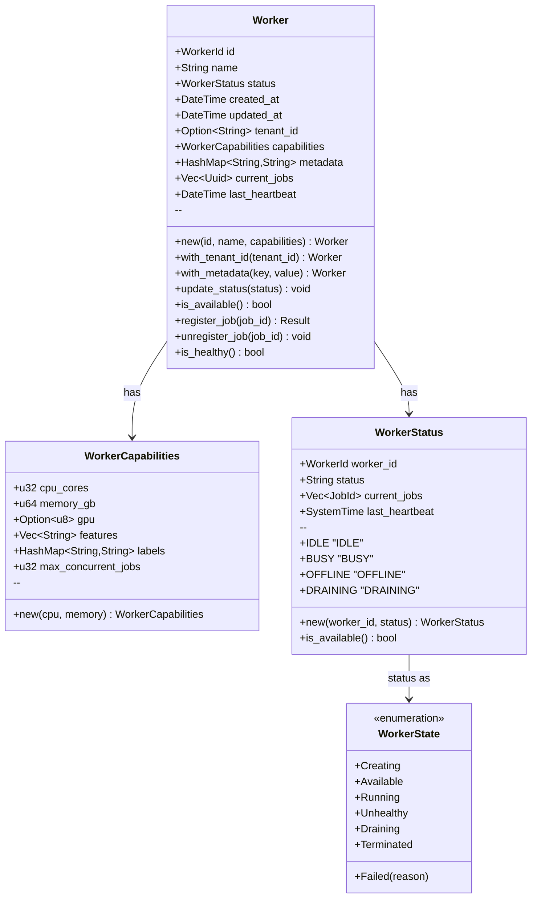

---

## 🔧 Job Execution Flow

```mermaid
sequenceDiagram
    participant S as Scheduler
    participant R as Worker Repository
    participant W as Selected Worker
    participant A as HWP Agent
    participant PM as Process Manager

    S->>R: Find available workers
    R->>S: List of workers

    S->>S: Calculate best worker

    S->>W: register_job(job_id)
    W->>S: Ok (job registered)

    S->>A: JobStream: AssignJobRequest

    A->>S: JobAccepted(job_id)

    par Execute Job
        A->>PM: Execute job spec
        PM->>PM: Spawn process
        PM->>PM: Monitor execution
    and Stream Logs
        loop Every log line
            PM->>A: Log data
            A->>S: LogEntry
        end
    end

    alt Job Success
        PM->>A: exit_code: 0
        A->>S: JobResult(success)
        A->>W: unregister_job(job_id)
    or Job Failure
        PM->>A: exit_code: != 0
        A->>S: JobResult(failure)
        A->>W: unregister_job(job_id)
    or Cancel Request
        S->>A: CancelJobRequest
        PM->>A: Job terminated
        A->>S: JobResult(cancelled)
        A->>W: unregister_job(job_id)
    end

    W->>S: Worker now available
```

---

## 🗄️ Persistencia y Estado

```mermaid
graph TD
    subgraph "Data Storage"
        subgraph "Worker Repository"
            WDB[(Workers Table)]
        end

        subgraph "Job Repository"
            JDB[(Jobs Table)]
        end

        subgraph "In-Memory"
            CACHE[Worker Cache]
            QUEUE[Priority Queue]
        end
    end

    subgraph "Worker Data Model"
        W1[Worker {
            id: UUID,
            name: String,
            status: String,
            capabilities: JSON,
            metadata: JSON,
            current_jobs: UUID[],
            last_heartbeat: Timestamp
        }]
    end

    WDB -.-> W1
    CACHE -.-> W1

    JDB --> QUEUE

    note right of CACHE
        - DashMap for lock-free access
        - Worker status in real-time
        - Health checks every 30s
    end note

    note right of QUEUE
        - LockFreePriorityQueue
        - 3 priority levels (high/normal/low)
        - O(1) enqueue/dequeue
    end
```

---

## 🎯 Capacidades y Compatibilidad

```mermaid
graph TB
    subgraph "Worker Capabilities"
        C1[CPU Cores: 4]
        C2[Memory: 8GB]
        C3[GPU: None]
        C4[Features: [docker, gpu]]
        C5[Labels: {env: prod}]
        C6[Max Concurrent Jobs: 4]
    end

    subgraph "Job Requirements"
        J1[CPU: 2000m (2 cores)]
        J2[Memory: 4096MB (4GB)]
        J3[GPU: Not required]
        J4[Labels: {env: prod}]
    end

    C1 -->|2000m ≤ 4000m| M1[✓ CPU Compatible]
    C2 -->|4GB ≤ 8GB| M2[✓ Memory Compatible]
    C3 -->|None OK| M3[✓ GPU Compatible]
    C4 -->|labels match| M4[✓ Labels Match]
    C5 -->|Max jobs: 4| M5[✓ Has Capacity]

    M1 --> F[Match Score: 100%]
    M2 --> F
    M3 --> F
    M4 --> F
    M5 --> F

    classDef worker fill:#e8f5e9,stroke:#2e7d32
    classDef job fill:#e3f2fd,stroke:#1565c0
    classDef match fill:#fff3e0,stroke:#e65100

    class C1,C2,C3,C4,C5,C6 worker
    class J1,J2,J3,J4 job
    class M1,M2,M3,M4,M5,F match
```

---

## 🚀 Performance Optimizations

### Lock-Free Data Structures

```mermaid
graph LR
    subgraph "LockFreePriorityQueue"
        Q1[SegQueue<br/>High Priority]
        Q2[SegQueue<br/>Normal Priority]
        Q3[SegQueue<br/>Low Priority]
        S[AtomicUsize<br/>Queue Size]
    end

    subgraph "Worker Cache"
        DM[DashMap<br/>WorkerId → Worker]
    end

    subgraph "Cluster State"
        QM[Queue<br/>Workers to schedule]
    end

    Q1 -->|O(1) Enqueue| S
    Q2 -->|O(1) Enqueue| S
    Q3 -->|O(1) Enqueue| S

    S -.->|Batching| QM

    DM -.->|Read/Write| QM

    classDef queue fill:#f3e5f5,stroke:#7b1fa2
    classDef cache fill:#e1f5fe,stroke:#0277bd
    classDef state fill:#fff3e0,stroke:#ef6c00

    class Q1,Q2,Q3,S queue
    class DM cache
    class QM state
```

### Optimization Techniques

1. **Lock-Free Queues** (O(1) operations)
   - `crossbeam::queue::SegQueue` for job queue
   - `dashmap::DashMap` for worker cache
   - `crossbeam::utils::CachePadded` for counters

2. **Batch Processing**
   - Dequeue up to batch_size jobs at once
   - Prioritize high → normal → low queue
   - Reduce contention

3. **Connection Pooling**
   - gRPC channel reuse
   - Keep-alive connections
   - Exponential backoff for reconnects

4. **Streaming Protocol**
   - Bidirectional gRPC stream
   - Real-time job assignments
   - Log streaming during execution

---

## 🔍 Health Monitoring

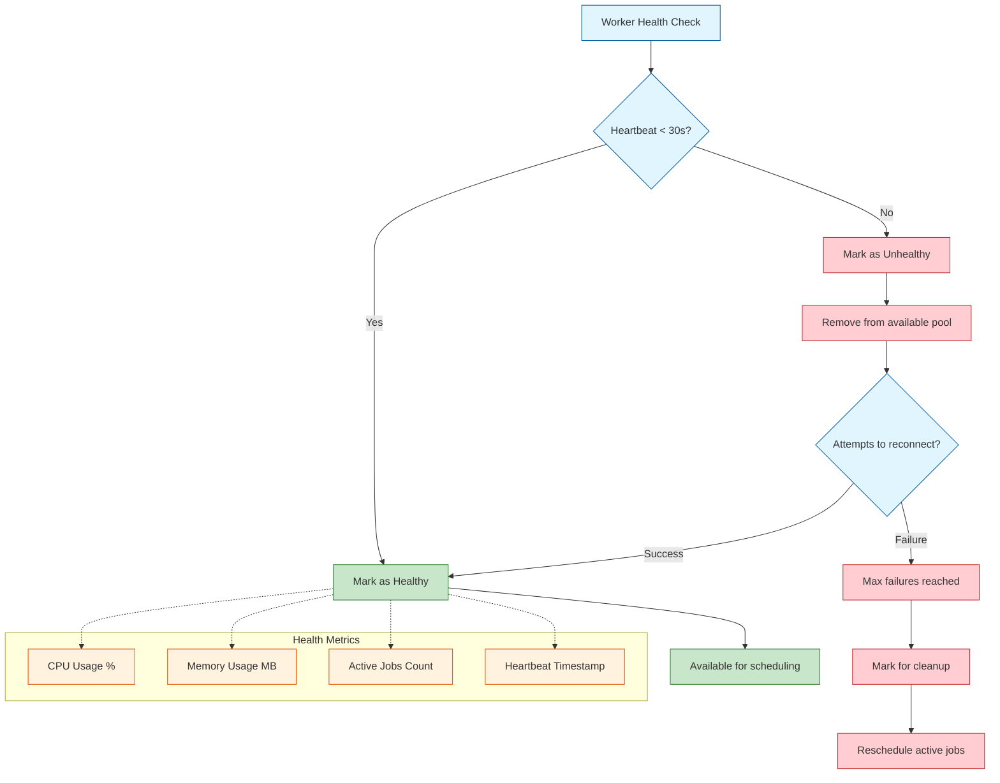

---

## 📊 Configuración del Sistema

### Scheduler Config
```toml
[scheduler]
max_queue_size = 1000           # Max jobs in queue
scheduling_interval_ms = 1000   # Scheduling loop interval
worker_heartbeat_timeout_ms = 30000  # Worker timeout
```

### Heartbeat Config
```toml
[heartbeat]
interval_ms = 5000              # Heartbeat frequency
max_failures = 3                # Max consecutive failures
failure_timeout_ms = 30000      # Failure threshold
```

### Worker Config
```toml
[worker]
cpu_cores = 4
memory_gb = 8
max_concurrent_jobs = 4
features = ["docker", "gpu"]
```

---

## 🎬 Escenarios de Uso

### Escenario 1: Worker Registration
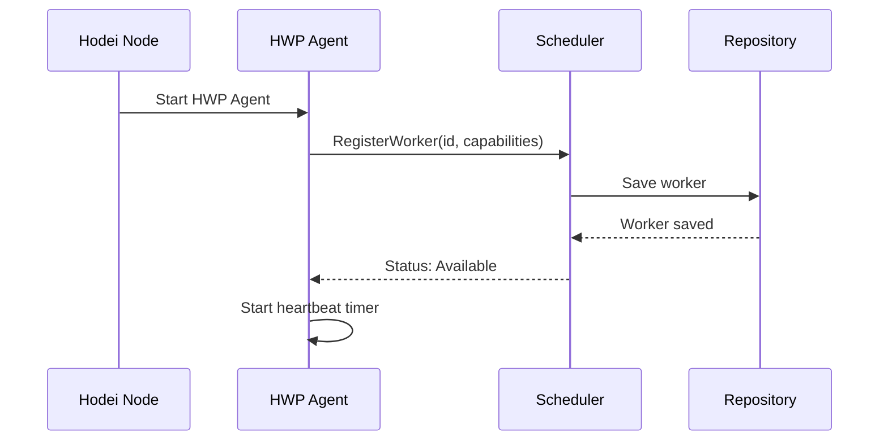

### Escenario 2: Job Assignment
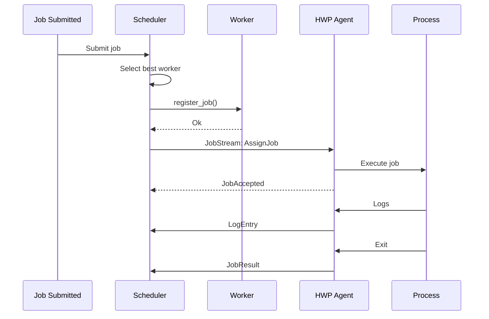

### Escenario 3: Worker Failure
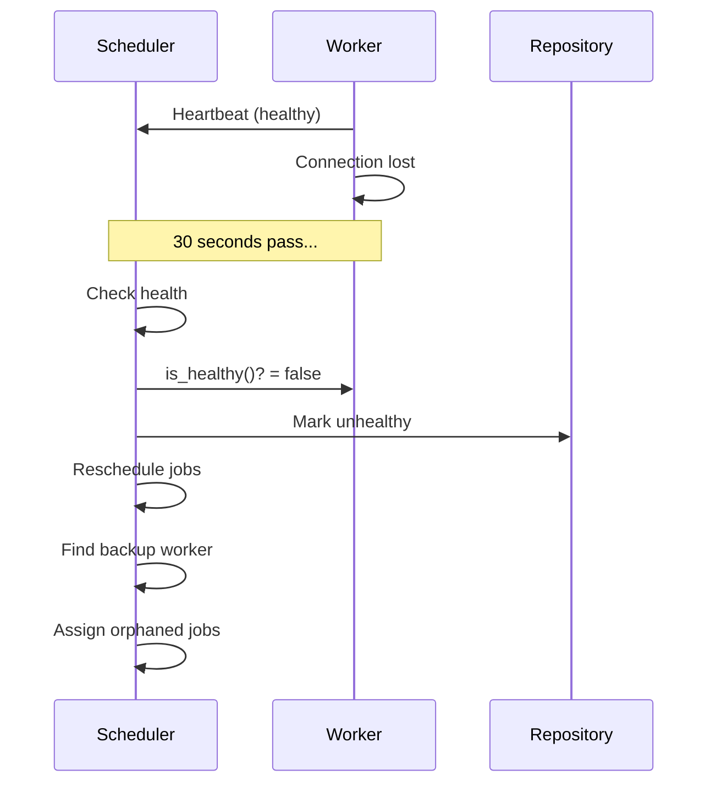

---

## 🔐 Seguridad

### mTLS Configuration
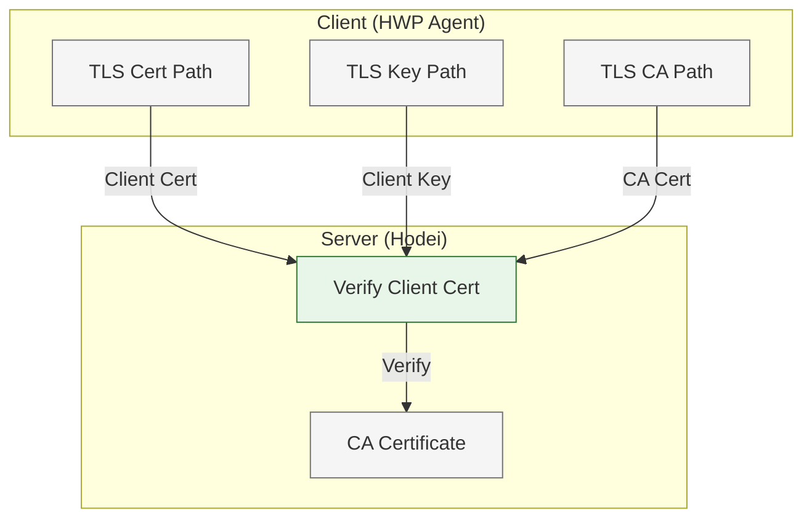

### JWT Authentication
- Worker registration uses JWT tokens
- Token validation on every gRPC call
- Role-based access control:
  - Worker: Execute assigned jobs
  - Scheduler: Manage all workers
  - Admin: Full access

---

## 📈 Métricas y Observabilidad

### Prometheus Metrics
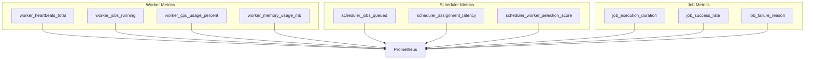

### Logs
- Structured logging with `tracing` crate
- Log levels: ERROR, WARN, INFO, DEBUG
- Correlation IDs for request tracing
- Job execution logs streamed in real-time

---

## 🔄 Recovery Mechanisms

### Automatic Recovery
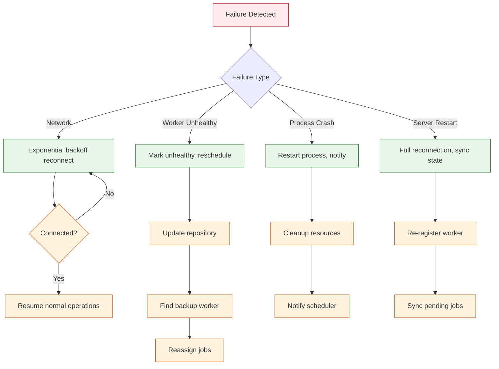

---

## 🎯 Mejoras y Optimizaciones Futuras

### Prioridad Alta
1. **Worker Autoscaling**
   - Dynamic worker provisioning
   - Cloud provider integration (AWS, GCP, Azure)
   - Auto-scaling based on queue depth

2. **GPU Scheduling**
   - GPU-aware bin packing
   - CUDA device monitoring
   - Multi-GPU worker support

3. **Multi-Region**
   - Geographic worker distribution
   - Data locality optimization
   - Cross-region job migration

### Prioridad Media
4. **Job Dependencies**
   - DAG-aware scheduling
   - Parallel step execution
   - Dependency resolution optimization

5. **Resource Prediction**
   - ML-based resource forecasting
   - Historical data analysis
   - Predictive autoscaling

### Prioridad Baja
6. **Fault Tolerance**
   - Multi-master scheduler
   - Worker replication
   - Automatic failover

---

## 📚 Referencias de Código

### Archivos Principales
- `/crates/core/src/worker.rs` - Worker entity y domain logic
- `/crates/shared-types/src/worker_messages.rs` - Message types
- `/crates/modules/src/scheduler/mod.rs` - Scheduler implementation
- `/crates/adapters/src/worker_client.rs` - gRPC client
- `/crates/hwp-agent/src/main.rs` - Agent entry point
- `/crates/hwp-agent/src/connection/grpc_client.rs` - gRPC connection
- `/crates/hwp-agent/src/monitor/heartbeat.rs` - Heartbeat system
- `/crates/hwp-proto/protos/hwp.proto` - Protocol definitions

### Puertos y Adaptadores
- `/crates/ports/src/worker_repository.rs` - Repository interface
- `/crates/ports/src/worker_client.rs` - Client interface

---

## 🏷️ Tags

`#worker-management` `#scheduling` `#grpc` `#distributed-systems` `#job-execution` `#bin-packing` `#heartbeat` `#worker-entity` `#hwp-agent` `#performance` `#monitoring`

---

**Documento generado:** 24 de noviembre de 2025
**Próxima revisión:** 1 de diciembre de 2025
**Versión:** 1.0.0
**Estado:** ✅ Completo
