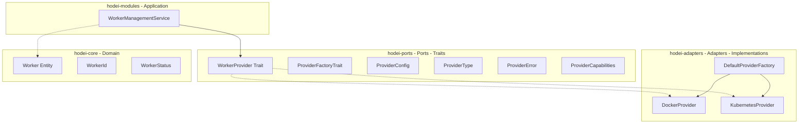
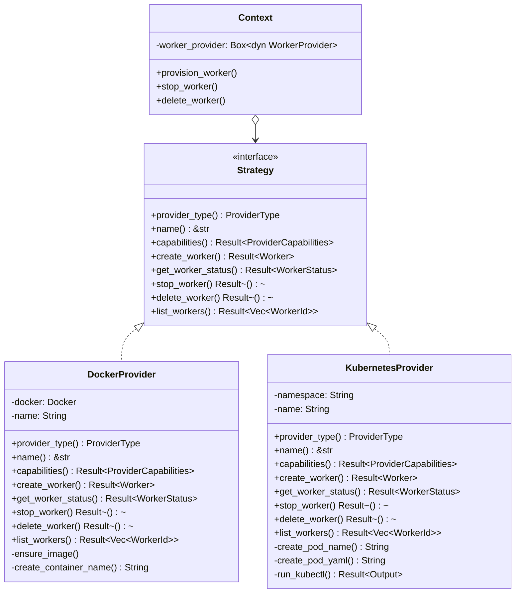
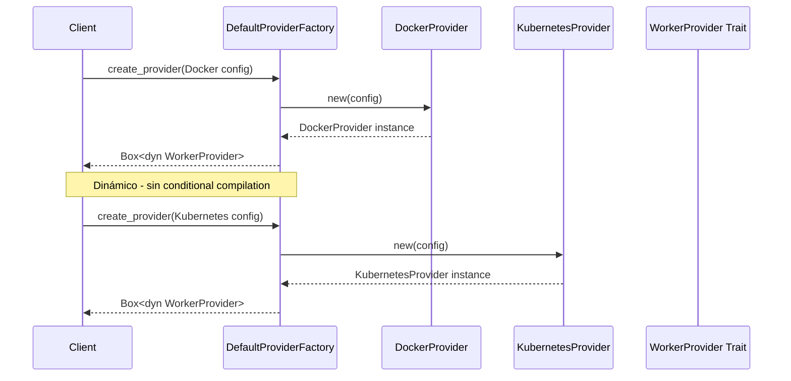
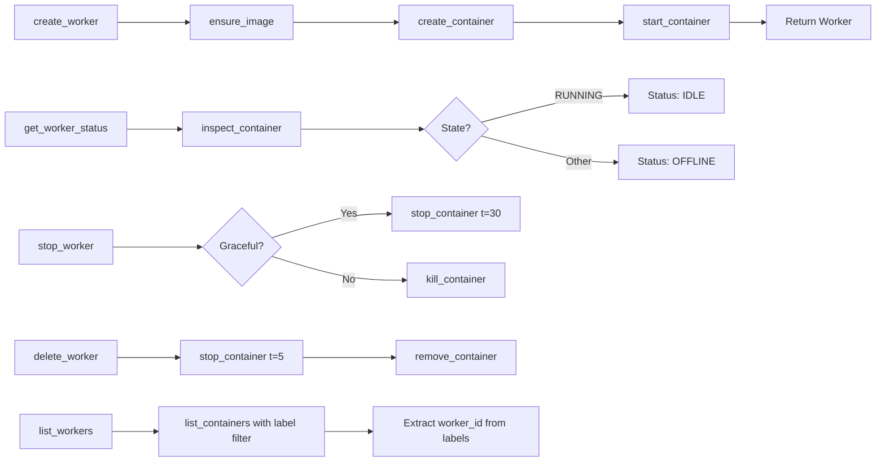
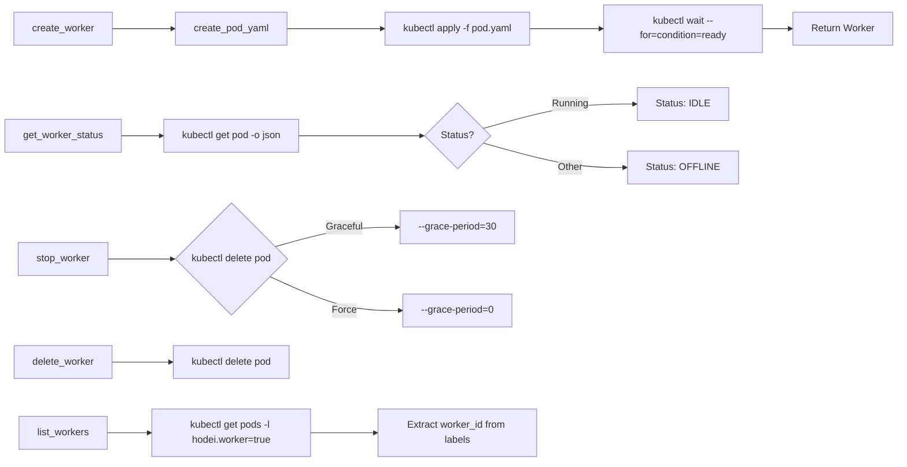
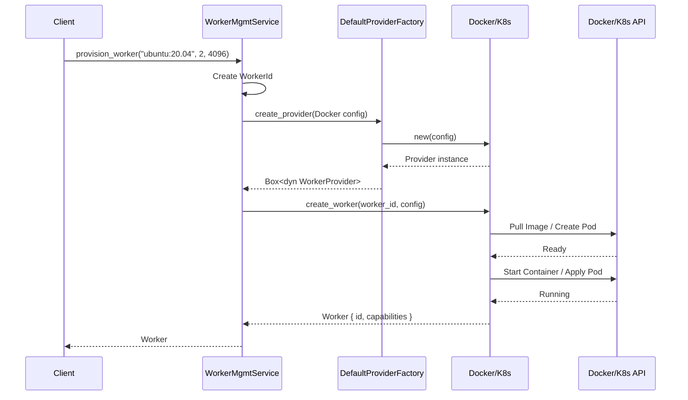
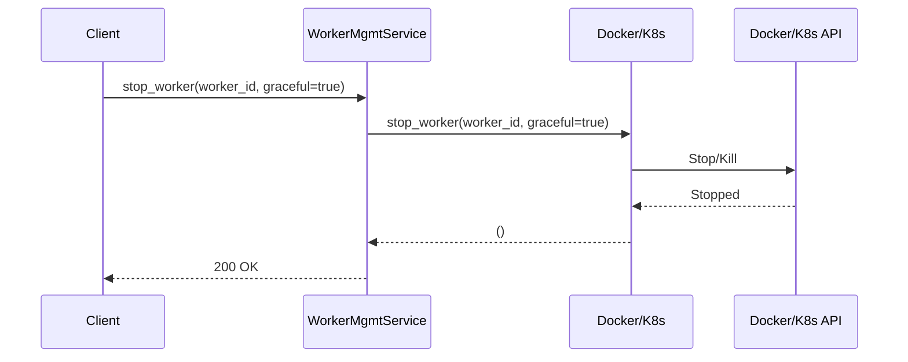

# Worker Management - Arquitectura e Implementación Real

## 📋 Tabla de Contenidos

1. [Visión General](#visión-general)
2. [Arquitectura Hexagonal](#arquitectura-hexagonal)
3. [Patrón Strategy](#patrón-strategy)
4. [Componentes del Código](#componentes-del-código)
5. [Diagrama de Arquitectura](#diagrama-de-arquitectura)
6. [Factory Pattern](#factory-pattern)
7. [Implementación Docker](#implementación-docker)
8. [Implementación Kubernetes](#implementación-kubernetes)
9. [Flujo de Secuencia](#flujo-de-secuencia)
10. [Ejemplos de Uso](#ejemplos-de-uso)

---

## 🎯 Visión General

La gestión de workers implementa el patrón **Strategy** con arquitectura hexagonal, permitiendo ejecutar workers dinámicamente en Docker o Kubernetes mediante una API unificada.

### Características Principales

✅ **Strategy Pattern**: Ambos providers implementan el mismo trait `WorkerProvider`
✅ **Factory Pattern**: `DefaultProviderFactory` crea providers según configuración
✅ **Sin Conditional Compilation**: No hay `#[cfg(feature="...")]`
✅ **Arquitectura Hexagonal**: Separación clara entre Ports (traits) y Adapters (implementaciones)

---

## 🏛️ Arquitectura Hexagonal

### Estructura de Crates



---

## 🎨 Patrón Strategy

### Definición en el Código

```rust
// crates/ports/src/worker_provider.rs
#[async_trait]
pub trait WorkerProvider: Send + Sync + std::fmt::Debug {
    fn provider_type(&self) -> ProviderType;
    fn name(&self) -> &str;
    async fn capabilities(&self) -> Result<ProviderCapabilities, ProviderError>;

    async fn create_worker(
        &self,
        worker_id: WorkerId,
        config: ProviderConfig,
    ) -> Result<Worker, ProviderError>;

    async fn get_worker_status(
        &self,
        worker_id: &WorkerId,
    ) -> Result<hodei_shared_types::WorkerStatus, ProviderError>;

    async fn stop_worker(&self, worker_id: &WorkerId, graceful: bool)
        -> Result<(), ProviderError>;

    async fn delete_worker(&self, worker_id: &WorkerId) -> Result<(), ProviderError>;

    async fn list_workers(&self) -> Result<Vec<WorkerId>, ProviderError>;
}
```

### Diagrama UML del Patrón



---

## 🔧 Componentes del Código

### 1. **Ports (Traits)** - `hodei-ports`

#### ProviderType Enum
```rust
// crates/ports/src/worker_provider.rs:13
#[derive(Debug, Clone, PartialEq, Eq, Serialize, Deserialize)]
pub enum ProviderType {
    Docker,
    Kubernetes,
}
```

#### ProviderConfig
```rust
// crates/ports/src/worker_provider.rs:66
#[derive(Debug, Clone, Serialize, Deserialize)]
pub struct ProviderConfig {
    pub provider_type: ProviderType,
    pub name: String,
    pub namespace: Option<String>,
    pub docker_host: Option<String>,
    pub kube_config: Option<String>,
}
```

Builder methods:
```rust
impl ProviderConfig {
    pub fn docker(name: String) -> Self { ... }
    pub fn kubernetes(name: String) -> Self { ... }
}
```

#### ProviderFactoryTrait
```rust
// crates/ports/src/worker_provider.rs:99
#[async_trait]
pub trait ProviderFactoryTrait: Send + Sync {
    async fn create_provider(
        &self,
        config: ProviderConfig,
    ) -> Result<Box<dyn WorkerProvider>, ProviderError>;
}
```

### 2. **Adapters (Implementations)** - `hodei-adapters`

#### DefaultProviderFactory
```rust
// crates/adapters/src/provider_factory.rs:10
pub struct DefaultProviderFactory;

impl DefaultProviderFactory {
    pub fn new() -> Self {
        Self
    }
}

#[async_trait]
impl ProviderFactoryTrait for DefaultProviderFactory {
    async fn create_provider(
        &self,
        config: ProviderConfig,
    ) -> Result<Box<dyn WorkerProvider>, ProviderError> {
        match config.provider_type {
            ProviderType::Docker => {
                let provider = DockerProvider::new(config).await?;
                Ok(Box::new(provider) as Box<dyn WorkerProvider>)
            }
            ProviderType::Kubernetes => {
                let provider = KubernetesProvider::new(config).await?;
                Ok(Box::new(provider) as Box<dyn WorkerProvider>)
            }
        }
    }
}
```

#### DockerProvider
```rust
// crates/adapters/src/docker_provider.rs:18
pub struct DockerProvider {
    docker: Docker,
    name: String,
}
```

#### KubernetesProvider
```rust
// crates/adapters/src/kubernetes_provider.rs:19
pub struct KubernetesProvider {
    namespace: String,
    name: String,
}
```

### 3. **Application Layer** - `hodei-modules`

```rust
// crates/modules/src/worker_management.rs:16
pub struct WorkerManagementService {
    provider: Box<dyn WorkerProvider + Send + Sync>,
}

impl WorkerManagementService {
    pub fn new(provider: Box<dyn WorkerProvider + Send + Sync>) -> Self {
        Self { provider }
    }

    pub async fn provision_worker(
        &self,
        image: String,
        cpu_cores: u32,
        memory_mb: u64,
    ) -> Result<Worker, WorkerManagementError> {
        let worker_id = WorkerId::new();
        let config = ProviderConfig::docker(format!("worker-{}", worker_id));

        let worker = self
            .provider
            .create_worker(worker_id.clone(), config)
            .await
            .map_err(WorkerManagementError::Provider)?;

        Ok(worker)
    }
}
```

---

## 🏭 Factory Pattern

### Diagrama del Factory



### Configuración de Providers

#### Docker Provider
```rust
// En el código:
let config = ProviderConfig::docker("docker-provider".to_string());
// Resultado: provider_type = Docker, namespace = None
```

#### Kubernetes Provider
```rust
// En el código:
let mut config = ProviderConfig::kubernetes("k8s-provider".to_string());
config.namespace = Some("hodei-workers".to_string());
// Resultado: provider_type = Kubernetes, namespace = "hodei-workers"
```

---

## 🐳 Implementación Docker

### Estructura
```rust
// crates/adapters/src/docker_provider.rs:18-22
pub struct DockerProvider {
    docker: Docker,        // bollard::Docker client
    name: String,          // provider name
}
```

### Operaciones

#### create_worker
```rust
// crates/adapters/src/docker_provider.rs:89-150
async fn create_worker(
    &self,
    worker_id: WorkerId,
    config: ProviderConfig,
) -> Result<Worker, ProviderError> {
    let worker_id_clone = worker_id.clone();
    let container_name = Self::create_container_name(&worker_id);
    let image = "ubuntu:20.04";

    // 1. Ensure image exists
    self.ensure_image(image).await?;

    // 2. Create container config
    let container_config = Config {
        image: Some(image.to_string()),
        env: Some(vec![
            "WORKER_ID=placeholder".to_string(),
            "HODEI_SERVER_GRPC_URL=http://hodei-server:50051".to_string(),
        ]),
        labels: {
            let mut labels = HashMap::new();
            labels.insert("hodei.worker".to_string(), "true".to_string());
            labels.insert("hodei.worker.id".to_string(), worker_id_clone.to_string());
            Some(labels)
        },
        host_config: Some(bollard::service::HostConfig {
            memory: Some(4 * 1024 * 1024 * 1024),
            nano_cpus: Some(2 * 1_000_000_000),
            auto_remove: Some(true),
            ..Default::default()
        }),
        ..Default::default()
    };

    // 3. Create container
    let create_options = CreateContainerOptions {
        name: container_name.clone(),
        ..Default::default()
    };
    self.docker.create_container(Some(create_options), container_config).await?;

    // 4. Start container
    self.docker.start_container::<&str>(&container_name, None).await?;

    // 5. Return Worker
    let worker = Worker::new(
        worker_id,
        format!("worker-{}", worker_id_clone),
        hodei_shared_types::WorkerCapabilities::new(2, 4096),
    );

    Ok(worker)
}
```

#### get_worker_status
```rust
// crates/adapters/src/docker_provider.rs:154-178
async fn get_worker_status(
    &self,
    worker_id: &WorkerId,
) -> Result<WorkerStatus, ProviderError> {
    let container_name = Self::create_container_name(worker_id);
    let container_info = self.docker.inspect_container(&container_name, None).await?;

    let status = match container_info.state.as_ref().and_then(|s| s.status.as_ref()) {
        Some(bollard::models::ContainerStateStatusEnum::RUNNING) => {
            WorkerStatus::new(worker_id.clone(), WorkerStatus::IDLE.to_string())
        }
        _ => WorkerStatus::new(worker_id.clone(), WorkerStatus::OFFLINE.to_string()),
    };

    Ok(status)
}
```

#### stop_worker
```rust
// crates/adapters/src/docker_provider.rs:182-206
async fn stop_worker(&self, worker_id: &WorkerId, graceful: bool)
    -> Result<(), ProviderError> {
    let container_name = Self::create_container_name(worker_id);

    if graceful {
        self.docker
            .stop_container(&container_name, Some(bollard::container::StopContainerOptions { t: 30 }))
            .await?;
    } else {
        self.docker
            .kill_container::<&str>(&container_name, None)
            .await?;
    }

    Ok(())
}
```

#### delete_worker
```rust
// crates/adapters/src/docker_provider.rs:210-227
async fn delete_worker(&self, worker_id: &WorkerId) -> Result<(), ProviderError> {
    let container_name = Self::create_container_name(worker_id);

    let _ = self
        .docker
        .stop_container(&container_name, Some(bollard::container::StopContainerOptions { t: 5 }))
        .await;

    self.docker.remove_container(&container_name, None).await?;

    Ok(())
}
```

#### list_workers
```rust
// crates/adapters/src/docker_provider.rs:231-262
async fn list_workers(&self) -> Result<Vec<WorkerId>, ProviderError> {
    let mut filters = std::collections::HashMap::new();
    filters.insert("label".to_string(), vec!["hodei.worker=true".to_string()]);

    let containers = self
        .docker
        .list_containers(Some(bollard::container::ListContainersOptions {
            all: false,
            filters,
            ..Default::default()
        }))
        .await?;

    let mut worker_ids = Vec::new();
    for container in containers {
        if let Some(labels) = container.labels {
            if let Some(worker_id) = labels.get("hodei.worker.id") {
                worker_ids.push(WorkerId::from_uuid(
                    uuid::Uuid::parse_str(worker_id).map_err(|_| {
                        ProviderError::Provider(format!("Invalid worker ID: {}", worker_id))
                    })?,
                ));
            }
        }
    }

    Ok(worker_ids)
}
```

### Diagrama de Operaciones Docker



---

## ☸️ Implementación Kubernetes

### Estructura
```rust
// crates/adapters/src/kubernetes_provider.rs:19-23
pub struct KubernetesProvider {
    namespace: String,  // default: "default"
    name: String,       // provider name
}
```

### YAML Template Generation

```rust
// crates/adapters/src/kubernetes_provider.rs:40-73
fn create_pod_yaml(worker_id: &WorkerId, namespace: &str) -> String {
    let pod_name = Self::create_pod_name(worker_id);
    let grpc_url = std::env::var("HODEI_SERVER_GRPC_URL")
        .unwrap_or_else(|_| "http://hodei-server:50051".to_string());

    format!(r#"apiVersion: v1
kind: Pod
metadata:
  name: {pod_name}
  namespace: {namespace}
  labels:
    hodei.worker: "true"
    hodei.worker.id: "{worker_id}"
spec:
  restartPolicy: Never
  containers:
  - name: worker
    image: ubuntu:20.04
    env:
    - name: WORKER_ID
      value: "{worker_id}"
    - name: HODEI_SERVER_GRPC_URL
      value: "{grpc_url}"
    resources:
      requests:
        cpu: "2"
        memory: "4Gi"
      limits:
        cpu: "2"
        memory: "4Gi"
"#, namespace = namespace, worker_id = worker_id)
}
```

### kubectl Operations

```rust
// crates/adapters/src/kubernetes_provider.rs:135-142
fn run_kubectl(args: &[&str]) -> Result<std::process::Output, ProviderError> {
    Command::new("kubectl")
        .args(args)
        .output()
        .map_err(|e| ProviderError::Provider(format!("kubectl failed: {}", e)))
}
```

### Diagrama de Operaciones Kubernetes



---

## 🔄 Flujo de Secuencia

### Creación de Worker



### Parada de Worker



---

## 💻 Ejemplos de Uso

### Ejemplo 1: Crear WorkerManagementService con Docker

```rust
// crates/modules/src/worker_management.rs:137-150
pub async fn create_default_worker_management_service()
    -> Result<WorkerManagementService, WorkerManagementError> {
    let config = ProviderConfig::docker("docker-provider".to_string());
    let factory = DefaultProviderFactory::new();
    let provider = factory
        .create_provider(config)
        .await
        .map_err(WorkerManagementError::Provider)?;

    Ok(WorkerManagementService::new(provider))
}
```

**Uso:**
```rust
use hodei_modules::create_default_worker_management_service;

let service = create_default_worker_management_service().await?;
let worker = service.provision_worker(
    "ubuntu:20.04".to_string(),
    2,      // cpu_cores
    4096,   // memory_mb
).await?;
```

### Ejemplo 2: Crear WorkerManagementService con Kubernetes

```rust
// crates/modules/src/worker_management.rs:152-165
pub async fn create_kubernetes_worker_management_service(
    namespace: String,
) -> Result<WorkerManagementService, WorkerManagementError> {
    let mut config = ProviderConfig::kubernetes("k8s-provider".to_string());
    config.namespace = Some(namespace);

    let factory = DefaultProviderFactory::new();
    let provider = factory
        .create_provider(config)
        .await
        .map_err(WorkerManagementError::Provider)?;

    Ok(WorkerManagementService::new(provider))
}
```

**Uso:**
```rust
use hodei_modules::create_kubernetes_worker_management_service;

let service = create_kubernetes_worker_management_service(
    "hodei-workers".to_string()
).await?;
let worker = service.provision_worker(
    "ubuntu:20.04".to_string(),
    2,
    4096,
).await?;
```

### Ejemplo 3: Uso Directo del Factory

```rust
use hodei_adapters::DefaultProviderFactory;
use hodei_ports::{ProviderFactoryTrait, worker_provider::ProviderConfig};
use hodei_core::WorkerId;

#[tokio::main]
async fn main() -> Result<(), Box<dyn std::error::Error>> {
    // Crear factory
    let factory = DefaultProviderFactory::new();

    // Crear Docker provider
    let docker_config = ProviderConfig::docker("docker-1".to_string());
    let docker_provider = factory.create_provider(docker_config).await?;
    println!("Provider type: {:?}", docker_provider.provider_type());

    // Crear Kubernetes provider
    let mut k8s_config = ProviderConfig::kubernetes("k8s-1".to_string());
    k8s_config.namespace = Some("production".to_string());
    let k8s_provider = factory.create_provider(k8s_config).await?;
    println!("Provider type: {:?}", k8s_provider.provider_type());

    // Usar cualquiera de los dos
    let worker_id = WorkerId::new();
    let worker = docker_provider.create_worker(
        worker_id,
        ProviderConfig::docker("docker-1".to_string())
    ).await?;

    Ok(())
}
```

---

## 📊 Exports en hodei-adapters

```rust
// crates/adapters/src/lib.rs
pub mod bus;
pub mod docker_provider;
pub mod event_bus;
pub mod kubernetes_provider;
pub mod kubernetes_provider_tests;
pub mod postgres;
pub mod provider_factory;
pub mod redb;
pub mod repositories;
pub mod security;
pub mod worker_client;

// Exports
pub use crate::docker_provider::DockerProvider;
pub use crate::kubernetes_provider::KubernetesProvider;
pub use crate::provider_factory::DefaultProviderFactory;
pub use crate::repositories::{
    InMemoryJobRepository,
    InMemoryPipelineRepository,
    InMemoryWorkerRepository,
};
pub use crate::worker_client::{GrpcWorkerClient, HttpWorkerClient};
pub use crate::postgres::{PostgreSqlJobRepository, PostgreSqlPipelineRepository, PostgreSqlWorkerRepository};
pub use crate::redb::{RedbJobRepository, RedbPipelineRepository, RedbWorkerRepository};
```

---

## ✅ Resumen

### Lo que tenemos (Código Real)

1. **WorkerProvider Trait** - Puerto que define el contrato
2. **DockerProvider** - Implementación con Docker API (bollard)
3. **KubernetesProvider** - Implementación con kubectl CLI
4. **DefaultProviderFactory** - Factory que crea providers dinámicamente
5. **WorkerManagementService** - Servicio de aplicación

### Lo que NO tenemos

❌ Conditional compilation con `#[cfg(feature="...")]`
❌ Feature gates en Cargo.toml para providers
❌ Fallbacks o simulaciones
❌ Hardcoded providers

### Tests Passing

```
✅ Total: 303 tests passed, 0 failed
  • hodei-adapters: 129 tests
  • hodei-core: 74 tests
  • hodei-shared-types: 32 tests
  • hodei-modules: 24 tests
  • hwp-agent: 32 tests
  • hodei-ports: 4 tests
  • hwp-proto: 5 tests
  • hodei-core (tests): 3 tests
```

---

## 📝 Conclusión

La implementación real del Worker Management sigue:

1. ✅ **Strategy Pattern** - Ambos providers implementan el mismo trait
2. ✅ **Factory Pattern** - Factory crea provider según configuración
3. ✅ **Arquitectura Hexagonal** - Separación Ports/Adapters/Application
4. ✅ **Sin Conditional Compilation** - Ambos providers siempre disponibles
5. ✅ **Código Productivo** - Sin simulaciones, implementaciones reales

---

**Versión**: 1.0.0 (Basada en código real)
**Fecha**: 2025-11-24
**Estado**: ✅ Implementado y testeado
